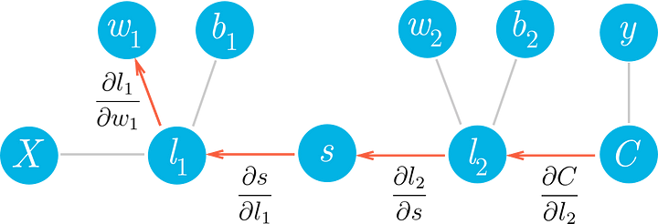

# Backpropagation



The mathematical foundations of neural networks are differentiable graphs — chains of computations whose derivative can be calculated. It is this property that allows the weights between nodes to be optimised through a process called Backpropagation, and what allows a network to learn from its mistakes.

Backpropagation is so named because the weights are updated backwards, from output towards input. This involves the following steps:

1. First, pass the training set batch through our neural network, this is known as the forward pass, and generates predictions

2. Calculate the error (difference between the known labels &predictions)

3. Calculate the gradient, (dot product of the transposed input & delta)

4. Finally adjust the weights (backwards) from layer i to preceding layer i-1

Backpropagation in Python using basic linear algebra functions from NumPy looks like this:

```python
# Convert inputs list to 2d array
inputs = np.array(inputs_list, ndmin=2).T
targets = np.array(targets_list, ndmin=2).T
 
### Step 1: Implementation of the Forward pass ###
 
# Hidden layer
hidden_inputs = np.dot(self.weights_input_to_hidden, inputs)
hidden_outputs = self.activation_function(hidden_inputs)
# Output layer
# calculate signals into final output layer
final_inputs = np.dot(self.weights_hidden_to_output, hidden_outputs)
# set signals from final output layer
final_outputs = final_inputs
 
### Implementation of the Backward pass ###
 
# Step 2: Compute output layer error (difference between known target and network output)
output_errors = targets — final_outputs
 
# Step 3: Compute backpropagated error
# Calculate hidden layer gradients
hidden_gradients = (hidden_outputs * (1-hidden_outputs))
 
# Calculate errors propagated to the hidden layer
hidden_errors = np.dot(output_errors, self.weights_hidden_to_output)
 
# Step 4: Backpropagate and update the weights
# First, update hidden-to-output weights with gradient descent step
self.weights_hidden_to_output += self.lr * np.dot(output_errors, hidden_outputs.T)
# Then update input-to-hidden weights with gradient descent step
self.weights_input_to_hidden += self.lr * np.dot(hidden_errors.T, inputs.T) * hidden_gradients
```

## References

* [Glossary of Deep Learning: Backpropagation](https://medium.com/deeper-learning/glossary-of-deep-learning-backpropagation-e6d748d36a0e)