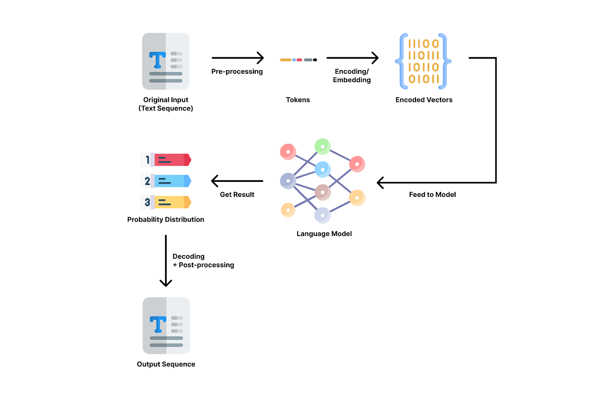
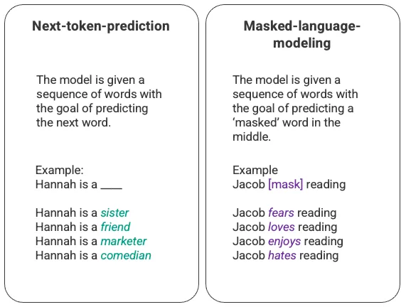
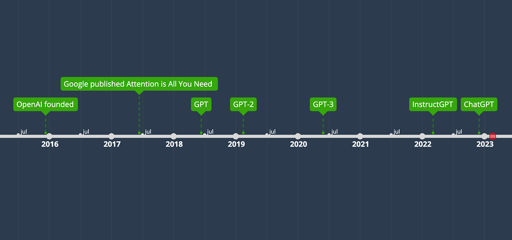
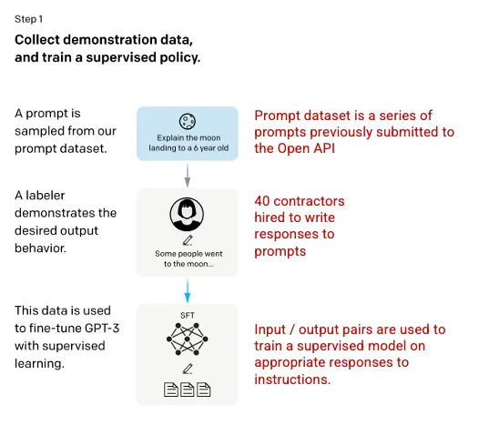
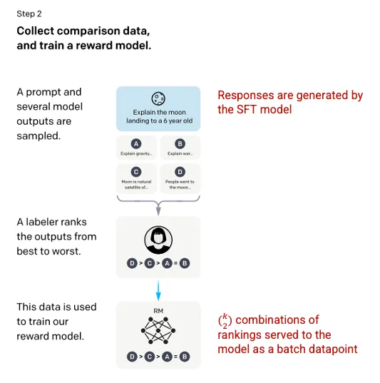
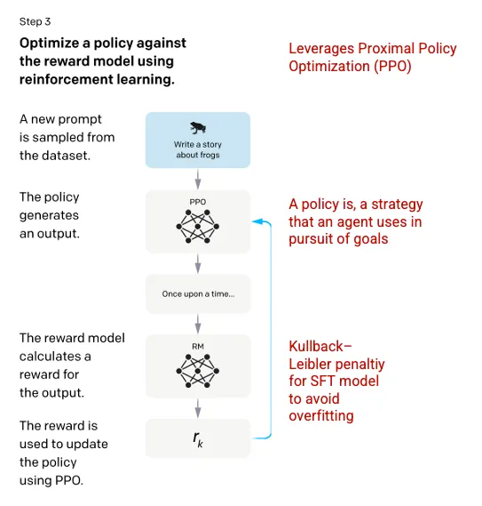

# ChatGPT

## Large Language Models (LLMs)

Language models can learn a library of text (called corpus) and predict words or sequences of words with probabilistic distributions, i.e. how likely a word or sequence can occur. 

The most basic training of language models involves predicting a word in a sequence of words. Most commonly, this is observed as either next-token-prediction and masked-language-modeling.

### Limitations of LSTM (Long-Short-Term-Memory)

1. The model is unable to value some of the surrounding words more than others. In the above example, while ‘reading’ may most often associate with ‘hates’, in the database ‘Jacob’ may be such an avid reader that the model should give more weight to ‘Jacob’ than to ‘reading’ and choose ‘love’ instead of ‘hates’.

2. The input data is processed individually and sequentially rather than as a whole corpus. This means that when an LSTM is trained, the window of context is fixed, extending only beyond an individual input for several steps in the sequence. This limits the complexity of the relationships between words and the meanings that can be derived.

## The transformer and GPT (Generative Pre-training Transformer) timeline

### Transformer Architecture

The encoder and decoder are the main components of transformer architecture. The encoder is responsible for analyzing and “understanding” the input text and the decoder is responsible for generating output.

The self-attention mechanism that drives GPT works by converting tokens (pieces of text, which can be a word, sentence, or other grouping of text) into vectors that represent the importance of the token in the input sequence. To do this, the model,

1. Creates a query, key, and value vector for each token in the input sequence.

2. Calculates the similarity between the query vector from step one and the key vector of every other token by taking the dot product of the two vectors.

3. Generates normalized weights by feeding the output of step 2 into a softmax function.

4. Generates a final vector, representing the importance of the token within the sequence by multiplying the weights generated in step 3 by the value vectors of each token.

The ‘multi-head’ attention mechanism that GPT uses is an evolution of self-attention. Rather than performing steps 1–4 once, the model iterates this mechanism several times, each time generating a new linear projection of the query, key, and value vectors. By expanding self-attention in this way, the model is capable of grasping sub-meanings and more complex relationships within the input data.

## ChatGPT

ChatGPT is a spinoff of InstructGPT, which introduced a novel approach to incorporating human feedback into the training process to better align the model outputs with user intent.

## Reinforcement Learning from Human Feedback (RLHF). 

### Step 1: Supervised Fine Tuning (SFT) Model

Supervised fine-tuning step: a pre-trained language model is fine-tuned on a relatively small amount of demonstration data curated by labelers, to learn a supervised policy (the SFT model) that generates outputs from a selected list of prompts. This represents the baseline model.

### Step 2: Reward Model

“Mimic human preferences” step: labelers are asked to vote on a relatively large number of the SFT model outputs, this way creating a new dataset consisting of comparison data. A new model is trained on this dataset. This is referred to as the reward model (RM).

### Step 3: Reinforcement Learning Model

Proximal Policy Optimization (PPO) step: the reward model is used to further fine-tune and improve the SFT model. The outcome of this step is the so-called policy model.

## References

* [How ChatGPT Works: The Model Behind The Bot](https://towardsdatascience.com/how-chatgpt-works-the-models-behind-the-bot-1ce5fca96286)

* [Training language models to follow instructions with human feedback](https://arxiv.org/pdf/2203.02155.pdf) (2022/03 InstructGPT paper)

* [How ChatGPT really works, explained for non-technical people](https://bootcamp.uxdesign.cc/how-chatgpt-really-works-explained-for-non-technical-people-71efb078a5c9)