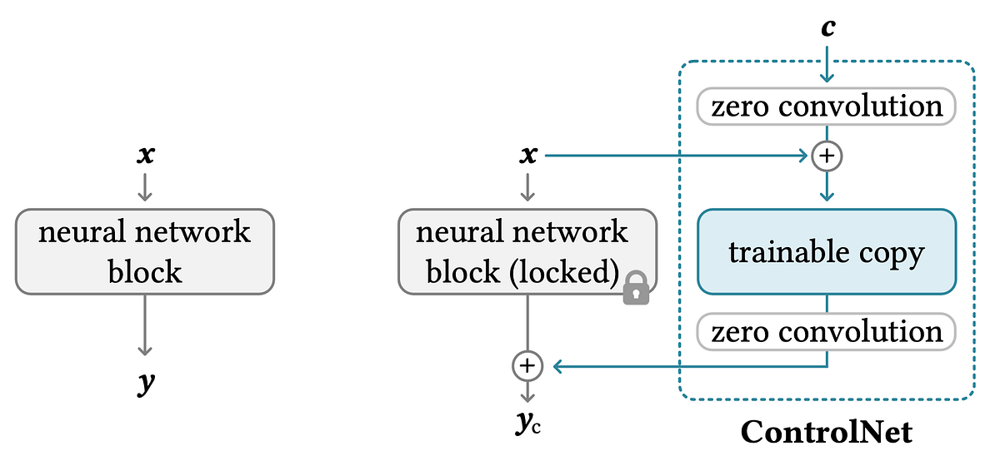

# ControlNet

ControlNet adds **spatial conditioning** to a frozen Stable Diffusion model: pose, edges, depth, segmentation, scribbles, and similar maps can steer the layout of the generated image while the text prompt still controls appearance and style.

See also: [Stable Diffusion](stable_diffusion_model.md) · [LoRA](lora.md) · [IP-Adapter](ip_adapter.md)

## Why ControlNet?

Text prompts alone are weak at specifying exact geometry (“left arm raised 30°, person centered, same room layout”). ControlNet takes an extra **condition image** (e.g. OpenPose skeleton, Canny edges, depth map) and injects that structure into the denoising process.

Typical condition types:

| Condition | What you provide | Useful for |
|-----------|------------------|------------|
| OpenPose / DWPose | Body / hand / face keypoints | Character pose |
| Canny / HED / Lineart | Edge map | Composition, line drawings → photo |
| Depth | Depth map | Camera geometry, scene layout |
| Soft edge / scribble | Rough sketch | Ideation from doodles |
| Segmentation | Region labels | Layout by semantic parts |
| Tile / reference | Image regions | Upscale / detail transfer |

## How it works (intuition)



1. Start from a **pretrained** Stable Diffusion U-Net (frozen “locked” copy of the encoding path).
2. Clone that encoding path into a trainable **ControlNet** branch that also receives the condition image (encoded to feature maps).
3. At several resolutions, ControlNet outputs are added into the main U-Net (via zero-initialized convolutions so training starts safely from the base model’s behavior).
4. Text conditioning still goes through the usual **text encoder → cross-attention** path.

So: **prompt ≈ content/style**, **ControlNet map ≈ geometry/layout**.

ControlNet was introduced for the U-Net LDM family (especially **SD 1.5**); SDXL has its own ControlNet / control adapters. SD 3.x ecosystems are still catching up relative to the 1.5 stack.

## Pipeline sketch

```text
prompt ──► text encoder ──► embeddings ──┐
                                         ▼
noise latent ──────────────────────► U-Net (frozen base) ──► VAE decode ──► image
                                         ▲
condition image ──► ControlNet branch ───┘
```

## ControlNet vs LoRA

| | **ControlNet** | **LoRA** |
|--|----------------|----------|
| Primary signal | Spatial map (pose, edges, depth, …) | Learned weight adapter |
| Controls | **Where / structure** | **What / style / subject** |
| Extra input at inference | Yes (condition image) | No (weights only) |
| Trains | ControlNet branch (base often frozen) | Small low-rank matrices |

Use **ControlNet** when composition must match a reference structure. Use **[LoRA](lora.md)** when you want a reusable style or character without redrawing pose maps. Combining both is common: LoRA for look, ControlNet for pose/layout.

## Compared to Pix2Pix GAN

**Pix2Pix** is a conditional GAN for **paired** image-to-image translation: each training sample is `(input image, aligned target)`, and at inference the model maps structure → appearance (edges→photo, labels→street scene, pose→person, etc.).

In the Stable Diffusion stack, **ControlNet** is the closest analogue:

| | **Pix2Pix** | **ControlNet (+ SD)** |
|--|-------------|------------------------|
| Supervision | Paired input ↔ output images | Condition map + text (and a strong pretrained SD prior) |
| What is locked | Spatial layout of the input | Pose / edges / depth / seg / scribble, etc. |
| What is free | Appearance learned from pairs | Appearance from prompt (+ optional [LoRA](lora.md)) |
| Typical ask | “Turn this map into that image” | Same — spatial condition → generated image |

**Use ControlNet** (not LoRA alone) when you want Pix2Pix-style **structure-preserving** image-to-image transforms.

Related options: plain **img2img** for softer photo→photo edits without an explicit structure map; **InstructPix2Pix**-style models for edit-by-instruction; **[IP-Adapter](ip_adapter.md)** when you want style/likeness from a reference image rather than a structure map. For classic conditional structure control, start with ControlNet.

For **unpaired** style/domain transfer (CycleGAN-like), see [LoRA](lora.md#compared-to-cyclegan).

## Practical tips

* Preprocess conditions carefully (correct pose detector, clean edges); garbage maps → garbage geometry.
* Balance **ControlNet strength / guidance** vs prompt; too high locks the image to the map and ignores style; too low ignores the map.
* Prefer SD 1.5 when you need the widest ControlNet zoo; check compatibility for SDXL / SD 3.5 before assuming a preprocessor works.
* ControlNet is complementary to img2img / inpainting; pick the tool that matches the edit you need.

## References

* L. Zhang, A. Rao, and M. Agrawala, [Adding Conditional Control to Text-to-Image Diffusion Models](https://arxiv.org/abs/2302.05543) (ControlNet, 2023).
* [Stable Diffusion overview](stable_diffusion_model.md)
* [LoRA](lora.md)
* [IP-Adapter / style reference](ip_adapter.md)
