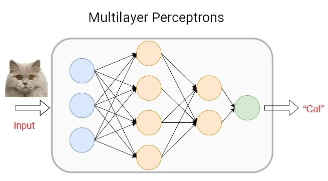
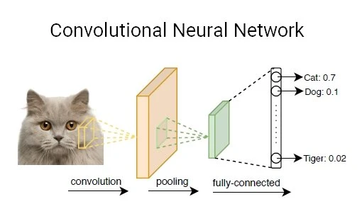
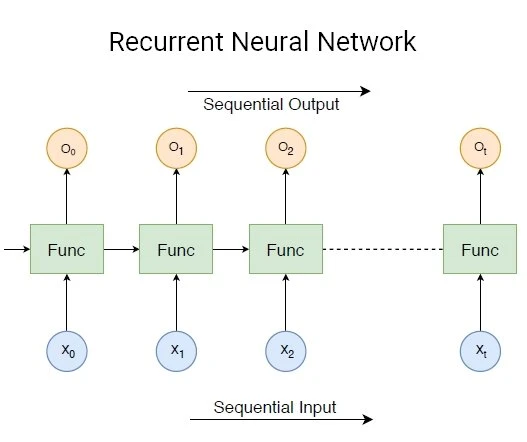

# Deep Neural Network

Deep neural networks (DNNs) have recently demonstrated impressive performance in complex machine learning tasks such as image classification or text and speech recognition.

## What Is a Deep Neural Network? 
Machine learning techniques have been widely applied in various areas such as pattern recognition, natural language processing, and computational learning. During the past decades, machine learning has brought enormous influence on our daily life with examples including efficient web search, self-driving systems, computer vision, and optical character recognition (OCR). 

Especially, deep neural network models have become a powerful tool for machine learning and artificial intelligence. A deep neural network (DNN) is an artificial neural network (ANN) with multiple layers between the input and output layers. 

The success of deep neural networks has led to breakthroughs such as reducing word error rates in speech recognition by 30% over traditional approaches (the biggest gain in 20 years) or drastically cutting the error rate in an image recognition competition since 2012 (from 26% to 3.5% while humans achieve 5%). 

## What makes a Neural Network “Deep”? 

Deep neural networks employ deep architectures in neural networks. “Deep” refers to functions with higher complexity in the number of layers and units in a single layer. 

The two key phases of neural networks are called training (or learning) and inference (or prediction), and they refer to the development phase versus production or application. When creating the architecture of deep network systems, the developer chooses the number of layers and the type of neural network, and training determines the weights.  

## Types of Deep Neural Networks 

### Multilayer Perceptrons (MLPs) 

A multilayer perceptron (MLP) is a class of a feedforward artificial neural network (ANN). MLPs models are the most basic deep neural network, which is composed of a series of fully connected layers. 

Each new layer is a set of nonlinear functions of a weighted sum of all outputs (fully connected) from the prior one.

### Convolutional Neural Network (CNN) 

A convolutional neural network (CNN, or ConvNet) is another class of deep neural networks. CNNs are most commonly employed in computer vision. Given a series of images or videos from the real world, with the utilization of CNN, the AI system learns to automatically extract the features of these inputs to complete a specific task, e.g., image classification, face authentication, and image semantic segmentation. 

Different from fully connected layers in MLPs, in CNN models, one or multiple convolution layers extract the simple features from input by executing convolution operations. Each layer is a set of nonlinear functions of weighted sums at different coordinates of spatially nearby subsets of outputs from the prior layer, which allows the weights to be reused.

### Recurrent Neural Network (RNN) 

A recurrent neural network (RNN) is another class of artificial neural networks that use sequential data feeding. RNNs have been developed to address the time-series problem of sequential input data. 

The input of RNN consists of the current input and the previous samples. Therefore, the connections between nodes form a directed graph along a temporal sequence. Furthermore, each neuron in an RNN owns an internal memory that keeps the information of the computation from the previous samples.

RNN models are widely used in Natural Language Processing (NLP) due to the superiority of processing the data with an input length that is not fixed. The task of the AI here is to build a system that can comprehend natural language spoken by humans, e.g., natural language modeling, word embedding, and machine translation. 

In RNNs, each subsequent layer is a collection of nonlinear functions of weighted sums of outputs and the previous state. Thus, the basic unit of RNN is called “cell”, and each cell consists of layers and a series of cells that enables the sequential processing of recurrent neural network models.

## References

- [Deep Neural Network: The 3 Popular Types (MLP, CNN and RNN)](https://viso.ai/deep-learning/deep-neural-network-three-popular-types/)