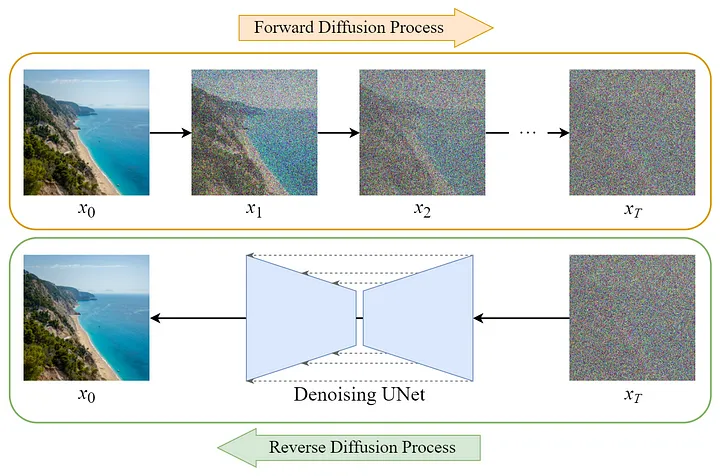
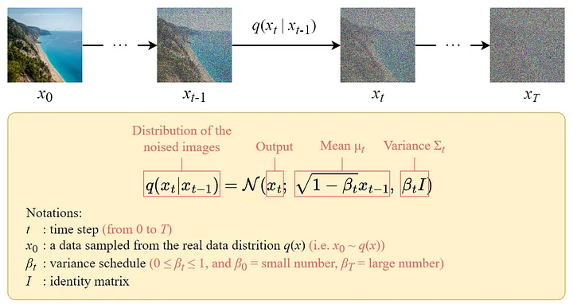
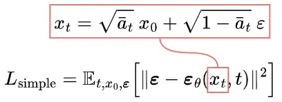
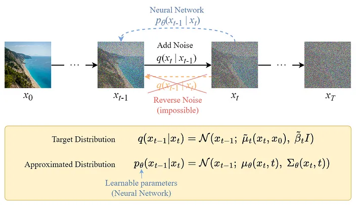
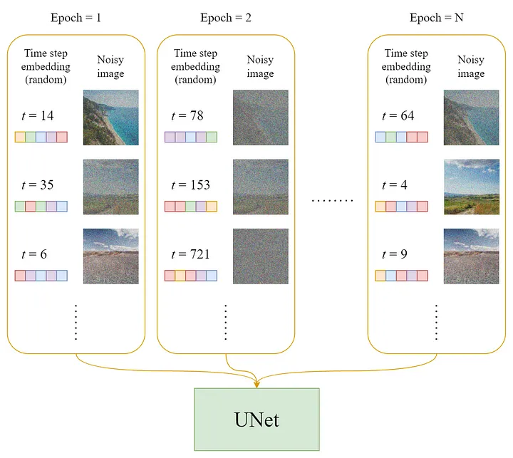
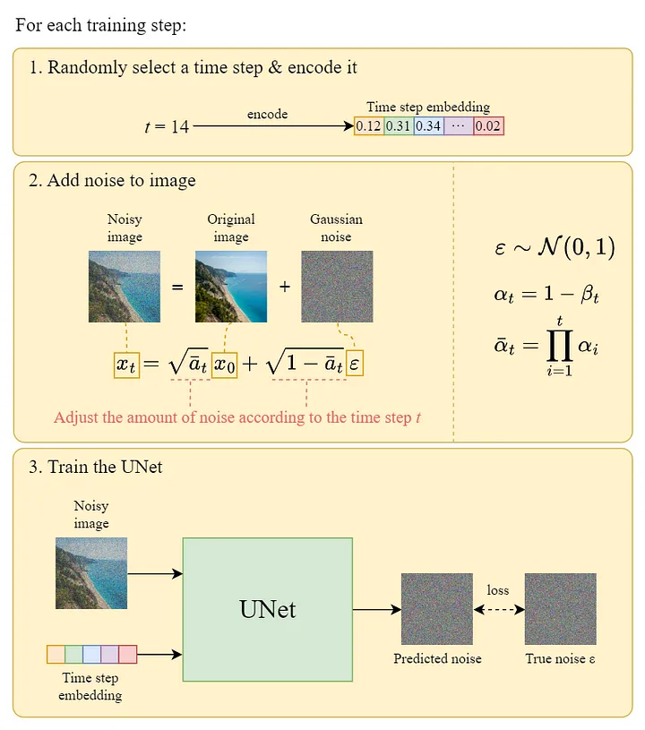
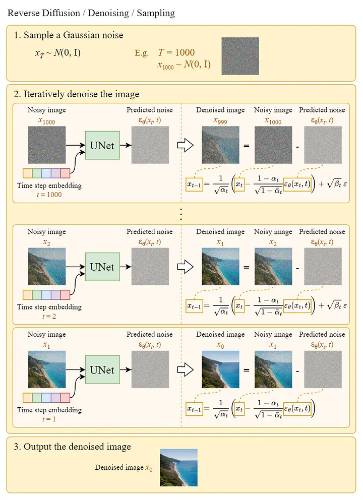

# Diffusion Model

The rise of the Diffusion Model can be regarded as the main factor for the recent breakthrough in the AI generative artworks field.

Diffusion models define a Markov chain of diffusion steps to slowly add random noise to data and then learn to reverse the diffusion process to construct desired data samples from the noise. Unlike VAE or flow models, diffusion models are learned with a fixed procedure and the latent variable has high dimensionality (same as the original data).

## Overview

The training of the Diffusion Model can be divided into two parts:

* Forward Diffusion Process → add noise to the image.

* Reverse Diffusion Process → remove noise from the image.

## Forward Diffusion Process

The forward diffusion process adds Gaussian noise to the input image step by step. Nonetheless, it can be done faster using the following closed-form formula to directly get the noisy image at a specific time step t:

## Reverse Diffusion Process

Since the reverse diffusion process is not directly computable, we train a neural network εθ to approximate it.

The training objective (loss function) is as follows:

## The U-Net Model

In each epoch:

* A random time step t will be selected for each training sample (image).

* Apply the Gaussian noise (corresponding to t) to each image.

* Convert the time steps to embeddings (vectors).

## Sampling

Sampling means painting an image from Gaussian noise. The following diagram shows how we can use the trained U-Net to generate an image:

## Summary

* The Diffusion model is divided into two parts: forward diffusion and reverse diffusion.

* The forward diffusion can be done using the closed-form formula.

* The backward diffusion can be done using a trained neural network.

* To approximate the desired denoising step q, we just need to approximate the noise εₜ using a neural network εθ.

* Training on the simplified loss function yields better sample quality.

## References

* [What are Diffusion Models?](https://lilianweng.github.io/posts/2021-07-11-diffusion-models/)
* [Diffusion Model Clearly Explained!](https://medium.com/@steinsfu/diffusion-model-clearly-explained-cd331bd41166)
