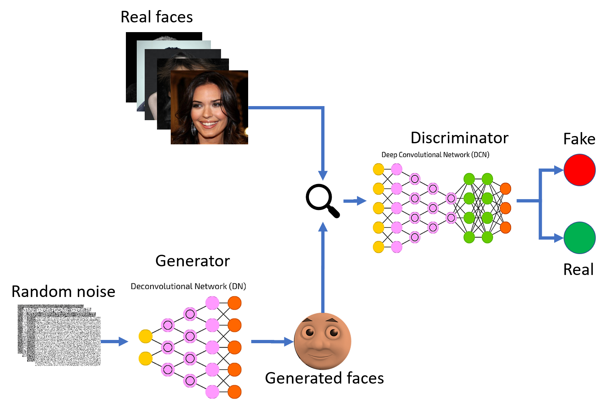
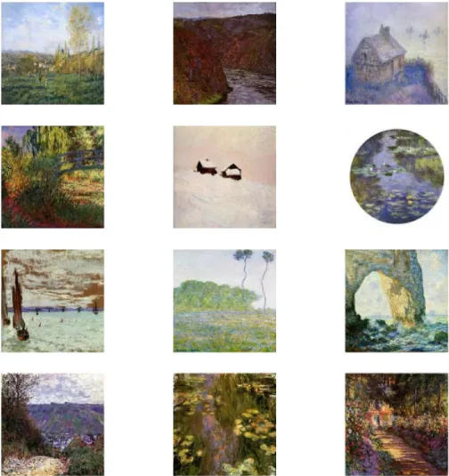

# Generative Adversarial Network (GAN)

A generative adversarial network is a class of machine learning frameworks. Based on a training data set, a GAN learns to generate new data with the same statistics as the training set. The data created by the GAN can be anything, such as images, videos, or text.

A `generative model` is a type of machine learning algorithm that is used to generate new data based on a given set of input data. This can be useful for tasks such as image generation, text generation, and other types of data synthesis.

The `discriminative model` is a type of machine learning algorithm that is used to distinguish between different categories of data, for example, for image classification and object detection. A generative modeling algorithm, on the other hand, is used to generate new data that is similar to the data that was used to train the model. One of the key differences between generative and discriminative models is that a generative model can generate new examples, while a discriminative model can classify data.

GAN consists of two models:

* A discriminator D estimates the probability of a given sample coming from the real dataset. It works as a critic and is optimized to tell the fake samples from the real ones.
* A generator G outputs synthetic samples given a noise variable input z (z brings in potential output diversity). It is trained to capture the real data distribution so that its generative samples can be as real as possible, or in other words, can trick the discriminator to offer a high probability.

These two models compete against each other during the training process: the generator G is trying hard to trick the discriminator, while the critic model D is trying hard not to be cheated. This interesting zero-sum game between two models motivates both to improve their functionalities.

## How do GANs work? 

The architecture of a GAN consists of two separate neural networks that are pitted against each other in a game-like scenario. The first network, known as the generator, tries to create fake data that looks real. The second network, known as the discriminator, tries to distinguish between data generated by the GAN (fake data) and real data. 

The image below visualizes the concept of how GANs work: Generative adversarial nets are trained until they reach a point when they both cannot improve because the generative distribution (green) is equal to the data generating distribution (dotted line). And the discriminator is unable to differentiate between the two distributions (dashed blue line shows the discriminative distribution).

## The most popular applications of GANs 

GANs can be used for a variety of AI tasks, such as machine learning based image generation, video generation, and text generation (for example, in natural language processing, NLP). The major benefit of generative adversarial networks is that they can be used to create new data instances where data collection is difficult or impossible.

- Create art with AI

- Face generation

- Improve image quality 

Other applications for GANs include image super-resolution, where a low-resolution image is upscaled to a higher resolution. A generative adversarial network can be used to remove artifacts from images or to improve the resolution of images. Additionally, GANs can be used to colorize black and white images or to add new details to an image.  

## References

- [A Beginner Guide to Generative Adversarial Networks (GANs)](https://viso.ai/deep-learning/generative-adversarial-networks-gan/)