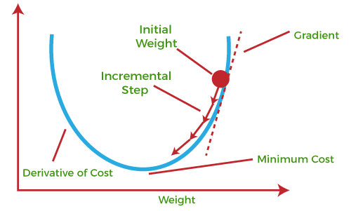

# Gradient Descent

Gradient Descent is known as one of the most commonly used optimization algorithms to train machine learning models by means of minimizing errors between actual and expected results. Further, gradient descent is also used to train Neural Networks.

In mathematical terminology, Optimization algorithm refers to the task of minimizing/maximizing an objective function f(x) parameterized by x. Similarly, in machine learning, optimization is the task of minimizing the cost function parameterized by the model's parameters. The main objective of gradient descent is to minimize the convex function using iteration of parameter updates. Once these machine learning models are optimized, these models can be used as powerful tools for Artificial Intelligence and various computer science applications.

## What is Gradient Descent or Steepest Descent?

Gradient descent was initially discovered by "Augustin-Louis Cauchy" in mid of 18th century. __Gradient Descent is defined as one of the most commonly used iterative optimization algorithms of machine learning to train the machine learning and deep learning models__. It helps in finding the local minimum of a function.

The best way to define the local minimum or local maximum of a function using gradient descent is as follows:

- If we move towards a negative gradient or away from the gradient of the function at the current point, it will give the local minimum of that function.
- Whenever we move towards a positive gradient or towards the gradient of the function at the current point, we will get the local maximum of that function.

## References

- [Gradient Descent in Machine Learning](https://www.javatpoint.com/gradient-descent-in-machine-learning)