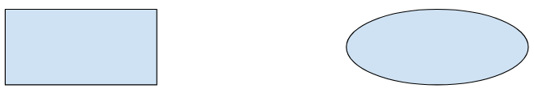

# Gradient Descent

Gradient Descent is known as one of the most commonly used optimization algorithms to train machine learning models by means of minimizing errors between actual and expected results. Further, gradient descent is also used to train Neural Networks.

In mathematical terminology, Optimization algorithm refers to the task of minimizing/maximizing an objective function f(x) parameterized by x. Similarly, in machine learning, optimization is the task of minimizing the cost function parameterized by the model's parameters. The main objective of gradient descent is to minimize the convex function using iteration of parameter updates. Once these machine learning models are optimized, these models can be used as powerful tools for Artificial Intelligence and various computer science applications.

## Convex set

A subset of Euclidean space such that a line drawn between any two points in the subset remains completely within the subset. For instance, the following two shapes are convex sets:



By contrast, the following two shapes are not convex sets:


## Convex Function

A function in which the region above the graph of the function is a convex set. The prototypical convex function is shaped something like the letter U. For example, the following are all convex functions:


A typical convex function is shaped like the letter 'U'.

By contrast, the following function is not convex. Notice how the region above the graph is not a convex set:


A strictly convex function has exactly one local minimum point, which is also the global minimum point. The classic U-shaped functions are strictly convex functions. However, some convex functions (for example, straight lines) are not U-shaped.

A lot of the common loss functions, including the following, are convex functions:

 * L2 loss
 * Log Loss
 * L1 regularization
 * L2 regularization

Many variations of gradient descent are guaranteed to find a point close to the minimum of a strictly convex function. Similarly, many variations of stochastic gradient descent have a high probability (though, not a guarantee) of finding a point close to the minimum of a strictly convex function.

The sum of two convex functions (for example, L2 loss + L1 regularization) is a convex function.

Deep models are never convex functions. Remarkably, algorithms designed for convex optimization tend to find reasonably good solutions on deep networks anyway, even though those solutions are not guaranteed to be a global minimum.

## What is Gradient Descent or Steepest Descent?

Gradient descent was initially discovered by "Augustin-Louis Cauchy" in mid of 18th century. __Gradient Descent is defined as one of the most commonly used iterative optimization algorithms of machine learning to train the machine learning and deep learning models__. It helps in finding the local minimum of a function.

The best way to define the local minimum or local maximum of a function using gradient descent is as follows:

- If we move towards a negative gradient or away from the gradient of the function at the current point, it will give the local minimum of that function.
- Whenever we move towards a positive gradient or towards the gradient of the function at the current point, we will get the local maximum of that function.

<p>

</p>

This entire procedure is known as Gradient Ascent, which is also known as steepest descent. __The main objective of using a gradient descent algorithm is to minimize the cost function using iteration__. To achieve this goal, it performs two steps iteratively:

- Calculates the first-order derivative of the function to compute the gradient or slope of that function.
- Move away from the direction of the gradient, which means slope increased from the current point by alpha times, where Alpha is defined as `Learning Rate`. It is a tuning parameter in the optimization process which helps to decide the length of the steps.

## Cost Function and Loss Function

The cost function is defined as the measurement of difference or error between actual values and expected values at the current position and present in the form of a single real number. It helps to increase and improve machine learning efficiency by providing feedback to this model so that it can minimize error and find the local or global minimum. Further, it continuously iterates along the direction of the negative gradient until the cost function approaches zero. At this steepest descent point, the model will stop learning further. 

Although cost function and `loss function` are considered synonymous, also there is a minor difference between them. The slight difference between the loss function and the cost function is about the error within the training of machine learning models, as loss function refers to the error of one training example, while a cost function calculates the average error across an entire training set.

The cost function is calculated after making a hypothesis with initial parameters and modifying these parameters using gradient descent algorithms over known data to reduce the cost function.

## How does Gradient Descent work?

Before starting the working principle of gradient descent, we should know some basic concepts to find out the slope of a line from linear regression. The equation for simple linear regression is given as:
```
Y=mX+c  
```
Where 'm' represents the slope of the line, and 'c' represents the intercepts on the y-axis.

<p>

</p>

The starting point(shown in above fig.) is used to evaluate the performance as it is considered just as an arbitrary point. At this starting point, we will derive the first derivative or slope and then use a tangent line to calculate the steepness of this slope. Further, this slope will inform the updates to the parameters (weights and bias).

The slope becomes steeper at the starting point or arbitrary point, but whenever new parameters are generated, then steepness gradually reduces, and at the lowest point, it approaches the lowest point, which is called a point of convergence.

Direction and `Learning Rate` are used to determine the partial derivative calculation of future iteration and allow it to the point of convergence or local minimum or global minimum. 

### Learning Rate

It is defined as the step size taken to reach the minimum or lowest point. This is typically a small value that is evaluated and updated based on the behavior of the cost function. If the learning rate is high, it results in larger steps but also leads to risks of overshooting the minimum. At the same time, a low learning rate shows the small step sizes, which compromises overall efficiency but gives the advantage of more precision.

<p>

</p>

## Types of Gradient Descent

Based on the error in various training models, the Gradient Descent learning algorithm can be divided into Batch gradient descent, stochastic gradient descent, and mini-batch gradient descent. 

### Batch Gradient Descent (BGD)

Batch gradient descent (BGD) is used to find the error for each point in the training set and update the model after evaluating all training examples. This procedure is known as the training epoch. In simple words, it is a greedy approach where we have to sum over all examples for each update.

Advantages of Batch gradient descent:

- It produces less noise in comparison to other gradient descent.
- It produces stable gradient descent convergence.

### Stochastic gradient descent (SGD)

Stochastic gradient descent (SGD) is a type of gradient descent that runs one training example per iteration. Or in other words, it processes a training epoch for each example within a dataset and updates each training example's parameters one at a time. As it requires only one training example at a time, hence it is easier to store in allocated memory. 

Advantages of Stochastic gradient descent:

In Stochastic gradient descent (SGD), learning happens on every example, and it consists of a few advantages over other gradient descent.

- It is easier to allocate in desired memory.
- It is relatively fast to compute than batch gradient descent.
- It is more efficient for large datasets.

### MiniBatch Gradient Descent:

Mini Batch gradient descent is the combination of both batch gradient descent and stochastic gradient descent. It divides the training datasets into small batch sizes then performs the updates on those batches separately. Splitting training datasets into smaller batches make a balance to maintain the computational efficiency of batch gradient descent and speed of stochastic gradient descent. Hence, we can achieve a special type of gradient descent with higher computational efficiency and less noisy gradient descent.

Advantages of Mini Batch gradient descent:

- It is easier to fit in allocated memory.
- It is computationally efficient.
- It produces stable gradient descent convergence.

## Challenges with the Gradient Descent

Although we know Gradient Descent is one of the most popular methods for optimization problems, it still also has some challenges. There are a few challenges as follows:

### Local Minima and Saddle Point

For convex problems, gradient descent can find the global minimum easily, while for non-convex problems, it is sometimes difficult to find the global minimum, where the machine learning models achieve the best results.

<p>

</p>

Whenever the slope of the cost function is at zero or just close to zero, this model stops learning further. Apart from the global minimum, there occur some scenarios that can show this slop, which is saddle point and local minimum. Local minima generate the shape similar to the global minimum, where the slope of the cost function increases on both sides of the current points.

In contrast, with saddle points, the negative gradient only occurs on one side of the point, which reaches a local maximum on one side and a local minimum on the other side. The name of a saddle point is taken by that of a horse's saddle.

The name of local minima is because the value of the loss function is minimum at that point in a local region. In contrast, the name of the global minima is given so because the value of the loss function is minimum there, globally across the entire domain the loss function.

### Vanishing and Exploding Gradient

In a deep neural network, if the model is trained with gradient descent and backpropagation, there can occur two more issues other than local minima and saddle point.

- Vanishing Gradients:
Vanishing Gradient occurs when the gradient is smaller than expected. During backpropagation, this gradient becomes smaller that causing the decrease in the learning rate of earlier layers than the later layer of the network. Once this happens, the weight parameters update until they become insignificant.

- Exploding Gradient:
Exploding gradient is just opposite to the vanishing gradient as it occurs when the Gradient is too large and creates a stable model. Further, in this scenario, model weight increases, and they will be represented as NaN. This problem can be solved using the dimensionality reduction technique, which helps to minimize complexity within the model.

## References

- [Gradient Descent in Machine Learning](https://www.javatpoint.com/gradient-descent-in-machine-learning)