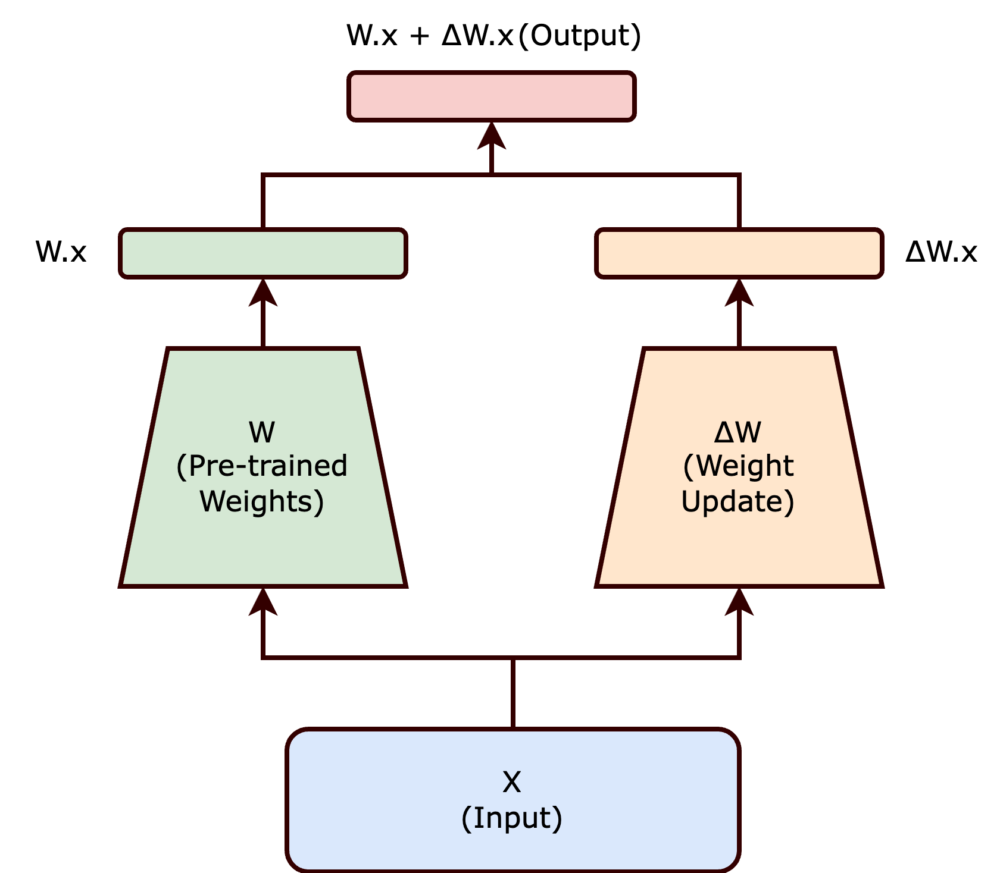

# LoRA (Low-Rank Adaptation)

LoRA is a **parameter-efficient fine-tuning** method. Instead of updating all weights of a large model (e.g. Stable Diffusion’s U-Net), you train small **low-rank** matrices and leave the base model frozen.

See also: [Stable Diffusion](stable_diffusion_model.md) · [ControlNet](controlnet.md) · [IP-Adapter](ip_adapter.md)

## Why LoRA?

Full fine-tuning of Stable Diffusion is expensive (VRAM, disk, and risk of forgetting the base model). LoRA keeps the original checkpoint and stores only a small adapter (often tens of MB instead of GBs).

Typical uses with Stable Diffusion:

* A specific **art style** or artist look
* A **character / product / person** (with care for likeness and licensing)
* A **domain** (e.g. medical photos, product shots) without replacing the whole model

You can usually **stack or swap** LoRAs at inference time without retraining the base.

## Idea in one formula



For a frozen weight matrix `W₀`, LoRA learns an update `ΔW = BA`, where `B` and `A` are thin matrices of rank `r` much smaller than the full matrix size:

```text
W = W₀ + (α / r) · B A
```

* `r` (**rank**): capacity of the adapter (common values: 4–64). Higher `r` → more expressiveness, larger file, easier overfitting.
* `α` (**scale**): how strongly the adapter is mixed in at train/inference time.

Only `A` and `B` are trained; `W₀` stays fixed.

## Where it attaches in Stable Diffusion

Classic LoRA updates **dense / linear weight matrices** (matrix multiplies), not every layer of the network. For a frozen `W`, it learns `ΔW = BA` and computes something like `h = Wx + (α/r) BAx`.

In Transformers and the SD U-Net, that usually means:

* Attention projections: `to_q`, `to_k`, `to_v`, `to_out` (the common default)
* Sometimes MLP / feed-forward **linear** layers

What default LoRA typically **does not** train: biases, LayerNorm / GroupNorm, and the full conv stack end-to-end. Convolutions *can* get LoRA-style adapters (reshape kernels or Conv-LoRA variants), but day-to-day Stable Diffusion “LoRA” almost always means low-rank adapters on **Linear** layers inside attention (and maybe FFN) — enough to shift style/subject without touching every module.

At inference: load base model → load LoRA weights → optionally set a **weight / strength** multiplier.

## LoRA vs full fine-tune vs ControlNet

| | **Full fine-tune** | **LoRA** | **ControlNet** |
|--|--------------------|----------|----------------|
| What changes | Most / all base weights | Small low-rank adapters | Extra locked-copy network + conditioning |
| Disk size | Full checkpoint (GBs) | Small (MBs–small GBs) | Separate ControlNet weights |
| Goal | Change overall behavior / domain | Style, subject, light domain shift | **Spatial structure** (pose, edges, depth, …) |
| Combinable? | N/A (new base) | Yes, with base + other LoRAs | Yes, with base + often with LoRAs |

LoRA changes **what** the model tends to draw (style/subject). [ControlNet](controlnet.md) steers **where** things go in the image. They solve different problems and are often used together.

## Compared to CycleGAN

**CycleGAN** learns **unpaired** image-to-image translation between domains A and B (e.g. photo↔painting, horse↔zebra) with **no matched pairs** — only two unordered collections of images.

In the Stable Diffusion stack, the usual stand-in is **LoRA + img2img** (not ControlNet alone):

1. Train a **LoRA** on unpaired images from the **target style / domain** only.
2. At inference, run **img2img**: encode the source image, partially denoise with the style LoRA + a domain prompt.

That shifts look/texture/domain while roughly keeping the input’s content.

| | **CycleGAN** | **LoRA + img2img** |
|--|--------------|---------------------|
| Data | Unpaired sets from domain A and B | Unpaired target-domain images (plus a pretrained SD base) |
| Learns | A↔B translators | A small adapter for domain/style B |
| Inference | Feed source image through the translator | img2img from source + LoRA (+ prompt) |
| Structure control | Implicit / cycle loss | Soft (denoise strength); harden with light [ControlNet](controlnet.md) if needed |

| Goal | Prefer |
|------|--------|
| Unpaired style / domain shift (CycleGAN-like) | **LoRA + img2img** |
| Keep exact pose / edges / layout (Pix2Pix-like) | **[ControlNet](controlnet.md)** |
| Style shift **and** locked geometry | LoRA + img2img, optionally light ControlNet |

**ControlNet alone** is the wrong fit for CycleGAN-style problems: it needs a spatial condition map and controls structure, not unpaired domain translation.

Also useful in the same family: **[IP-Adapter / style reference](ip_adapter.md)** — often no extra training; pull style from a reference image via img2img or text-to-image.

For **paired** structure→image (Pix2Pix-like), see [ControlNet](controlnet.md#compared-to-pix2pix-gan).

## Practical tips

* Start with modest rank (e.g. 8–16) and enough diverse images; raise rank only if underfitting.
* Match the LoRA to the **same base** (SD 1.5 LoRA ≠ SDXL LoRA).
* At inference, tune LoRA **strength**; too high washes out the prompt or overfits training faces/styles.
* Prefer curated captions; LoRA amplifies whatever is consistent in the training set.

## References

* E. Hu et al., [LoRA: Low-Rank Adaptation of Large Language Models](https://arxiv.org/abs/2106.09685) (2021) — original method (NLP; same idea used widely for diffusion).
* [Stable Diffusion overview](stable_diffusion_model.md)
* [ControlNet](controlnet.md)
* [IP-Adapter / style reference](ip_adapter.md)
