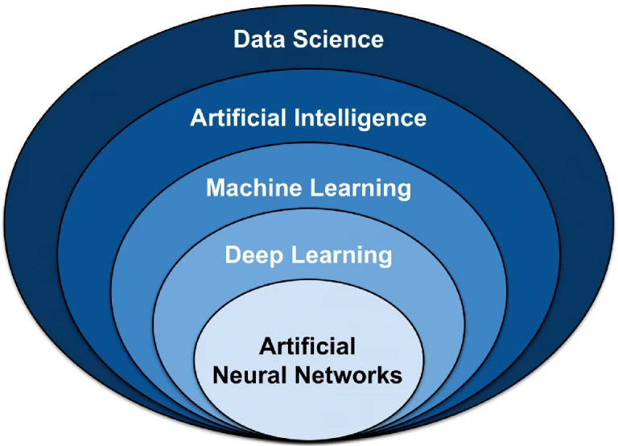
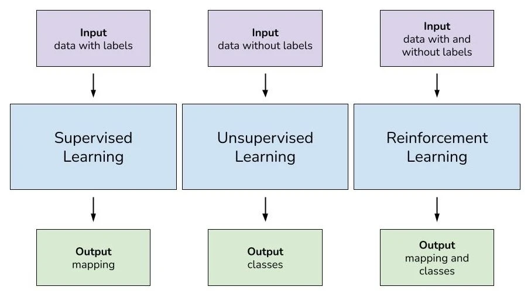
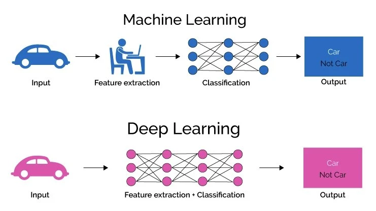

# Artificial Intelligence, Machine Learning and Deep Learning

* [What is Artifical Intelligence (AI)?](./machine_learning_and_deep_learning.md#what-is-artificial-intelligence-ai)
* [What is Machine Learning (ML)?](./machine_learning_and_deep_learning.md#what-is-machine-learning-ml)
* [What Is Deep Learning (DL)?](./machine_learning_and_deep_learning.md#what-is-deep-learning-dl) 
* [Deep Learning vs. Machine Learning](./machine_learning_and_deep_learning.md#deep-learning-vs-machine-learning)

The terms AI, machine learning, and deep learning are often used mutually and interchangeably. 

## What is Artificial Intelligence (AI)?

For over 200 years, the principal drivers of economic growth have been technological innovations. The most important of these are so-called general-purpose technologies such as the steam engine, electricity, and the internal combustion engine. Each of those innovations catalyzed waves of innovations and opportunities across industries. The most important general-purpose technology of our era is artificial intelligence. 

Artificial intelligence, or AI, is one of the oldest fields of computer science and very broad, involving different aspects of mimicking cognitive functions for real-world problem solving and building computer systems that learn and think like people. Accordingly, AI is often called machine intelligence to contrast it to human intelligence. 

The field of AI revolved around the intersection of computer science and cognitive science. AI can refer to anything from a computer program playing a game of chess to self-driving cars and computer vision systems. Due to the successes in machine learning (ML), AI now raises enormous interest. AI, and particularly machine learning (ML), is the machine’s ability to keep improving its performance without humans having to explain exactly how to accomplish all of the tasks it’s given. Within the past few years, machine learning has become far more effective and widely available. We can now build systems that learn how to perform tasks on their own.

## What is Machine Learning (ML)?

Machine learning is a subfield of AI. The core principle of machine learning is that a machine uses data to “learn” based on it. Hence, machine learning systems can quickly apply knowledge and training from large data sets to excel at people recognition, speech recognition, object detection, translation, and many other tasks. 

Unlike developing and coding a software program with specific instructions to complete a task, ML allows a system to learn to recognize patterns on its own and make predictions. 

Machine Learning is a very practical field of artificial intelligence with the aim to develop software that can automatically learn from previous data to gain knowledge from experience and to gradually improve its learning behavior to make predictions based on new data.

### Machine Learning vs. AI 

Even while Machine Learning is a subfield of AI, the terms AI and ML are often used interchangeably. Machine Learning can be seen as the “workhorse of AI” and the adoption of data-intensive machine learning methods. 

Machine learning takes in a set of data inputs and then learns from that inputted data. Hence, machine learning methods use data for context understanding, sense-making, and decision-making under uncertainty. 

As part of AI systems, machine learning algorithms are commonly used to identify trends and recognize patterns in data.

The enormous progress in machine learning has been driven by the development of novel statistical learning algorithms along with the availability of big data (large data sets) and low-cost computation.

## What Is Deep Learning (DL)? 

A nowadays extremely popular method of machine learning is deep learning (DL). Deep Learning is a family of machine learning models based on deep neural networks. 

Deep Learning is a subset of Machine Learning. It uses some ML techniques to solve real-world problems by tapping into neural networks that simulate human decision-making. 

Deep learning is best characterized by its layered structure, which is the foundation of artificial neural networks. Each layer is adding to the knowledge of the previous layer. DL tasks can be expensive, depending on significant computing resources, and require massive datasets to train models on. 

The hierarchy of concepts allows the computer to autonomously learn complicated concepts by building them out of simpler ones. Therefore, a graph of these hierarchies would be many layers deep (hence the name deep neural network).

## Deep Learning vs. Machine Learning 

Deep learning is a part of machine learning, but it’s different from traditional machine learning methods. Deep Learning has specific advantages over other forms of Machine Learning, making DL the most popular algorithmic technology of the current era. 

 

## References

- [What’s the difference between Machine Learning and Deep Learning?](https://viso.ai/deep-learning/deep-learning-vs-machine-learning/)