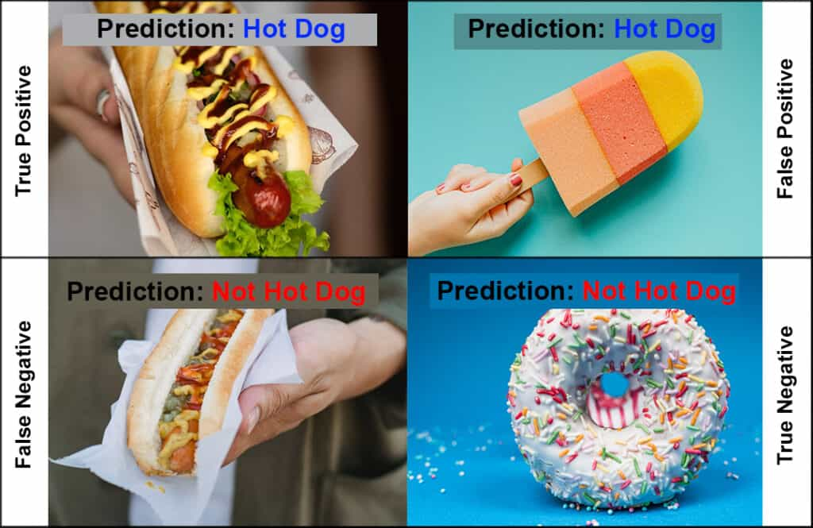
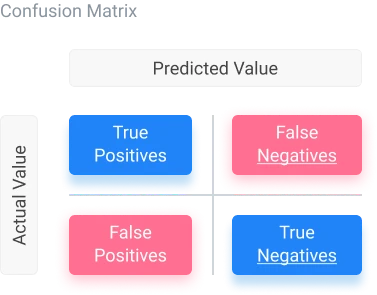
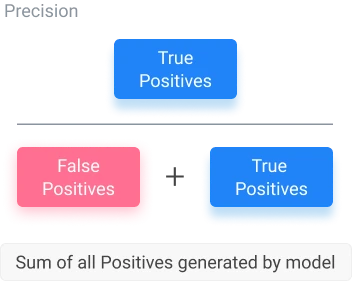
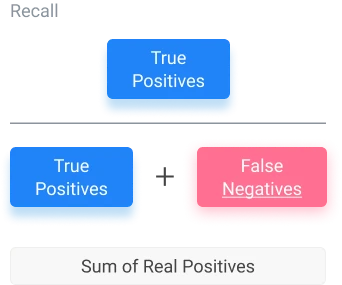
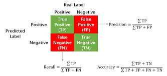
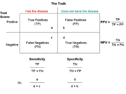
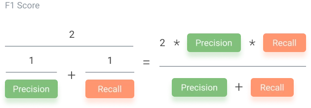

# Machine Learning Performance Evaluation

Accuracy prediction is important in any machine learning model process because it ensures that the model we created works properly and can be used with trust. The confusion matrix, precision, recall, and F1 score usually gives a better intuition of prediction results as compared to accuracy.

## Confusion Matrix

A confusion matrix is used to display parameters in a matrix format. It allows us to visualize true and false positives, as well as true and false negatives.

To understand the Confusion Matrix, let’s take an example of a classification problem. A model has to identify whether there are hot dogs in the image. The predictions can be either correct or incorrect. The following combination of predictions is possible based on the output and the actual image.

Confusion matrix is an NxN table that summarizes how successful a classification model's predictions were; that is, the correlation between the label and the model's classification. One axis of a confusion matrix is the label that the model predicted, and the other axis is the actual label. N represents the number of classes. In a binary classification problem, N=2. 

For example, here is a sample confusion matrix for a binary classification problem:

|  | Tumor(predicted) | Non-Tumor(predicted|
| --- | ---| --- | 
| Tumor (actual) |	18 |	1 |
|Non-Tumor (actual)	| 6	| 452 |

The preceding confusion matrix shows that of the 19 samples that actually had tumors, the model correctly classified 18 as having tumors (18 <b>true positives</b>), and incorrectly classified 1 as not having a tumor (1 <b>false negative</b>). Similarly, of 458 samples that actually did not have tumors, 452 were correctly classified (452 <b>true negatives</b>) and 6 were incorrectly classified (6 <b>false positives</b>).

The confusion matrix for a multi-class classification problem can help you determine mistake patterns. For example, a confusion matrix could reveal that a model trained to recognize handwritten digits tends to mistakenly predict 9 instead of 4, or 1 instead of 7.

Confusion matrices contain sufficient information to calculate a variety of performance metrics, including <b>precision</b> and <b>recall</b>.

## Precision

Precision is the percentage of positive instances out of the total predicted positive instances. It takes the total positives predicted (true or not) in the denominator and the total true positives in the numerator. In the equation below, the denominator is the sum of the true positives and false positives, while the numerator is only true positives. This equation lets us know how often the model is correct when it predicts positive values.

## Recall or TPR (True Positive Rate) 

Recall encapsulates what the percentage of positive instances out of the total real positive instances is. In this case, the “positive instances” are the model-predicted values, while the “total real positive instances” are ground truth. Because of this, the denominator will be the number of real positive instances present in the dataset (false negatives, true positives). 

## Precision and Recall

`Precision` measures the proportion of predicted positives that are actually correct. If you are wondering how to calculate precision, it is simply the __True Positives__ out of __total detections__.

`Recall` measures the proportion of actual positives that were predicted correctly. It is the __True Positives__ out of all __Ground Truths__. Mathematically, it is defined as follows.

  

## Sensitivity and Specificity (Medical Applications)

Specificity entails the percentage of negative instances out of the total actual negative instances. 

## F1 Score

F1 score is when we take the mean of precision and recall. It takes the contribution of both of them, which means that the higher the F1 score, the more accurate the model. Conversely, if the product in the numerator dips down too low, the final F1 score decreases dramatically. 

## References

- [How To Analyze the Performance of Machine Learning Models](https://viso.ai/deep-learning/analyzing-machine-learning-model-performance-strategies/)