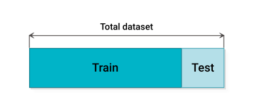
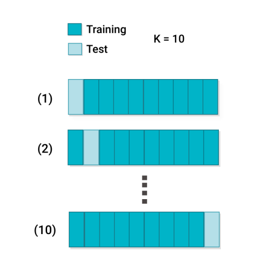
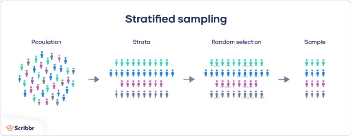
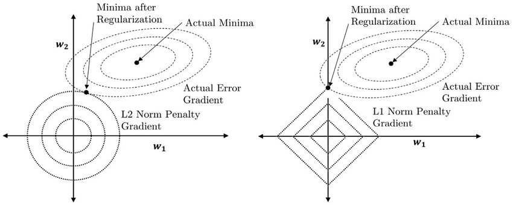
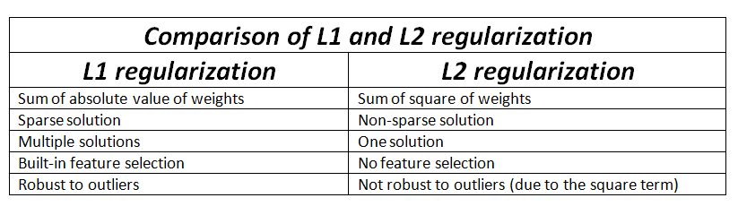
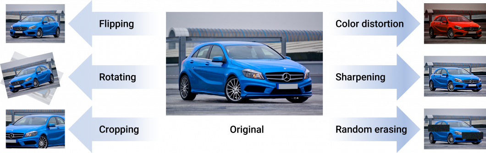

# Overfitting and Underfitting


In machine learning, overfitting and underfitting are two of the main problems that can occur during the learning process. In general, overfitting happens when a model is too complex for the data it is supposed to be modeling, while underfitting occurs when a model is not complex enough. 

<p align="center">

</p>

## What is overfitting?

In machine learning, overfitting is a phenomenon that occurs when a machine learning algorithm begins to memorize the training data rather than learning the underlying patterns. It occus when a model is too complex for the data it is supposed to be modeling. This can lead to poor performance on new data, as the algorithm is not able to generalize from the training data to other datasets. Overfitting is a common problem in machine learning, and can be caused by a variety of factors. 

## What is underfitting? 

Underfitting, on the other hand, occurs when a model is not complex enough. While there can be different causes, it is often the case that the model is not given enough data to learn from. As a result, the model is not able to learn the generalizable patterns in the data and ends up performing poorly on both the training dataset and new data points. 

An underfitted model is “too simple”, with too few features and insufficient data to build an effective model. While an overfit model has low bias and high variance – an underfit model is the opposite. It shows a high bias and low variance. Adding more features to a model that is too simple can help to limit bias.

## How to tell if a model is overfitting or underfitting? 

So, how can you tell if your model is overfitting or underfitting? One way is to look at how well it performs on new data. If your model is overfitting, it will perform well on the training data but not so well on the test set with new data. If your model is underfitting, it will perform poorly on both the training dataset and the test set. 

### Train Test Split

The train-test split procedure is a cross validation method and that is used to estimate the performance of machine learning algorithms when they are used to make predictions on data not used to train the model. They tend to inform

- Ensure that data is arranged into a format acceptable for train test split. That consists of all pre-processing steps ensuring that data does not has category in texts and data has been scaled using Simple Scaler or MinMaxScaler.

- Split the dataset into two pieces: a training set (75%) and a testing set (25%), this can be 70–30 split as well. This consists of random sampling without replacement . Note that the colour in “Features” and “Target” indicate where their data will go (“X_train”, “X_test”, “y_train”, “y_test”) for a particular train test split.

- Train the model on the training set. 

- Test the model on the testing set and evaluate the performance.

## What is a good fit in machine learning?

A good fit in machine learning is defined as a model that accurately predicts the output of __new data__. The goal of machine learning is to build models that generalize well, which means they have a low error rate on a test set with __unseen data__.

<p align="center">

</p>

## Bias and Variance

Error of a model can be split into reducible and irreducible.

- Reducible:
    - bias (“error due to squared bias”)
    - variance (“error due to variance”)

- Irreducible: the error we cannot remove with our model caused by things outside of our control, like statistical noise in observations (also called irreducible noise).

Bias — is a difference between model predictions and training data on one set.

Variance — difference between model predictions and expected value over all training sets.

```
Tip to remember:

Small variance & high bias -> underfit

High variance & small bias -> overfit
```

### Bias-variance trade-off:

Ideally, we would like our model to have low bias and low variance, however in practice it is quite hard. This trade-off helps to choose the correct model.

Simple models like linear and logistic regression usually have a high bias and a low variance. Complex models, such as random forest, generally have a low bias but a high variance.

<p align="center">

</p>

## Key Statistical Concepts of Overfitting 

In the following, we summarize the most important statistical concepts in overfitting. 
- Noise is unexplained and random variation inherent to the data (biological noise) or introduced by variables of no interest (procedural noise, including measurement errors, and site variation). 
- Overfitting is over-learning of random patterns associated with noise or memorization in the training data. Overfitting leads to a significantly decreased ability to generalize to new validation data. 
- Bias quantifies the error term introduced by approximating highly complicated real-life problems with a much simpler statistical model. Machine learning models with high bias tend to underfit. 
- Variance refers to learning random structure irresponsible of the underlying true signal. Models with high variance tend to overfit. 
- Data Leakage is the concept of “looking at data twice” (Contamination). Overfitting happens when observations used for testing also re-occur in the training process. The model then “remembers” instead of learning the underlying association. 
- Model Selection is the iterative process using resampling such as k-fold cross-validation to fit different models in the training set. 
- Model Assessment is the evaluation of a model’s out-of-sample performance. This should be conducted on a test set of data that was set aside and not used in training or model selection. The use of multiple measures of performance (AUC, F1 Score, etc.) is recommended. 
- Resampling methods fit a model multiple times on different subsets of the training data. Popular techniques are k-fold cross-validation and bootstrap. 
- k-Fold Cross-Validation is used to divide the data into k equally sized folds/sets. Iteratively, k − 1 data is used for training and evaluated on the remaining unseen fold. Each fold is used for testing once. 
- LOOCV (leave-one-out cross-validation) is a variation of cross-validation. Each observation is left out once, and the model is trained on the remaining data and then evaluated on the held-out observation. 
- Bootstrap allows estimating the uncertainty associated with any given model. In typically 1’000 to 10’000 iterations, bootstrapped samples are repetitively drawn with replacements from the original data, the predictive model is iteratively fit and evaluated. 
- Hyperparameter Tuning deals with hyperparameters that determine how a statistical model learns and have to be specified before training. They are model specific and might include regularization parameters penalizing the model’s complexity (ridge, lasso), number of trees and their depth (random forest), and many more. Hyperparameters can be tuned, that is, iteratively improved to find the model that performs best given the complexity of the available data.

## Causes of overfitting of a machine learning model 

There are several causes of overfitting. The first is using too few training examples. If the model is only trained on a few examples, it is more likely to overfit. The second cause is using too many features. If the model is trained on too many features, it can learn irrelevant details that do not generalize well to other input data. Finally, overfitting can also be caused by using a complex model. Complex machine learning algorithms are more likely to overfit because they can learn details that are not relevant to the data set. 

There are common mistakes that drive overfitting risks: 

### Lack of data pre-processing 

Data pre-processing is a crucial step in any machine learning project. Without proper pre-processing, it is very likely that the machine learning algorithm will not work as expected. There are many ways to pre-process data, but some of the most common methods include imputation, normalization, and standardization. 

### Incorrect use of algorithms 

Incorrect use of algorithms is another common mistake that machine learning practitioners make. There are many different types of machine learning algorithms, and each one is designed to solve a specific type of problem. If the wrong algorithm is used for a particular problem, it is unlikely that the desired results will be achieved. 

### Poor feature engineering 

Poor feature engineering is also a common issue in machine learning. Feature engineering is the process of creating new features from existing data. This can be done in a number of ways, but some common methods include feature extraction and feature selection. If any of these steps are not done correctly, it is likely that the machine learning algorithm will overfit the data. 

### Segmentation bias in the training data 

Segmentation bias in the training dataset is another problem that can lead to poor machine learning results. Segmentation bias occurs when the training data is not representative of the entire population. This can happen for a number of reasons, but some common causes include sampling bias and selection bias. If the training data is not representative of the population, it is likely that the machine learning algorithm will not generalize well to new data. To avoid these common mistakes, it is important to have a strong understanding of the machine learning process.  

## Techniques to fight underfitting and overfitting

<p align="center">

</p>

### Cross Validation

Cross-validation is a statistical technique which involves partitioning the data into subsets, training the data on a subset and use the other subset to evaluate the model’s performance. To reduce variability we perform multiple rounds of cross-validation with different subsets from the same data.

There are 4 main types of cross validation:

1. __Holdout method__ — The holdout method is the simplest kind of cross validation. The data set is separated into two sets, called the training set and the validation/testing set. The function approximate fits a function using the training set only.

<p align="center">

</p>

2. __K-Fold Cross-Validation__: splits data in K-folds and tests each K-Fold by each K-Fold.

<p align="center">

</p>

3. __Stratified K-Fold Cross Validation__ (Lets say you are doing a fraud analysis and you have 99% no-fraud and 1% fraud, you would need to use stratification to give some more weightage to non-frauds, otherwise accuracy of your model will be too high all the time) — Stratified k-Fold is a variation of the standard k-Fold CV technique which is designed to be effective in such cases of target imbalance.

<p align="center">

</p>

4. __Leave-P-Out Cross-validation__

    Leave p-out cross-validation (LpOCV) is an exhaustive cross-validation technique, that involves using p-observation as validation data, and remaining data is used to train the model. This is repeated in all ways to cut the original sample on a validation set of p observations and a training set


### Early stopping

 Maybe there should be a callback which saves the model when the optimal error rate, accuracy or other metric improves? Or maybe just a mechanism that stops learning if nothing is improving for a couple of epochs? Knowing the right time to stop is a good way to prevent overfitting too.

### Feature selection

It is easier to do when we are working with table data: make sure all features we give to the model are important, otherwise the model will be learning extra information (which actually is not that helpful) and overfit fast. 

### Regularization
 
Regularization is a technique which prevents learning too complex model which may overfit.

L1 (Lasso Regularization) and L2 (Ridge Regularization) regularization lets us add a penalty to the cost function to push weights towards zero.

<p align="center">

</p>

<p align="center">

</p>

For computer vision problems L2 is often called a better choice, but L1 is usually chosen for indifference to outliers and is useful for feature selection. The L2 approach is also implemented in the SVM algorithm.

There is also Elastic Net regularization, which is a combination of L1 and L2 methods having all their benefits.

### Dropout for Neural Networks 

Dropout is a regularization technique to apply with a deep neural network (DNN). Dropout is a technique where you randomly ignore some of the neurons in your network during the training phase. This forces the network to learn from different parts of the data and prevents it from overfitting. 

<p align="center">

</p>

### Data Augmentation

The rise of computer vision is largely based on the success of deep learning methods that use Convolutional Neural Networks (CNN). However, these neural networks are heavily reliant on a lot of training data to avoid overfitting and poor model performance. Unfortunately, in many cases such as real-world applications, there is limited data available, and gathering enough training data is very challenging and expensive.

Data augmentation is a set of techniques that enhance the size and quality of machine learning training datasets so that better deep learning models can be trained with them.

<p align="center">

</p>

Early experiments showing the effectiveness of data augmentations come from simple image transformations, for example, horizontal flipping, color space augmentations, and random cropping. Such transformations encode many of the invariances that present challenges to image recognition tasks.

<p align="center">

</p>

There are different methods for image data augmentation: 

- __Geometric transformations__: Augmenting image data using flipping horizontally or vertically, random cropping, rotation augmentation, translation to shift images left/right/up/down, or noise injection. 
- __Color distortion__ contains changing brightness, hue, or saturation of images. Altering the color distribution or manipulating the RGB color channel histogram is used to increase model resistance to lighting biases. 
- __Kernel filters__ use image processing techniques to sharpen and blur images. Those methods aim to increase details about objects of interest or to improve motion blur resistance. 
- __Mixing images__ applies techniques to blend different images together by averaging their pixel values for each RGB channel, or with random image cropping and patching. While counterintuitive to humans, the method has shown to be effective in increasing model performance. 

- __Information deletion__ uses random erasing, cutout, and hide-and-seek methods to mask random image parts, optimally using patches filled with random pixel values. Deleting a level of information is used to increase occlusion resistance in image recognition, resulting in a notable increase in model robustness.

### Ensembling 

Machine learning technique ensembling means using more than one model to make a prediction. This can be done by training several models independently and then voting on the predictions, or by averaging the predictions of multiple models. Ensembling can help to reduce overfitting by making the predictions more robust.

## References

- [What is Overfitting in Computer Vision? How to Detect and Avoid it](https://viso.ai/computer-vision/what-is-overfitting/)