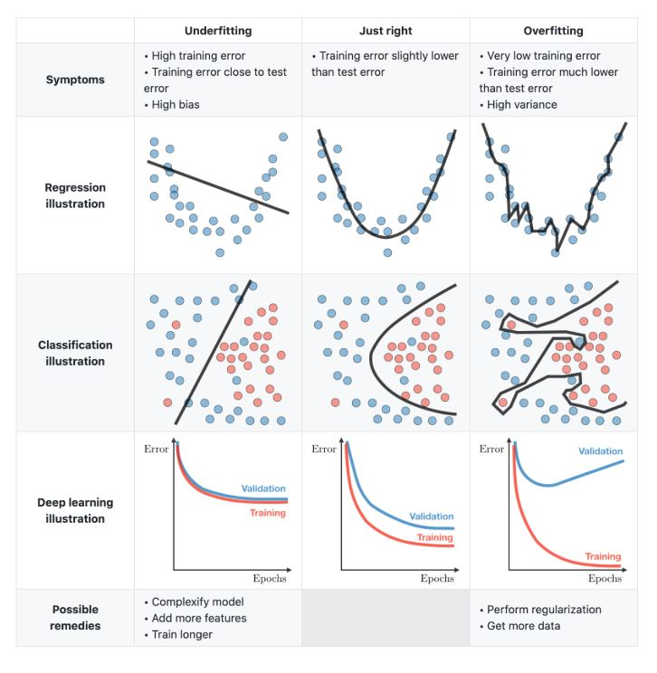
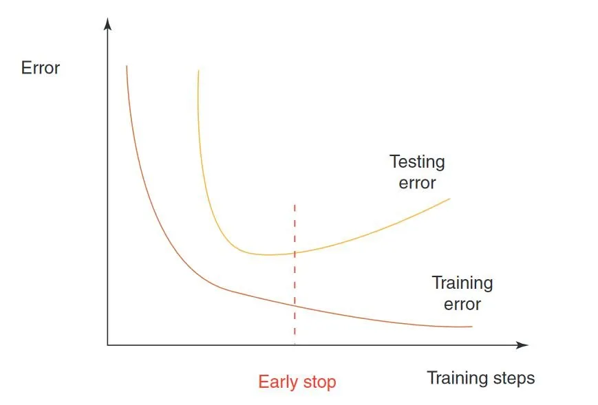
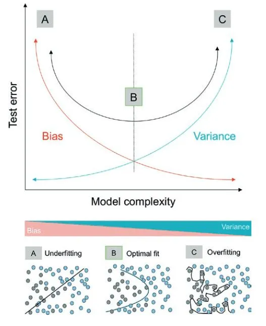
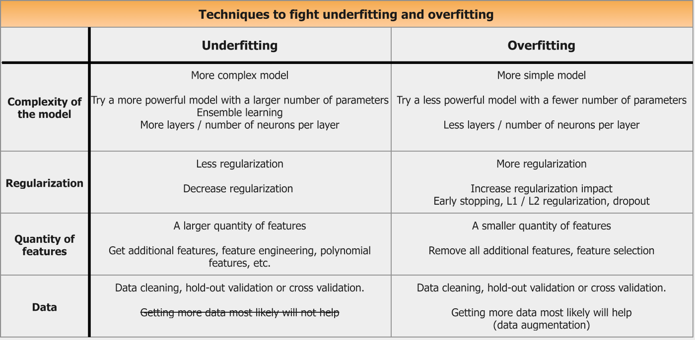
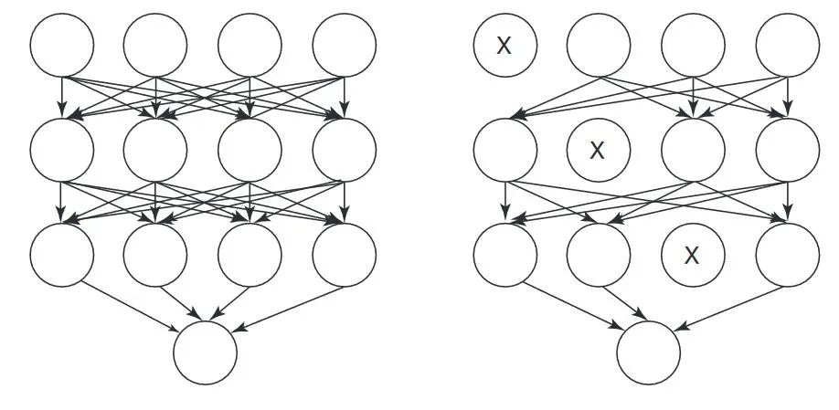
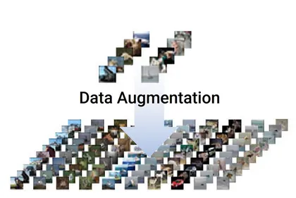

# Overfitting

When it comes to machine learning, overfitting is one of the biggest challenges that developers face. This means that the ML model has been trained on a limited data set, and as a result, it performs extremely well on that specific data set but may not generalize well to other datasets.

## What is overfitting?

In machine learning, overfitting is a phenomenon that occurs when a machine learning algorithm begins to memorize the training data rather than learning the underlying patterns. This can lead to poor performance on new data, as the algorithm is not able to generalize from the training data to other datasets. Overfitting is a common problem in machine learning, and can be caused by a variety of factors. 

### Underfitting vs. overfitting

In machine learning, overfitting and underfitting are two of the main problems that can occur during the learning process. In general, overfitting happens when a model is too complex for the data it is supposed to be modeling, while underfitting occurs when a model is not complex enough. 

#### What is overfitting? 

Overfitting occurs when a model is too complex for the data it is supposed to be modeling. This can happen for a variety of reasons, but one of the most common is that the model is simply trying to learn too much from the data. When this occurs, the model ends up memorizing the training data instead of learning generalizable patterns. As a result, the model performs well on the training dataset but does not generalize well to new data. 

#### What is underfitting? 

Underfitting, on the other hand, occurs when a model is not complex enough. While there can be different causes, it is often the case that the model is not given enough data to learn from. As a result, the model is not able to learn the generalizable patterns in the data and ends up performing poorly on both the training dataset and new data points. 

An underfitted model is “too simple”, with too few features and insufficient data to build an effective model. While an overfit model has low bias and high variance – an underfit model is the opposite. It shows a high bias and low variance. Adding more features to a model that is too simple can help to limit bias.

#### How to tell if a model is overfitting or underfitting? 

So, how can you tell if your model is overfitting or underfitting? One way is to look at how well it performs on new data. If your model is overfitting, it will perform well on the training data but not so well on the test set with new data. If your model is underfitting, it will perform poorly on both the training dataset and the test set. 

#### What is a good fit in machine learning?

A good fit in machine learning is defined as a model that accurately predicts the output of __new data__. The goal of machine learning is to build models that generalize well, which means they have a low error rate on a test set with __unseen data__.

## Key Statistical Concepts of Overfitting 

In the following, we summarize the most important statistical concepts in overfitting. 
- Noise is unexplained and random variation inherent to the data (biological noise) or introduced by variables of no interest (procedural noise, including measurement errors, and site variation). 
- Overfitting is over-learning of random patterns associated with noise or memorization in the training data. Overfitting leads to a significantly decreased ability to generalize to new validation data. 
- Bias quantifies the error term introduced by approximating highly complicated real-life problems with a much simpler statistical model. Machine learning models with high bias tend to underfit. 
- Variance refers to learning random structure irresponsible of the underlying true signal. Models with high variance tend to overfit. 
- Data Leakage is the concept of “looking at data twice” (Contamination). Overfitting happens when observations used for testing also re-occur in the training process. The model then “remembers” instead of learning the underlying association. 
- Model Selection is the iterative process using resampling such as k-fold cross-validation to fit different models in the training set. 
- Model Assessment is the evaluation of a model’s out-of-sample performance. This should be conducted on a test set of data that was set aside and not used in training or model selection. The use of multiple measures of performance (AUC, F1 Score, etc.) is recommended. 
- Resampling methods fit a model multiple times on different subsets of the training data. Popular techniques are k-fold cross-validation and bootstrap. 
- k-Fold Cross-Validation is used to divide the data into k equally sized folds/sets. Iteratively, k − 1 data is used for training and evaluated on the remaining unseen fold. Each fold is used for testing once. 
- LOOCV (leave-one-out cross-validation) is a variation of cross-validation. Each observation is left out once, and the model is trained on the remaining data and then evaluated on the held-out observation. 
- Bootstrap allows estimating the uncertainty associated with any given model. In typically 1’000 to 10’000 iterations, bootstrapped samples are repetitively drawn with replacements from the original data, the predictive model is iteratively fit and evaluated. 
- Hyperparameter Tuning deals with hyperparameters that determine how a statistical model learns and have to be specified before training. They are model specific and might include regularization parameters penalizing the model’s complexity (ridge, lasso), number of trees and their depth (random forest), and many more. Hyperparameters can be tuned, that is, iteratively improved to find the model that performs best given the complexity of the available data.

## Causes of overfitting of a machine learning model 

There are several causes of overfitting. The first is using too few training examples. If the model is only trained on a few examples, it is more likely to overfit. The second cause is using too many features. If the model is trained on too many features, it can learn irrelevant details that do not generalize well to other input data. Finally, overfitting can also be caused by using a complex model. Complex machine learning algorithms are more likely to overfit because they can learn details that are not relevant to the data set. 

There are common mistakes that drive overfitting risks: 

### Lack of data pre-processing 

Data pre-processing is a crucial step in any machine learning project. Without proper pre-processing, it is very likely that the machine learning algorithm will not work as expected. There are many ways to pre-process data, but some of the most common methods include imputation, normalization, and standardization. 

### Incorrect use of algorithms 

Incorrect use of algorithms is another common mistake that machine learning practitioners make. There are many different types of machine learning algorithms, and each one is designed to solve a specific type of problem. If the wrong algorithm is used for a particular problem, it is unlikely that the desired results will be achieved. 

### Poor feature engineering 

Poor feature engineering is also a common issue in machine learning. Feature engineering is the process of creating new features from existing data. This can be done in a number of ways, but some common methods include feature extraction and feature selection. If any of these steps are not done correctly, it is likely that the machine learning algorithm will overfit the data. 

### Segmentation bias in the training data 

Segmentation bias in the training dataset is another problem that can lead to poor machine learning results. Segmentation bias occurs when the training data is not representative of the entire population. This can happen for a number of reasons, but some common causes include sampling bias and selection bias. If the training data is not representative of the population, it is likely that the machine learning algorithm will not generalize well to new data. To avoid these common mistakes, it is important to have a strong understanding of the machine learning process.  

## Techniques to fight underfitting and overfitting

### Dropout for Neural Networks 

Dropout is a regularization technique to apply with a deep neural network (DNN). Dropout is a technique where you randomly ignore some of the neurons in your network during the training phase. This forces the network to learn from different parts of the data and prevents it from overfitting. 

### Training Data Augmentation 

You can also use data augmentation, which is where you artificially create more data. To augment a data set, you can generate image variations with different angles, distortion, or different lighting. For example, if you have a dataset of images of cats and dogs, you can use test data augmentation to generate new images of cats and dogs by applying random transformations to the existing images. This will help the model to learn from more data and improve the accuracy of the predictions.

### Ensembling 

Machine learning technique ensembling means using more than one model to make a prediction. This can be done by training several models independently and then voting on the predictions, or by averaging the predictions of multiple models. Ensembling can help to reduce overfitting by making the predictions more robust.

## References

- [What is Overfitting in Computer Vision? How to Detect and Avoid it](https://viso.ai/computer-vision/what-is-overfitting/)