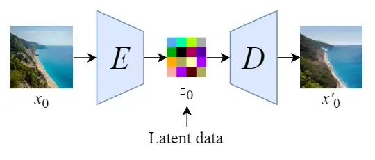
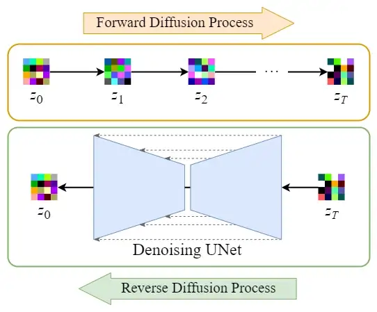
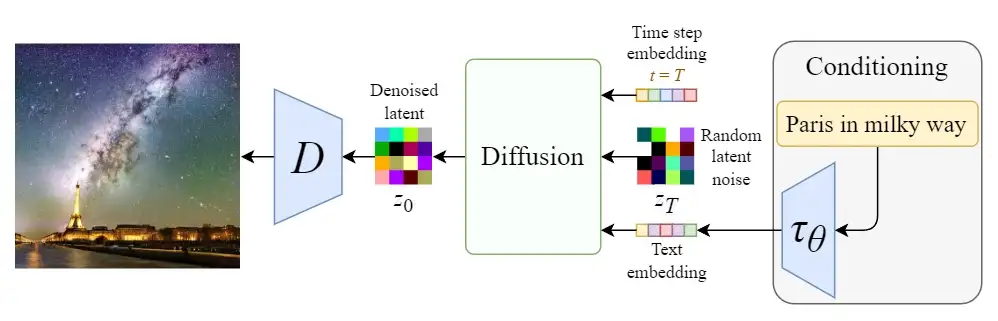
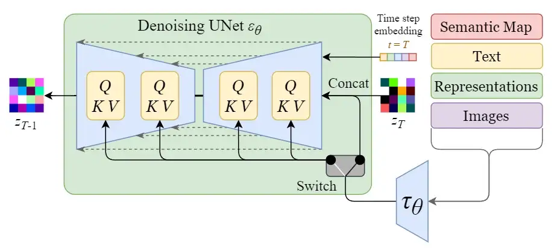
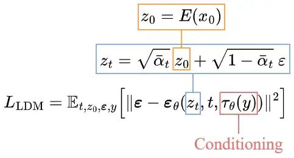
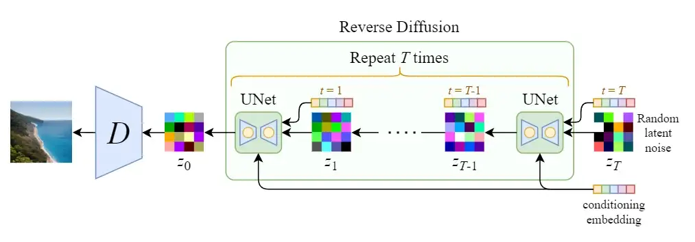
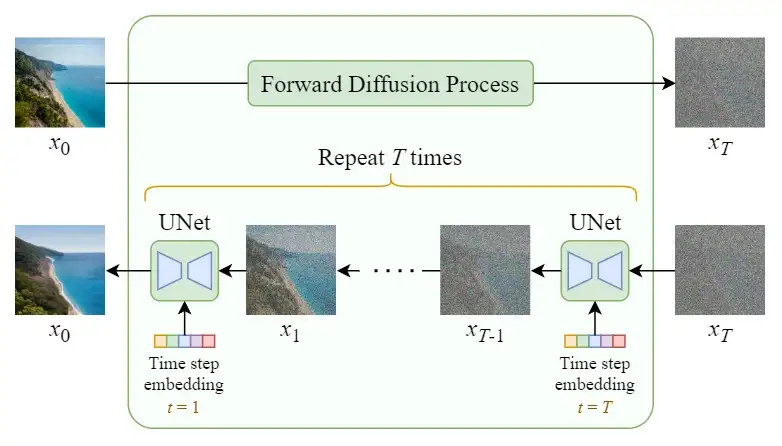
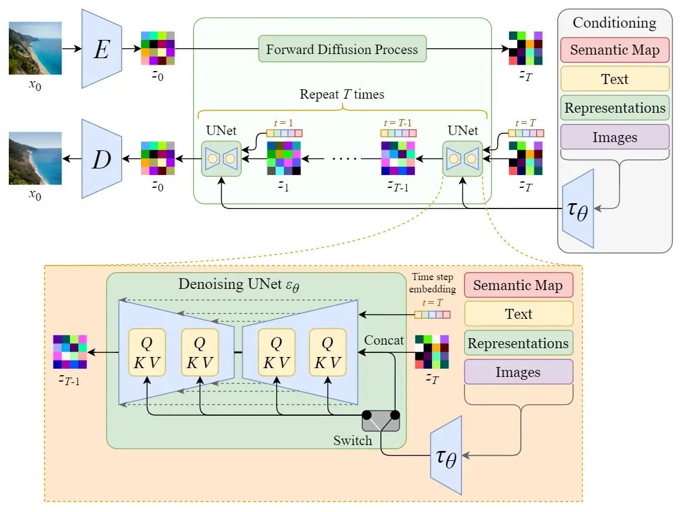

# Stable Diffusion

The rise of the Diffusion Model can be regarded as the main factor for the recent breakthrough in the AI generative artworks field.

Most of the recent AI art found on the internet is generated using the Stable Diffusion model.

## Diffusion Speed Problem

The diffusing (sampling) process iteratively feeds a full-sized image to the U-Net to get the final result. This makes the pure Diffusion model extremely slow when the number of total diffusing steps T and the image size are large.

Hereby, Stable Diffusion is designed to tackle this problem.

## Stable Diffusion

The original name of Stable Diffusion is <b>“Latent Diffusion Model” (LDM)</b>. As its name points out, the Diffusion process happens in the latent space. This is what makes it faster than a pure Diffusion model.

We will first train an autoencoder to learn to compress the image data into lower-dimensional representations.

* By using the trained encoder E, we can encode the full-sized image into lower dimensional latent data (compressed data).

* By using the trained decoder D, we can decode the latent data back into an image.

## Latent Diffusion

After encoding the images into latent data, the forward and reverse diffusion processes will be done in the latent space.

1. Forward Diffusion Process → add noise to the <b>latent data</b>.
2. Reverse Diffusion Process → remove noise from the <b>latent data</b>.

## Conditioning

The true power of the Stable Diffusion model is that it can generate images from text prompts. This is done by modifying the inner diffusion model to accept conditioning inputs.

The inner diffusion model is turned into a conditional image generator by augmenting its denoising U-Net with the cross-attention mechanism.

The switch in the above diagram is used to control between different types of conditioning inputs:

* For text inputs, they are first converted into embeddings (vectors) using a language model 𝜏θ (e.g. BERT, CLIP), and then they are mapped into the U-Net via the (multi-head) <b>Attention(Q, K, V)</b> layer.

* For other spatially aligned inputs (e.g. semantic maps, images, inpainting), the conditioning can be done using concatenation.

## Training

The training objective (loss function) is pretty similar to the one in the pure diffusion model. The only changes are:

* Input latent data zₜ instead of the image xₜ.

* Added conditioning input 𝜏θ(y) to the U-Net.

## Sampling

Since the size of the latent data is much smaller than the original images, the denoising process will be much faster.

## Architecture Comparison

Finally, let’s compare the overall architectures of the pure diffusion model and the stable diffusion model (latent diffusion model).

### Pure Diffusion Model

### Stable Diffusion (Latent Diffusion Model)

## Summary

To quickly summarize:

* Stable Diffusion (Latent Diffusion Model) conducts the diffusion process in the latent space, and thus it is much faster than a pure diffusion model.

* The backbone diffusion model is modified to accept conditioning inputs such as text, images, semantic maps, etc.

## References

* [Stable Diffusion Clearly Explained!](https://medium.com/@steinsfu/stable-diffusion-clearly-explained-ed008044e07e)

* R. Rombach, A. Blattmann, D. Lorenz, P. Esser, and B. Ommer, [High-resolution image synthesis with Latent Diffusion Models](https://arxiv.org/abs/2112.10752).