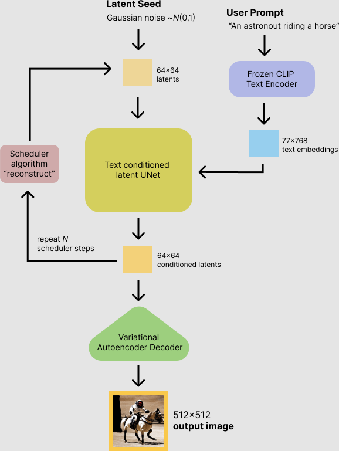
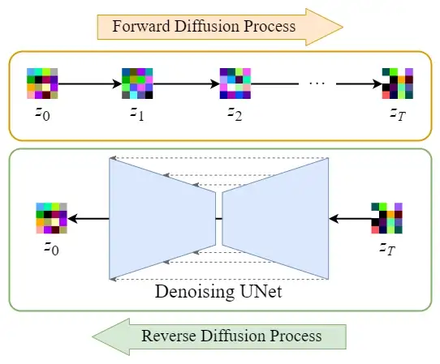
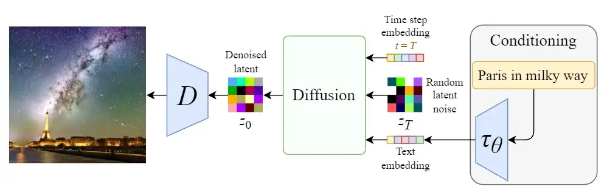
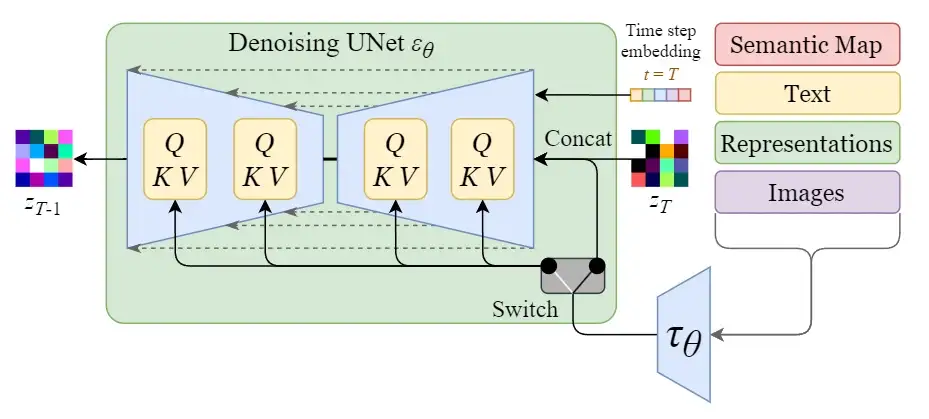
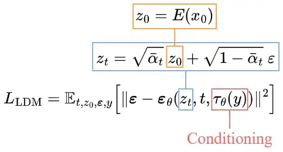
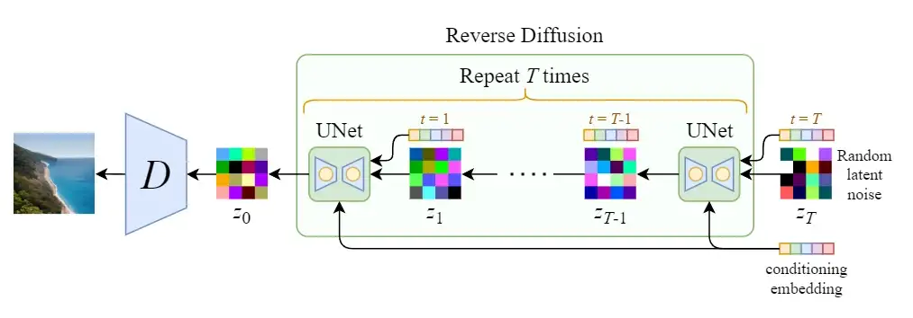
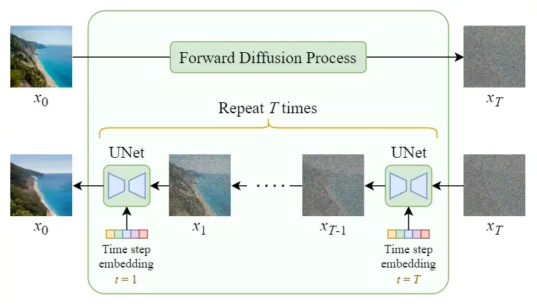
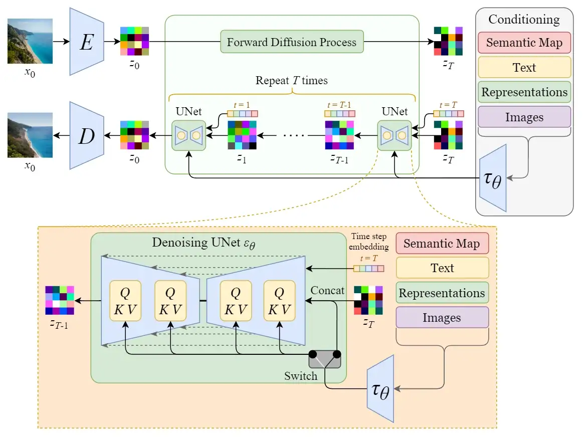
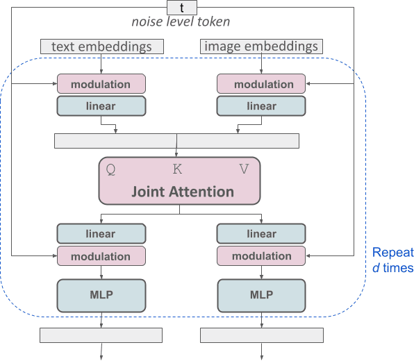
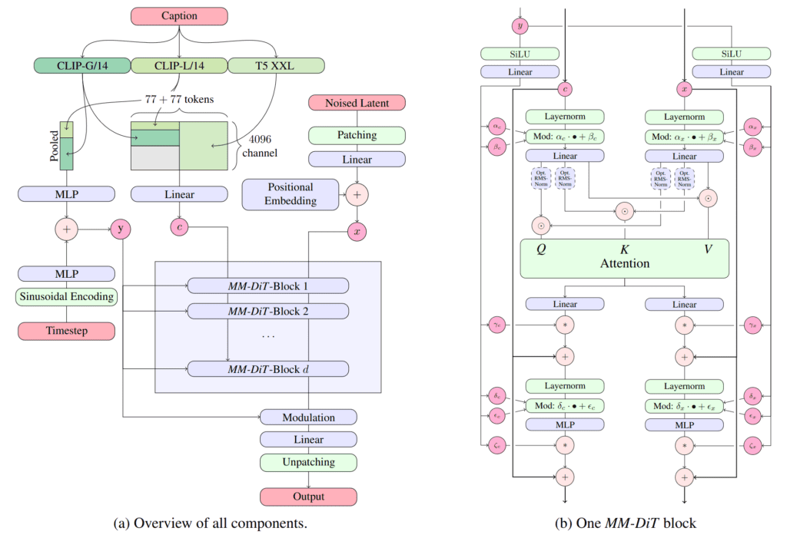

# Stable Diffusion

The rise of the Diffusion Model can be regarded as the main factor for the recent breakthrough in the AI generative artworks field.

Most of the recent AI art found on the internet is generated using the Stable Diffusion model.

## Diffusion Speed Problem

The diffusing (sampling) process iteratively feeds a full-sized image to the U-Net to get the final result. This makes the pure Diffusion model extremely slow when the number of total diffusing steps T and the image size are large.

Hereby, Stable Diffusion is designed to tackle this problem.

## Stable Diffusion

The original name of Stable Diffusion is <b>“Latent Diffusion Model” (LDM)</b>. As its name points out, the Diffusion process happens in the latent space. This is what makes it faster than a pure Diffusion model.

We will first train an autoencoder to learn to compress the image data into lower-dimensional representations.

* By using the trained encoder E, we can encode the full-sized image into lower dimensional latent data (compressed data).

* By using the trained decoder D, we can decode the latent data back into an image.

## Latent Diffusion

After encoding the images into latent data, the forward and reverse diffusion processes will be done in the latent space.

1. Forward Diffusion Process → add noise to the <b>latent data</b>.
2. Reverse Diffusion Process → remove noise from the <b>latent data</b>.

## Conditioning

The true power of the Stable Diffusion model is that it can generate images from text prompts. This is done by modifying the inner diffusion model to accept conditioning inputs.

The inner diffusion model is turned into a conditional image generator by augmenting its denoising U-Net with the cross-attention mechanism.

The switch in the above diagram is used to control between different types of conditioning inputs:

* For text inputs, they are first converted into embeddings (vectors) using a language model 𝜏θ (e.g. BERT, CLIP), and then they are mapped into the U-Net via the (multi-head) <b>Attention(Q, K, V)</b> layer.

* For other spatially aligned inputs (e.g. semantic maps, images, inpainting), the conditioning can be done using concatenation.

## Training

The training objective (loss function) is pretty similar to the one in the pure diffusion model. The only changes are:

* Input latent data zₜ instead of the image xₜ.

* Added conditioning input 𝜏θ(y) to the U-Net.

## Sampling

Since the size of the latent data is much smaller than the original images, the denoising process will be much faster.

## Architecture Comparison

Finally, let’s compare the overall architectures of the pure diffusion model and the stable diffusion model (latent diffusion model).

### Pure Diffusion Model

### Stable Diffusion (Latent Diffusion Model)

## Summary

To quickly summarize:

* Stable Diffusion (Latent Diffusion Model) conducts the diffusion process in the latent space, and thus it is much faster than a pure diffusion model.

* The backbone diffusion model is modified to accept conditioning inputs such as text, images, semantic maps, etc.

## Key concepts

These building blocks appear throughout the diagrams above. For adaptation methods beyond the base checkpoint, see [LoRA](lora.md), [ControlNet](controlnet.md), and [IP-Adapter](ip_adapter.md).

### U-Net

The **U-Net** is the denoising backbone in SD 1.5 / SDXL. It has an encoder path (downsample), a bottleneck, and a decoder path (upsample) with **skip connections** that pass spatial detail from encoder to decoder — the “U” shape.

In Stable Diffusion it does **not** operate on full RGB pixels. At each scheduler step it takes a **noisy latent**, the **timestep**, and **conditioning** (usually text embeddings via cross-attention), and predicts noise (or an equivalent update) so the latent gets cleaner. SD 3.5 replaces this U-Net with an **MMDiT** transformer, but the role is the same: iterative denoising in latent space.

Related background: [Encoder / Autoencoder / U-Net](autoencoder.md).

### Text encoder

The **text encoder** turns a prompt string into vectors the denoiser can attend to.

* Tokenize the prompt → run a language / vision-language model → produce a sequence of embeddings (e.g. CLIP: length 77, width 768 for SD 1.5).
* Those embeddings condition the U-Net (or MMDiT) through **cross-attention** (or joint attention in SD 3.5).

Different releases stack different encoders: SD 1.5 uses CLIP ViT-L; SDXL adds OpenCLIP bigG; SD 3.5 adds **T5-XXL** for stronger long-prompt and text rendering. The encoder is usually **frozen** during image-model training; only the diffusion backbone learns to use its outputs.

### VAE (Variational Autoencoder)

The **VAE** is the bridge between pixel space and latent space:

* **Encoder**: image → compact latent (e.g. 512×512 RGB → ~64×64×4 for SD 1.5).
* **Decoder**: clean latent → RGB image.

Diffusion runs in this compressed space so each U-Net step is cheaper. At inference you typically start from random latent noise, denoise with the U-Net/MMDiT, then **decode once** with the VAE. Training the LDM freezes a pretrained VAE so reconstruction quality and latent statistics stay fixed.

### Embedding

An **embedding** is a numeric vector (or sequence of vectors) that represents discrete or structured input in a form a neural net can use.

In Stable Diffusion you mostly meet:

* **Text embeddings** — output of the text encoder for each prompt token; fed into cross-attention.
* **Latents** — continuous compressed image codes (also “embeddings” of the image in latent space).
* **Timestep embeddings** — encoding of the diffusion step \(t\), injected into the denoiser so it knows how noisy the input is.

People also say “embedding” for **textual inversion** vectors (a learned pseudo-token for a concept). That is a tiny trained embedding, not the whole text encoder.

### LoRA

**LoRA** (Low-Rank Adaptation) fine-tunes a large model by training small low-rank weight updates instead of all parameters. In Stable Diffusion it is the usual way to add a style or subject as a small file on top of a frozen base checkpoint.

→ Full notes: [LoRA](lora.md) (also compared with [ControlNet](controlnet.md)).

### ControlNet

**ControlNet** adds a parallel network that reads a **spatial condition** (pose, edges, depth, scribble, …) and steers the frozen Stable Diffusion U-Net so layout follows that map while the text prompt still drives appearance.

→ Full notes: [ControlNet](controlnet.md) (also compared with [LoRA](lora.md)).

### IP-Adapter / style reference

**IP-Adapter** conditions SD with a **reference image** (an “image prompt”). **Style reference** usually means using that mainly to copy look/aesthetic without training a LoRA first.

→ Full notes: [IP-Adapter](ip_adapter.md).

## SD 1.5 vs SDXL vs SD 3.5

The sections above describe the original Latent Diffusion idea (what people usually mean by “Stable Diffusion”). Later releases keep that latent-space idea but change scale, text conditioning, and — for SD 3.5 — the backbone itself.

| | **Stable Diffusion 1.5** | **SDXL 1.0** | **Stable Diffusion 3.5** |
|--|--------------------------|--------------|---------------------------|
| **Released** | Aug 2022 | Jul 2023 | Oct 2024 |
| **Backbone** | U-Net LDM | Larger U-Net LDM (+ optional refiner) | **MMDiT** (Multimodal Diffusion Transformer) |
| **Approx. params** | ~0.86B (U-Net) | ~2.6B (base U-Net) | Medium ~2.5B; Large ~8B |
| **Native resolution** | 512×512 | 1024×1024 | 1024×1024 (scalable) |
| **Latent / VAE** | 4×64×64 at 512² | Larger latent for 1024²; improved VAE | Improved VAE; transformer denoises latents |
| **Text encoders** | CLIP ViT-L/14 | CLIP ViT-L + OpenCLIP ViT-bigG | CLIP-L + CLIP-G + **T5-XXL** |
| **Prompt following** | Good for short prompts | Better detail & composition | Strongest; much better long prompts |
| **Text / typography in image** | Weak | Improved vs 1.5 | Strongest of the three |
| **Speed / VRAM** | Fastest; lowest VRAM | Heavier than 1.5 | Heaviest (esp. Large + T5) |
| **Typical use** | Fine-tunes, ControlNet ecosystem, low-resource | High-res general generation | Best quality / text / complex prompts |
| **Ecosystem** | Largest (LoRAs, ControlNets, tools) | Large and mature | Growing; fewer legacy add-ons |

**How to read this**

* **1.5** is still the practical default when you care about fine-tunes, [ControlNet](controlnet.md), and running on modest GPUs.
* **SDXL** is the jump to native 1024² and dual text encoders while staying in the U-Net LDM family.
* **SD 3.5** replaces the U-Net with a **transformer (MMDiT)** and adds **T5**, which is why prompt adherence and on-image text improve most — at higher compute cost.

### SD 3.5 architecture

Simplified view of one repeating block: text and image streams meet in **joint attention**, with noise-level (**t**) modulation; the block is stacked **d** times.

Fuller view: three text encoders (CLIP-G, CLIP-L, T5 XXL) build conditioning **y** / context **c**; patched noised latents **x** go through stacked **MM-DiT** blocks, then unpatching to the output. Panel (b) shows one MM-DiT block in more detail.

## References

* [Stable Diffusion Clearly Explained!](https://medium.com/@steinsfu/stable-diffusion-clearly-explained-ed008044e07e)

* R. Rombach, A. Blattmann, D. Lorenz, P. Esser, and B. Ommer, [High-resolution image synthesis with Latent Diffusion Models](https://arxiv.org/abs/2112.10752).

* [LoRA](lora.md) · [ControlNet](controlnet.md) · [IP-Adapter](ip_adapter.md) · [Autoencoder / U-Net](autoencoder.md)
