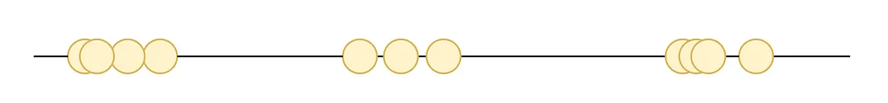
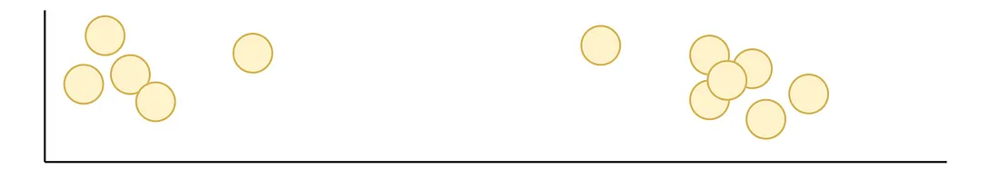
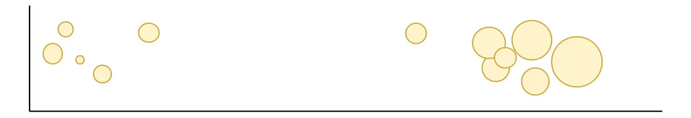
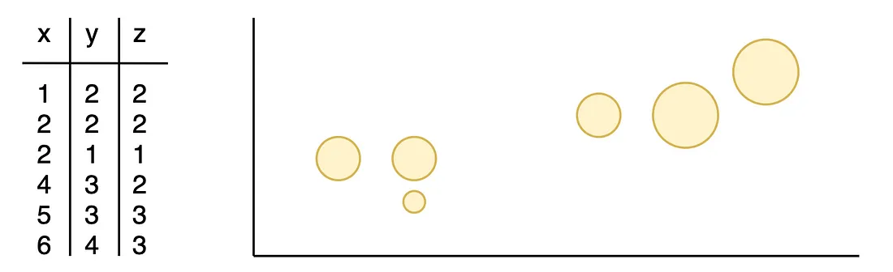
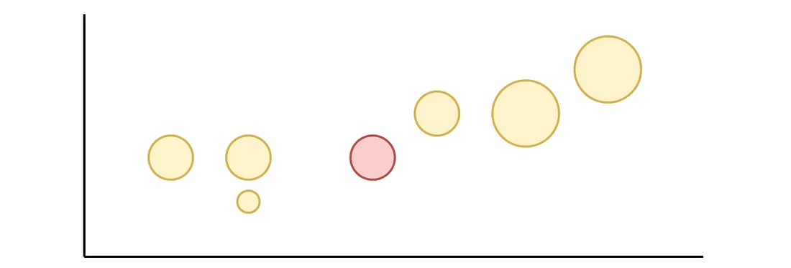
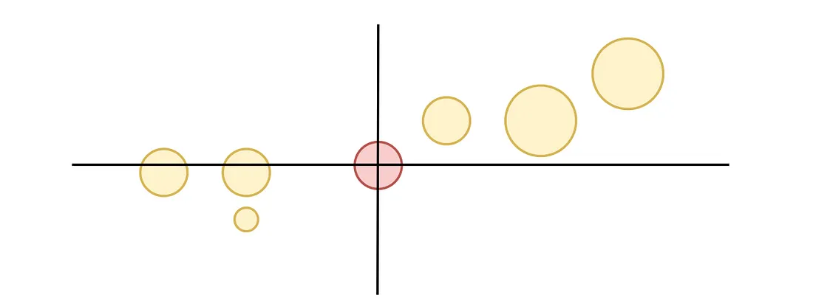
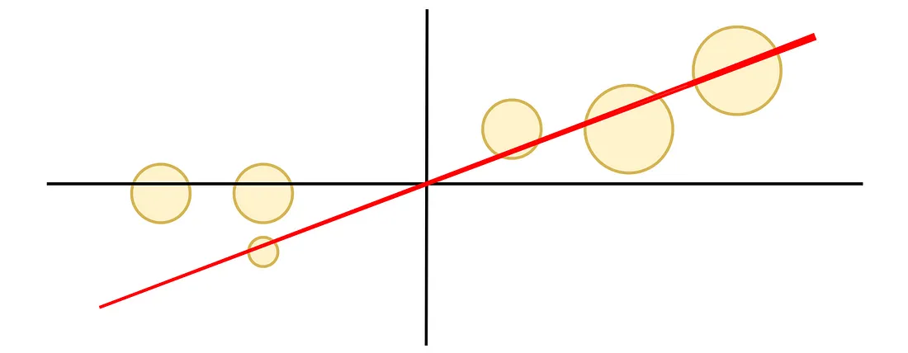
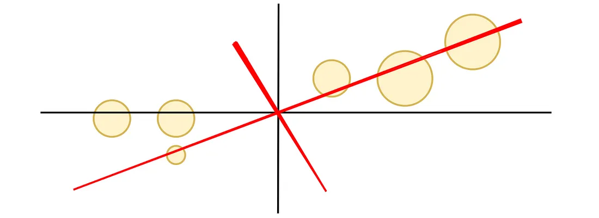
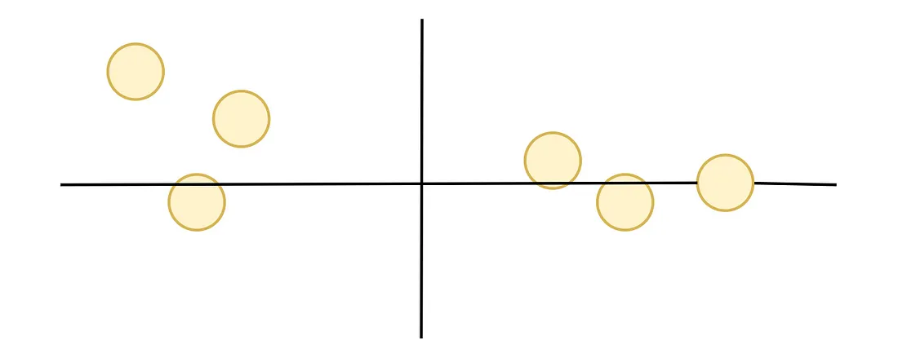

# PCA Feature Transofrmation Intuitive Guide

Visualizing clusters in 1 dimension is a piece of cake.

Finding clusters in 2 dimensions is easy

Seeing clusters in 3 dimensions…. We can either edit node size or opacity to distinguish the 3rd dimension.

PCA projects higher dimensional data into a lower dimension by combining correlated features into new features.

1. Plot data

Let’s assume our data looks like below. On the left, are features x, y and z. On the right, those points are plotted.

2. Find the centre of the data

This is the mean of each feature: x, y and z.

3. Shift the data points so the centre is now at (0,0)

4. Find the line of best fit

The line of best fit is called PC1 (principal component 1).

PC1 maximizes the sum of squared distances from where points meet the line of best fit at a right angle.

PC1 is a linear combination of x,y and z, meaning it contains parts of each x, y and z.

5. Find PC2

PC2 is the best fitting line perpendicular (intersecting at a right angle) to PC1.

PC2 is also a linear combination of each x,y and z.

PC1 and PC2 now both explain some of the variance in our features.

6. Rotate the chart so PC1 is the x-axis and PC2 is the y-axis

Post-rotation, our data is now in just 2 dimensions! And clusters are easy to spot.

