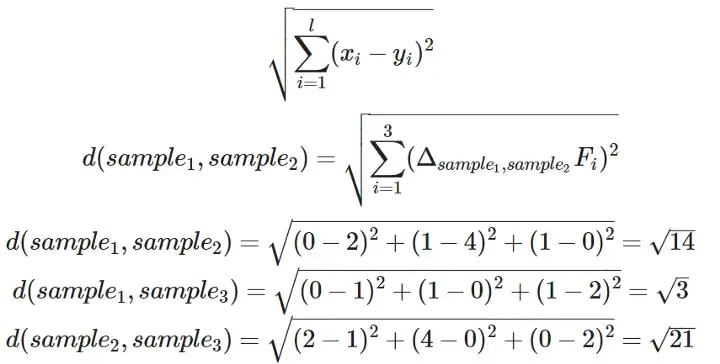

# Clustering

Clustering is the most often used technique for unsupervised learning. Clustering groups the data points which are similar to each other in terms of the features of the data.

There are many clustering types available:

- Centroid-based (K-means)
- Connectivity-based (Hierarchical Clustering)
- Density-based (DBSCAN)
- Graph-based (Affinity Propagation)
- Distribution-based (Gaussian Mixture Model)
- Compression-based (Spectral Clustering, BIRCH)

## Centroid-based

Centroid-based methods group data points together based on the proximity of data points to the centroid (cluster center). One very popular model which falls under this category is the K-means clustering.

The proximity between data points to the centroid is measured by

- Euclidean distance: Shortest (straight-line) distance, useful for numerical features, this is the default distance measure.
- Manhattan distance: Sum of absolute differences, useful for categorical features.
- Hamming distance: Percentage of bits that differ, useful for binary features.
- Mahalanobis distance: 
- Minkowski distance: Generalized form of Euclidean and Manhattan distance
- Chebyshev distance: Maximum absolute difference

Regardless of which distance measure, numerical features should always be standardized when performing clustering!

### When to use K-means

- You want tnterpretability: K-means is easy to understand and interpret.

### When to NOT use K-means

- You are unsure about the number of clusters: K-means require the number of clusters to be predefined. Usually, the Elbow method is used to determine the optimal number of clusters.
- You have outliers in the data: All data points are assigned to a cluster, hence the presence of outliers can skew the results and have to be removed or transformed.
- You want computation efficiency: The computation cost of K-means increases with the size of data as it runs in O(tkn) time where t is the number of iterations, k is the number of clusters, and n is the number of data points. 

- Connectivity model: In this types of model the data points are considered more similar to nearby points in comparison than those farther away. These models can be either agglomerative or divisive. In the agglomerative approach, all data points are grouped into many clusters and then these clusters are merged into bigger ones with respect to the distances between them. In the divisive approach, all the data points are grouped into one cluster and then divided into smaller clusters with increasing distance. Hierarchical clustering is a well known and popular example for this model. This model does not handle large datasets very well.

- Density model: This type of models cluster the data points in one or multidimensional space based on determining areas of higher density (high number of data points in a small space) compared to the rest of the data. One often used example is DBSCAN.

### Other centroid-based algorithms

- Mean Shift, 
- Fuzzy Clustering (soft K-means; data points can be part of multiple clusters)

## Distance Measures

Until now we have discussed how clustering groups similar data points together. This is done by using different types of distance measures to determine if the data points are similar. Smaller distance between data points means more similar data points. Which distance measure to use depends very much on the type of data and problem that we are dealing with and it is an important factor. THe most used distance measures are:

- Eucledian distance

- Manhattan distance

Where Eucledian distance is usually the default distance measure for most of the clustering models. We can calculate the Eucledian distances for a simple example so that the concept is clear. Below is an example dataset containing three samples and their three features (F1, F2, F3):

| |F1|F2|F3|
|---|---|---|---|
|Sample 1|0|1|1|
|Sample 2|2|4|0|
|Sample 3|1|0|2|

Remembering the formula for Eucledian distance between two points, where x_i represents the feature of x for every sample i, and y_i represents the feature of y for every sample i:

The resulting distance matrix becomes:

In addition there are also correlation based distance measures such as Pearson correlation distance, Eisen cosine correlation distance, Spearman correlation distance and Kendall correlation distance. As the name already expresses, these measures consider two data points to be similar if their features are highly correlated. That means two data points having highly correlated features can be clustered together even if their eucledian distance is large. We will not go into detail for correlation based distances but keep in mind that Pearson’s correlation is sensitive to outlier data. With datasets containing outliers a better option might be Spearman’s correlation.

## References

- [What is Clustering in Machine Learning](https://python.plainenglish.io/lets-talk-about-clustering-in-machine-learning-13a78ac025e3)

- [6 Types of Clustering Methods — An Overview](https://medium.com/towards-data-science/6-types-of-clustering-methods-an-overview-7522dba026ca)