# Information for an Event

The intuition behind quantifying information is the idea of measuring how much surprise there is in an event. Those events that are rare (low probability) are more surprising and therefore have more information than those events that are common (high probability).

- Low Probability Event: High Information (surprising).
- High Probability Event: Low Information (unsurprising).

Rare events are more uncertain or more surprising and require more information to represent them than common events.

We can calculate the amount of information there is in an event using the probability of the event. This is called “Shannon information,” “self-information,” or simply the “information,” and can be calculated for a discrete event x as follows:

$$ h(x)=-log(p(x))$$

Where log() is the base-2 logarithm and p(x) is the probability of the event x.

Other logarithms can be used instead of the base-2. For example, it is also common to use the natural logarithm that uses base-e (Euler’s number) in calculating the information, in which case the units are referred to as “nats.”

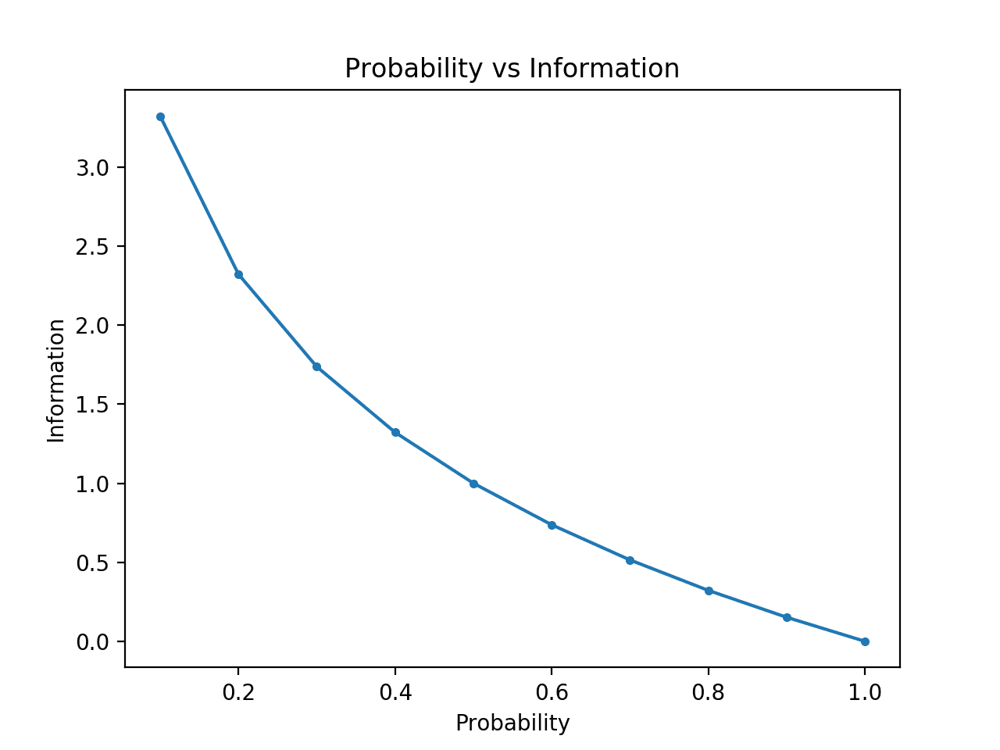

# Entropy

In information theory, entropy of a random variable X is the level of uncertainty inherent in the variables possible outcome.

- Skewed Probability Distribution: Low entropy.
- Balanced Probability Distribution: High entropy.

For p(x) — probability distribution and a random variable X, entropy is defined as follows

$$ H(X) = 
\begin{cases}
- \int_x p(x)log_bp(x), \quad if \,X \, is \,continuous \\
- \sum_{x \in X}p(x)log_bp(x), \quad if \,X \,is\, discrete
\end{cases}
$$

where b is the base of the logarithm used. Common values of b are 2, Euler's number e, and 10, and the corresponding units of entropy are the bits for b = 2, nats for b = e, and bans for b = 10.

Reason for negative sign: log(p(x))<0 for all p(x) in (0,1). p(x) is a probability distribution and therefore the values must range between 0 and 1.
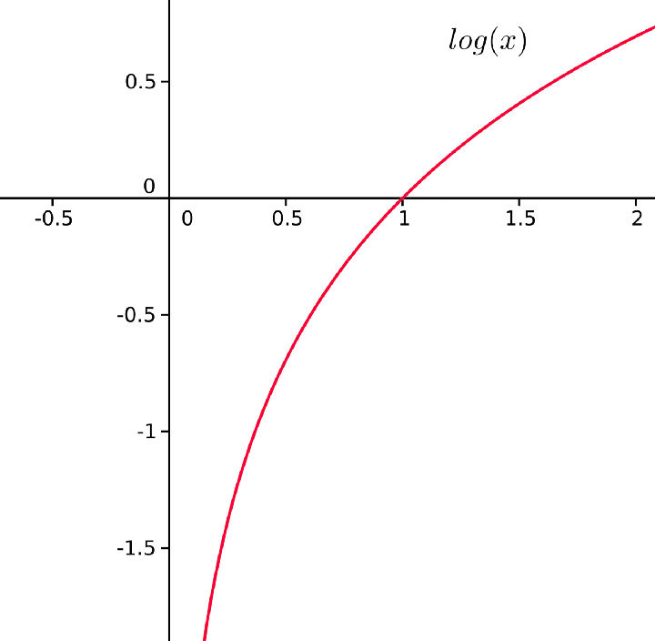

The greater the value of entropy,H(x) , the greater the uncertainty for probability distribution and the smaller the value the less the uncertainty.

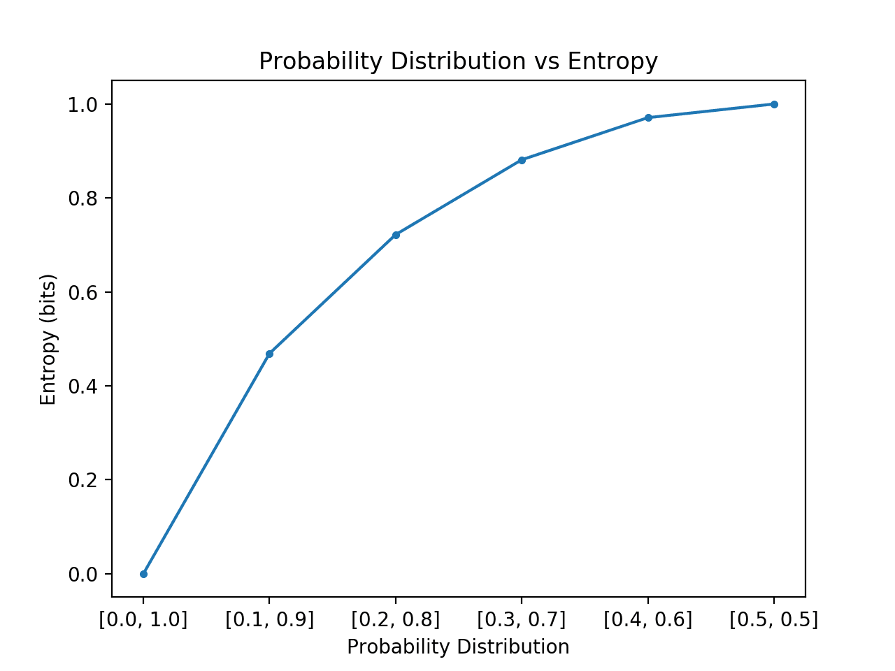

## Entropy Example

Consider the following 3 “containers” with shapes: triangles and circles

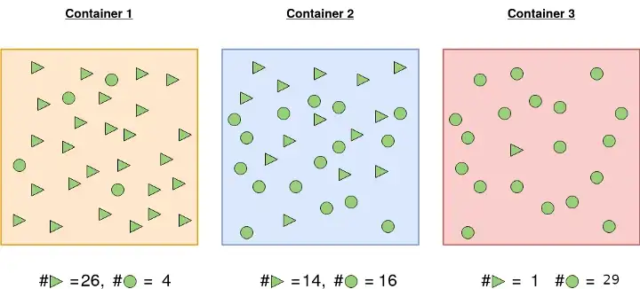

<b>Container 1</b>: The probability of picking a triangle is 26/30 and the probability of picking a circle is 4/30. For this reason, the probability of picking one shape and/or not picking another is more certain.

<b>Container 2</b>: Probability of picking the a triangular shape is 14/30 and 16/30 otherwise. There is almost 50–50 chance of picking any particular shape. Less certainty of picking a given shape than in 1.

<b>Container 3</b>: A shape picked from container 3 is highly likely to be a circle. Probability of picking a circle is 29/30 and the probability of picking a triangle is 1/30. It is highly certain than the shape picked will be circle.

Let us calculate the entropy so that we ascertain our assertions about the certainty of picking a given shape.

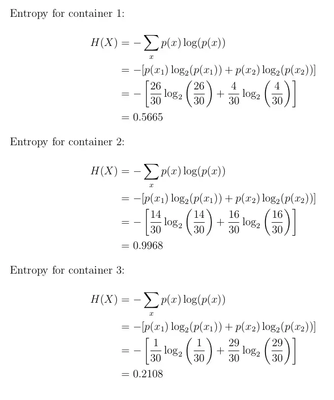

As expected the entropy for the first and third container is smaller than the second one. This is because probability of picking a given shape is more certain in container 1 and 3 than in 2. 

# Cross Entropy and Categorical Cross Entropy

Cross-entropy builds upon the idea of entropy from information theory and calculates the number of bits required to represent or transmit an average event from one distribution compared to another distribution.

The intuition for this definition comes if we consider a target or underlying probability distribution P and an approximation of the target distribution Q, then the cross-entropy of Q from P is the number of additional bits to represent an event using Q instead of P.

The cross-entropy between two probability distributions, such as Q from P, can be stated formally as:

$$H(P, Q) = – \sum_{x \in X} P(x) * log(Q(x))$$

For classification problems: 

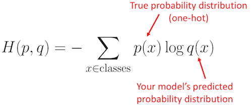

Where H() is the cross-entropy function, P may be the target distribution and Q is the approximation of the target distribution. Log is the base-2 logarithm, meaning that the results are in bits. If the base-e or natural logarithm is used instead, the result will have the units called nats.

The result will be a positive number measured in bits and will be equal to the entropy of the distribution if the two probability distributions are identical.

Cross-Entropy loss is also called `logarithmic loss`, `log loss` or `logistic loss`.

Consider a 4-class classification task where an image is classified as either a dog, cat, horse or cheetah.

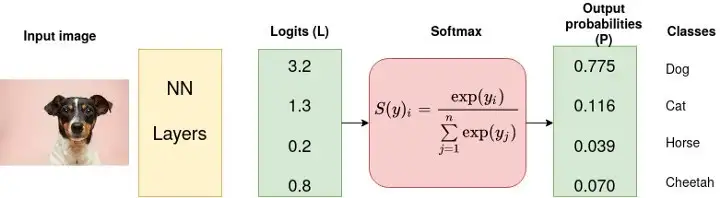

In the above Figure, Softmax converts logits into probabilities. The purpose of the Cross-Entropy is to take the output probabilities (P) and measure the distance from the truth values (as shown in Figure below).

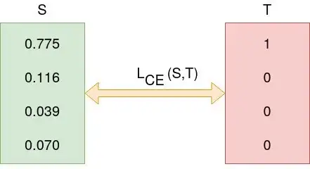

For the example above the desired output is [1,0,0,0] for the class dog but the model outputs [0.775, 0.116, 0.039, 0.070] .

The objective is to make the model output be as close as possible to the desired output (truth values). During model training, the model weights are iteratively adjusted accordingly with the aim of minimizing the Cross-Entropy loss. The process of adjusting the weights is what defines model training and as the model keeps training and the loss is getting minimized, we say that the model is learning.

The categorical cross-entropy is computed as follows:

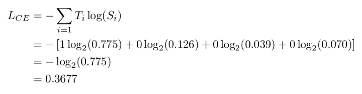

Softmax is continuously differentiable function. This makes it possible to calculate the derivative of the loss function with respect to every weight in the neural network. This property allows the model to adjust the weights accordingly to minimize the loss function (model output close to the true values).

Assume that after some iterations of model training the model outputs the following vector of logits

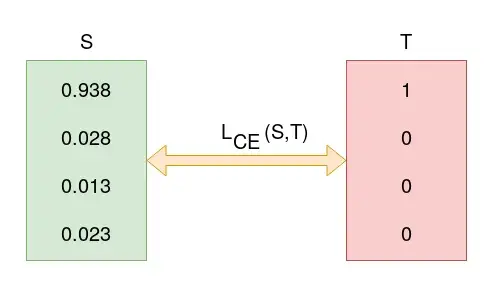

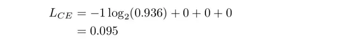

0.095 is less than previous loss, that is, 0.3677 implying that the model is learning. The process of optimization (adjusting weights so that the output is close to true values) continues until training is over.

# Sparse Categorical Cross Entropy

Both categorical cross entropy and sparse categorical cross-entropy have the same loss function. The only difference between the two is on how truth labels are defined.

* Categorical cross-entropy is used when true labels are one-hot encoded, for example, we have the following true values for 3-class classification problem [1,0,0], [0,1,0] and [0,0,1].

* In sparse categorical cross-entropy , truth labels are integer encoded, for example, [1], [2] and [3] for 3-class problem.

# Binary Cross Entropy

Binary Cross-Entropy is a special case of Categorical Cross Entropy. It is a loss function for a binary classification task.

Cross-entropy is widely used as a loss function when optimizing classification models.

Two examples that you may encounter include the logistic regression algorithm (a linear classification algorithm), and artificial neural networks that can be used for classification tasks.

$$ -y*log(p)-(1-y)*log(1-p)$$

The use of cross-entropy for classification often gives different specific names based on the number of classes, mirroring the name of the classification task; for example:

- Binary Cross-Entropy: Cross-entropy as a loss function for a binary classification task.
- Categorical Cross-Entropy: Cross-entropy as a loss function for a multi-class classification task.

# KL Divergence

The KL divergence is often referred to as the “relative entropy.”

- Cross-Entropy: Average number of total bits to represent an event from Q instead of P.
- Relative Entropy (KL Divergence): Average number of extra bits to represent an event from Q instead of P.

$$KL(P || Q) = – \sum_{x \in X} P(x) * log(\dfrac{P(x)} {Q(x)})$$

The value within the sum is the divergence for a given event.

As such, we can calculate the cross-entropy by adding the entropy of the distribution plus the additional entropy calculated by the KL divergence. This is intuitive, given the definition of both calculations; for example:

$$H(P, Q) = H(P) + KL(P || Q)$$

Where H(P, Q) is the cross-entropy of Q from P, H(P) is the entropy of P and KL(P || Q) is the divergence of Q from P.

Like KL divergence, cross-entropy is not symmetrical, meaning that:

$$H(P, Q) \neq H(Q, P)$$
