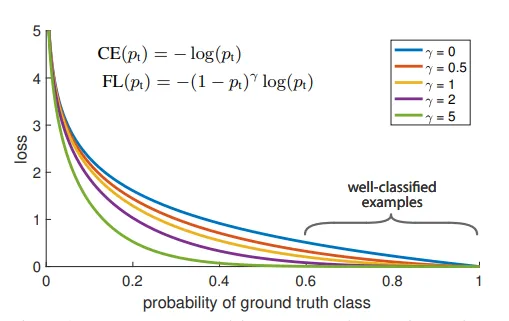

# Focal Loss

## Entropy

For p(x) — probability distribution and a random variable X, entropy is defined as follows

$$ H(X) = 
\begin{cases}
- \int_x p(x)log_bp(x), \quad if \,X \, is \,continuous \\
- \sum_{x \in X}p(x)log_bp(x), \quad if \,X \,is\, discrete
\end{cases}
$$

## Cross Entropy and Categorical Cross Entropy

The cross-entropy between two probability distributions, such as Q from P, can be stated formally as:

$$H(P, Q) = – \sum_{x \in X} P(x) * log(Q(x))$$

For classification problems: 

Where H() is the cross-entropy function, P may be the target distribution and Q is the approximation of the target distribution. 

### Cases where Cross-Entropy loss performs badly

* <b>Class imbalance</b> inherits bias in the process. The majority class examples will dominate the loss function and gradient descent, causing the weights to update in the direction of the model becoming more confident in predicting the majority class while putting less emphasis on the minority classes. `Balanced Cross-Entropy` loss handles this problem.

* Fails to distinguish between <b>hard</b> and <b>easy</b> examples. Hard examples are those in which the model repeatedly makes huge errors, whereas easy examples are those which are easily classified. As a result, Cross-Entropy loss fails to pay more attention to hard examples.

## Balanced Cross-Entropy Loss

Balanced Cross-Entropy loss adds a weighting factor to each class, which is represented by the Greek letter alpha, [0, 1]. Alpha could be the inverse class frequency or a hyper-parameter that is determined by cross-validation. The alpha parameter replaces the actual label term in the Cross-Entropy equation.

$$BalancedCrossEntropy=-\sum_{i=1}^n\alpha_ilog_b(p_i)$$

Despite the fact that this loss function addresses the issue of class imbalance, it cannot distinguish between <b>hard</b> and <b>easy</b> examples. The problem was solved by focal loss.

## Focal Loss

Focal loss focuses on the examples that the model gets wrong rather than the ones that it can confidently predict, ensuring that predictions on hard examples improve over time rather than becoming overly confident with easy ones.

Focal loss achieves this through something called Down Weighting. <b>Down weighting</b> is a technique that reduces the influence of easy examples on the loss function, resulting in more attention being paid to hard examples. This technique can be implemented by adding a modulating factor to the Cross-Entropy loss.

Where γ (Gamma) is the focusing parameter to be tuned using cross-validation. The image below shows how Focal Loss behaves for different values of γ.

Down weighting increases with an increase in γ.

### How gamma parameter works?

* In the case of the misclassified sample, the pi is small, making the modulating factor approximately or very close to 1. That keeps the loss function unaffected. As a result, it behaves as a Cross-Entropy loss.

* As the confidence of the model increases, that is, pi → 1, modulating factor will tend to 0, thus down-weighting the loss value for well-classified examples. The focusing parameter, γ ≥ 1, will rescale the modulating factor such that the easy examples are down-weighted more than the hard ones, reducing their impact on the loss function. For instance, consider predicted probabilities to be 0.9 and 0.6. Considering γ = 2, the loss value calculated for 0.9 comes out to be 4.5e-4 and down-weighted by a factor of 100, for 0.6 to be 3.5e-2 down-weighted by a factor of 6.25. From the experiments, γ = 2 worked the best for the authors of the Focal Loss paper.

* When γ = 0, Focal Loss is equivalent to Cross Entropy.

In practice, we use an α-balanced variant of the focal loss that inherits the characteristics of both the weighing factor α and the focusing parameter γ, yielding slightly better accuracy than the non-balanced form.

$$FocalLoss=-\sum_{i=1}^n\alpha_i(1-p_i)^{\gamma}log_b(p_i)$$

Focal Loss naturally solved the problem of class imbalance because examples from the majority class are usually easy to predict while those from the minority class are hard due to a lack of data or examples from the majority class dominating the loss and gradient process. Because of this resemblance, the Focal Loss may be able to solve both problems.

