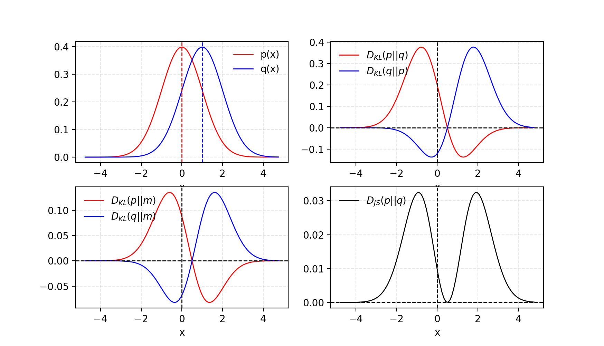

# KL (Kullback-Leibler) Divergence

KL (Kullback–Leibler) divergence measures how one probability distribution diverges from a second expected probability distribution.

$$KL(P || Q) = – \sum_{x \in X} P(x) * log(\dfrac{P(x)} {Q(x)})$$

KL(P||Q) achieves the minimum zero when P(x) == Q(X) everywhere.

It is noticeable according to the formula that KL divergence is asymmetric. In cases where P(x) is close to zero, but Q(x) is significantly non-zero, the Q’s effect is disregarded. It could cause buggy results when we just want to measure the similarity between two equally important distributions.

As such, we can calculate the cross-entropy by adding the entropy of the distribution plus the additional entropy calculated by the KL divergence. This is intuitive, given the definition of both calculations; for example:

$$H(P, Q) = H(P) + KL(P || Q)$$

Where H(P, Q) is the cross-entropy of Q from P, H(P) is the entropy of P and KL(P || Q) is the divergence of Q from P.

Like KL divergence, cross-entropy is not symmetrical, meaning that:

$$H(P, Q) \neq H(Q, P)$$

# JS (Jensen–Shannon) Divergence  

JS (Jensen-Shannon) divergence is another measure of similarity between two probability distributions, bounded by [0, 1]. JS divergence is symmetric and more smooth. 

$$D_{JS}(p||q)=\dfrac{1}{2}D_{KL}(p||\dfrac{p+q}{2}) + \dfrac{1}{2}D_{KL}(q||\dfrac{p+q}{2})$$

Given two Gaussian distribution, p with mean=0 and std=1 and q with mean=1 and std=1. The average of two distributions is labelled as m=(p + q)/2. KL divergence DKL
 is asymmetric but JS divergence DJS is symmetric.

