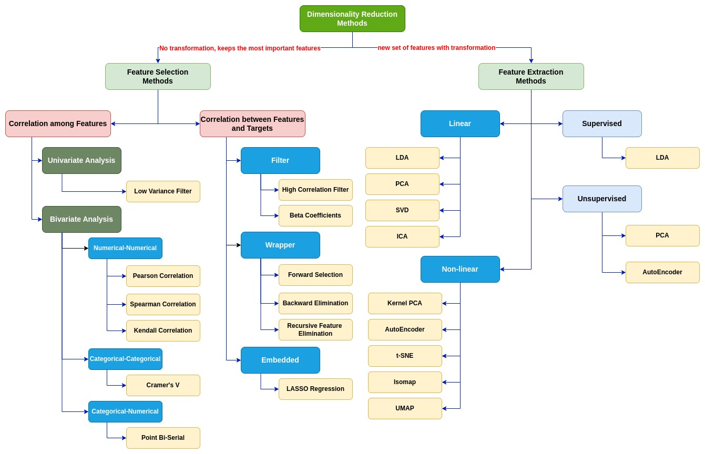

# Data Preprocessing

Machine Learning algorithms are completely dependent on data because it is the most crucial aspect that makes model training possible. We always need to feed right data i.e. the data in correct scale, format and containing meaningful features, for the problem we want machine to solve. Data preprocessing may be defined as the procedure that <b>makes our dataset more appropriate for ML process</b>.

## Data Preprocessing Technology Map


The technology map for feature selection and dimensioanlity reduction is illustrated as the following figure.



## Handling Missing data:

If our dataset contains some missing data, then it may create a huge problem for our machine learning model. Hence it is necessary to handle missing values present in the dataset.

There are mainly two ways to handle missing data, which are:

- <b>Eliminating samples or features</b>: The first way is used to commonly deal with null values. In this way, we just delete the specific row or column which consists of null values. But this way is not so efficient and removing data may lead to loss of information which will not give the accurate output.

- <b>Imputing missing values with interpolation, such as mean imputation</b>: In this way, we will calculate the mean of that column or row which contains any missing value and will put it on the place of missing value. This strategy is useful for the features which have numeric data such as age, salary, year, etc. 

## Splitting the Dataset into separate training and test sets

In machine learning data preprocessing, we divide our dataset into a training set and test set. This is one of the crucial steps of data preprocessing as by doing this, we can enhance the performance of our machine learning model.

```Python
# Splitting the dataset into the Training set and Test set
from sklearn.model_selection import train_test_split

X_train, X_test, y_train, y_test = train_test_split(X, y, test_size=0.2, random_state=0)
```
- In train_test_split() function, we have passed four parameters in which first two are for arrays of data, and test_size is for specifying the size of the test set. The test_size maybe .5, .3, or .2, which tells the dividing ratio of training and testing sets.
- The last parameter random_state is used to set a seed for a random generator so that you always get the same result
