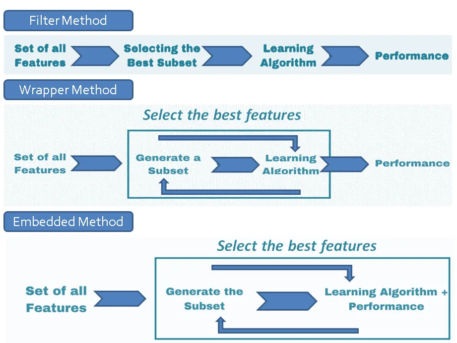

# Feature Selection and Dimensionality Reduction

<b>Dimensionality reduction</b> simply refers to the process of reducing the number of attributes in a dataset while keeping as much of the variation in the original dataset as possible. It is a <b>data preprocessing step</b> meaning that we perform dimensionality reduction before training the model.

In a tabular dataset containing rows and columns, the columns represent the dimensions of the n-dimensional feature space and the rows are the data points lying in that space.

There are mainly two types of dimensionality reduction methods. Both methods reduce the number of dimensions but in different ways. It is very important to distinguish between those two types of methods. 

- <b>Feature Selection Methods</b>: One type of method only keeps the most important features in the dataset and removes the redundant features. There is no transformation applied to the set of features. 

- <b>Feature Extraction Methods</b>: The other method finds a combination of new features. An appropriate transformation is applied to the set of features. The new set of features contains different values instead of the original values.

There are two common ways you can approach the feature selection:

1. <b>Forward feature selection</b>: With this approach, you start fitting your model with one feature (or a small subset) and keep adding features until there is no impact on your ML model metrics. You can use methods like <b>correlation analysis</b> (e.g., based on `Pearson coefficient`), or you can fit a model starting with a single feature or subset of features.

2. <b>Backward feature elimination</b>: With this approach, you start from the full set of features and then iteratively reduce feature by feature as long as the ML model metrics stay the same.

### Feature selection based on the number of features:

- <b>Univariate analysis</b>: Analyze a single feature, and the most common two techniques you can use are:
    - <b>Remove features with low variance (more than 90%)</b>.

        <b>Low variance</b> Suppose you have two features, 1) gender that contains only one gender value (e.g., Female), and 2) age that contains different values between 30 and 50 years old. In this case, the gender feature has low variance since the values in this attribute are all the same, and during the model training stage, it won’t help the model to find any patterns; therefore, you save for dropping this feature.  

    - <b>Remove features that have a high amount of missing values</b>

- <b>bi-variate analysis</b>: We use bivariate analysis to find out if there is a relationship (correlation) between two sets of variables. The easiest way to detect highly correlated features is to use `Pearson correlation`.

    - Zero correlation indicates that there is no relationship between the variables;
    - A correlation of –1 indicates a perfect negative correlation, meaning that as one variable goes up, the other goes down;
    - A correlation of +1 indicates a perfect positive correlation, meaning that both variables move in the same direction together.

    <b>Multicollinearity</b>: Highly-correlated features may provide the same information, which makes them redundant. In cases like these, it can lead to skewed or misleading results, and to cure this problem, we can keep just one feature and remove the redundant features without losing any information.

    An example could be a monthly salary and annual salary features; while they may not be identical, they likely have the same pattern. 
    
    - Models like `logistic regression` and `linear regression` are sensitive to this problem.

    - `Decision trees` and `boosted trees algorithms` are immune to multicollinearity.

### Find a correlation between features and target variable

The popular methods can be classified as the following:

- <b>Filtered-based method</b>: The most straightforward methodology. The features are selected independently of any machine learning algorithms. Using statistics (e.g., `Pearson Correlation`), we select important features based on how each feature impacts the target outcome. This is the least compute-intensive and fastest methodology.
    * <b>Pros</b>: They are model agnostic, easy to compute and interpret.
    * <b>Example</b>: Correlation, Information Value

- <b>Wrapper method</b>: This method selects the features based on ML training metric results. Each subset gets a score after training, then we add or remove features and eventually stop when we achieve the desired ML metric threshold. This could be forward, backward or recursive selection. 
    * <b>Pros</b>: As the method is model specific, the selected features perform well on the selected method.
    * <b>Cons</b>: Computationally most expensive and also have the risk of overfitting to a specific model.
    * <b>Example</b>: Forward Selection, Backward Elimination, Recursive Feature Elimination.

- <b>Embedded method</b>: Models like Lasso regression have their own built-in feature selection methods where they add a penalizing term to the regression equation to reduce over-fitting.
    * <b>Pros</b>: Embedded
    * <b>Cons</b>: Limited models with built-in feature selection methods
    * <b>Example</b>: Lasso Regression

Here’s a quick summary of the methods:

## Advantages of Dimensionality Reduction

- <b>Dimensionality reduction reduces the size and complexity of your dataset</b>. A lower number of dimensions in data means less training time and less computational resources and increases the overall performance of machine learning algorithms.

- <b>Dimensionality reduction reduces overfitting</b> — When there are many features in the data, the models become more complex and tend to overfit on the training data. 

- <b>Dimensionality reduction improves interpreterbility of ML models</b> -  ML models with lesser features are easier to understand and explain.

- <b>Dimensionality reduction avoids multicollinearity</b> - In regression, multicollinearity occurs when an independent variable is highly correlated with one or more of the other independent variables.

- Dimensionality reduction is very useful for <b>factor analysis</b> — This is a useful approach to find latent variables which are not directly measured in a single variable but rather inferred from other variables in the dataset. These latent variables are called factors. 

- Dimensionality reduction removes <b>noise</b> in the data — By keeping only the most important features and removing the redundant features, dimensionality reduction removes noise in the data. This will improve the model accuracy.

- Dimensionality reduction can be used for <b>image compression</b> - image compression is a technique that minimizes the size in bytes of an image while keeping as much of the quality of the image as possible.

- Dimensionality reduction can be used to transform non-linear data into a linearly-separable form.

## References

- [11 Dimensionality reduction techniques you should know in 2021](https://towardsdatascience.com/11-dimensionality-reduction-techniques-you-should-know-in-2021-dcb9500d388b)

- [Feature Selection Techniques](https://medium.com/@data.science.enthusiast/feature-selection-techniques-forward-backward-wrapper-selection-9587f3c70cfa)

- [Deep-dive on ML techniques for feature selection in Python - Part 1](https://towardsdatascience.com/deep-dive-on-ml-techniques-for-feature-selection-in-python-part-1-3574269d5c69)

- [Deep-dive on ML techniques for feature selection in Python — Part 2](https://towardsdatascience.com/deep-dive-on-ml-techniques-for-feature-selection-in-python-part-2-c258f8a2ac43)

- [Deep-dive on ML techniques for feature selection in Python — Part 3](https://towardsdatascience.com/deep-dive-on-ml-techniques-for-feature-selection-in-python-part-3-de2a7593247f)