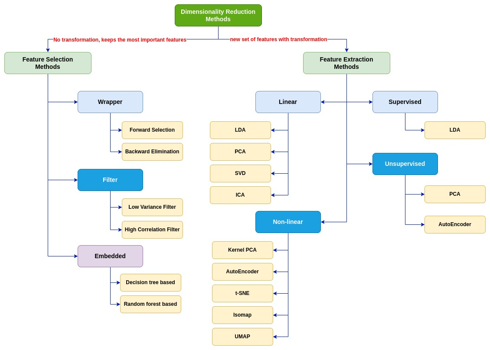

# Dimensionality Reduction

<b>Dimensionality reduction</b> simply refers to the process of reducing the number of attributes in a dataset while keeping as much of the variation in the original dataset as possible. It is a <b>data preprocessing step</b> meaning that we perform dimensionality reduction before training the model.

In a tabular dataset containing rows and columns, the columns represent the dimensions of the n-dimensional feature space and the rows are the data points lying in that space.

## Advantages of Dimensionality Reduction

- A lower number of dimensions in data means less training time and less computational resources and increases the overall performance of machine learning algorithms.

- Dimensionality reduction avoids the problem of <b>overfitting</b> — When there are many features in the data, the models become more complex and tend to overfit on the training data. 

- Dimensionality reduction takes care of <b>multicollinearity</b> - In regression, multicollinearity occurs when an independent variable is highly correlated with one or more of the other independent variables.

- Dimensionality reduction is very useful for <b>factor analysis</b> — This is a useful approach to find latent variables which are not directly measured in a single variable but rather inferred from other variables in the dataset. These latent variables are called factors. 

- Dimensionality reduction removes <b>noise</b> in the data — By keeping only the most important features and removing the redundant features, dimensionality reduction removes noise in the data. This will improve the model accuracy.

- Dimensionality reduction can be used for <b>image compression</b> - image compression is a technique that minimizes the size in bytes of an image while keeping as much of the quality of the image as possible.

- Dimensionality reduction can be used to transform non-linear data into a linearly-separable form.

## Dimensionality Reduction Methods

There are mainly two types of dimensionality reduction methods. Both methods reduce the number of dimensions but in different ways. It is very important to distinguish between those two types of methods. 

- One type of method only keeps the most important features in the dataset and removes the redundant features. There is no transformation applied to the set of features. 

- The other method finds a combination of new features. An appropriate transformation is applied to the set of features. The new set of features contains different values instead of the original values.

## References

[11 Dimensionality reduction techniques you should know in 2021](https://towardsdatascience.com/11-dimensionality-reduction-techniques-you-should-know-in-2021-dcb9500d388b)