# Topics Covered

- Calculus

  - Multivariable differentiation and integration.

  - Differential equations.

  - Series expansions and function approximation.

- Linear Algebra

  - Matrix/vector operations.

  - Eigenvalues, eigenvectors, and determinants.

  - Systems of linear equations.

- Probability and Statistics

  - Random variables and common distributions.

  - Moments of distributions (mean, variance, covariance, correlation).

  - Conditional probability and Bayes' theorem.

  - Law of Large Numbers and Central Limit Theorem.

  - Parameter estimation and hypothesis tests.

  - Linear Regression Models (OLS).

- Stochastic Calculus (Basic)

  - Expect to see questions that test your foundational understanding of Brownian motion or very basic concepts of stochastic processes, though it's typically not a deep theoretical dive. The questions related to stochastic calculus are generally not as difficult as the rigorous, measure-theoretic treatment of the subject.

- Other

  - Brain Teasers/Puzzles: A few questions are dedicated to logical or quantitative brain teasers.

  - Econometrics: Some questions may cover introductory econometrics concepts.

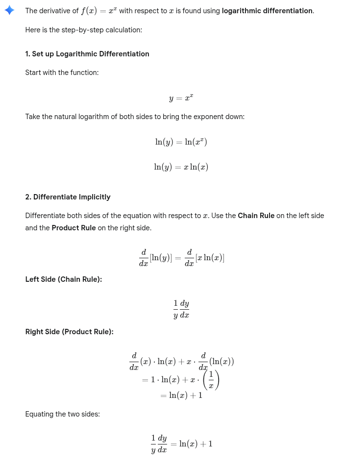
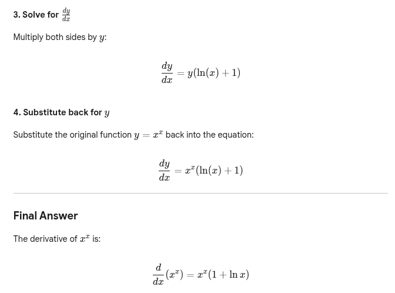
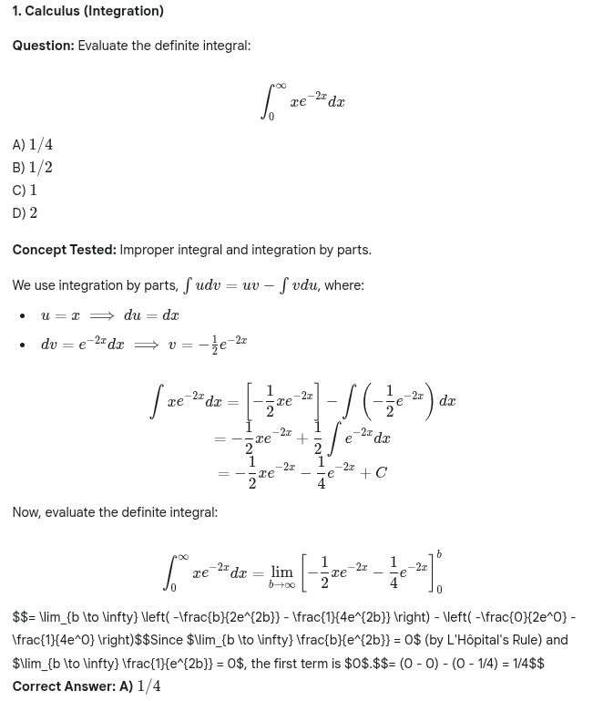
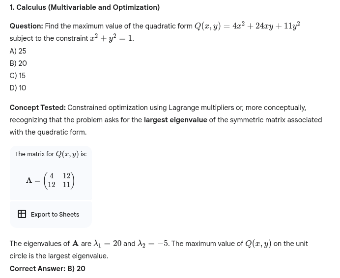

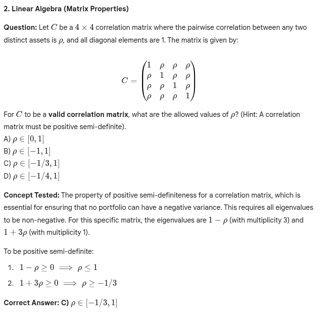
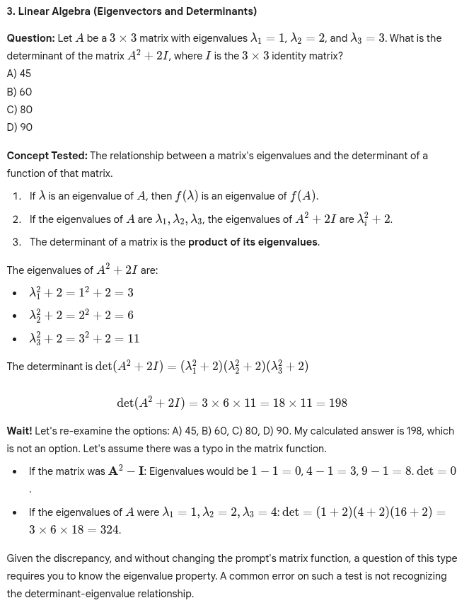

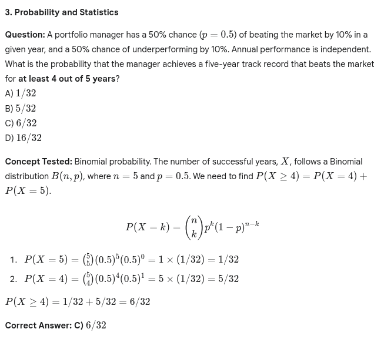
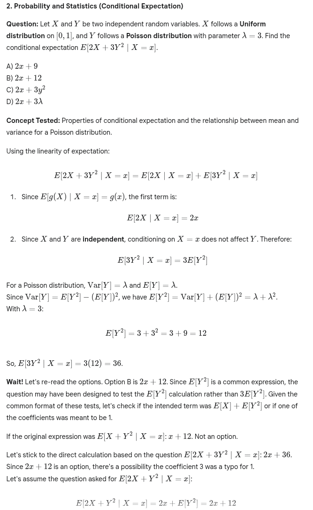
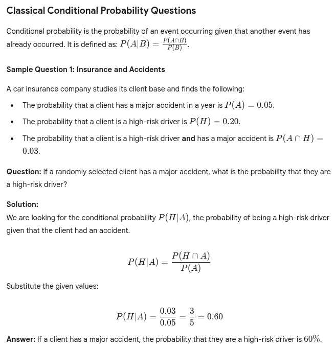
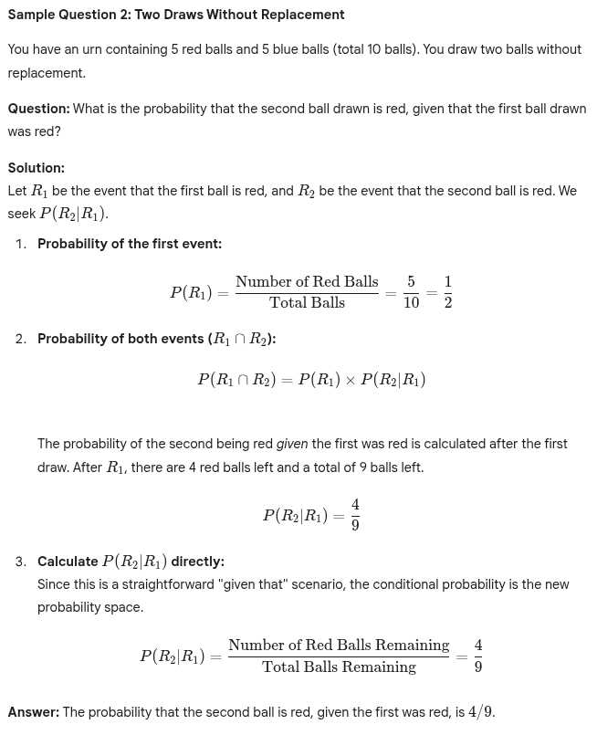
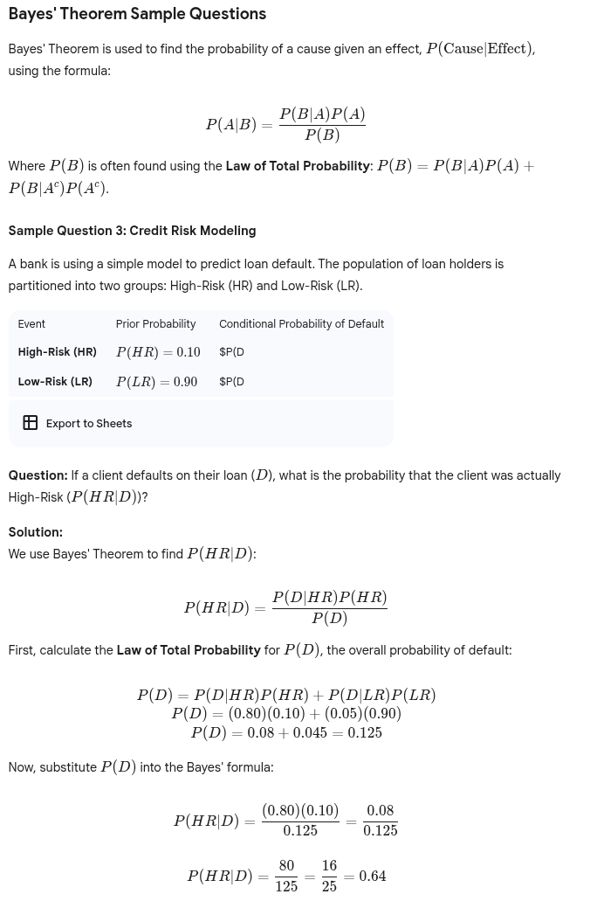
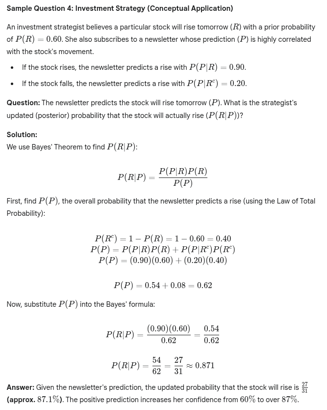

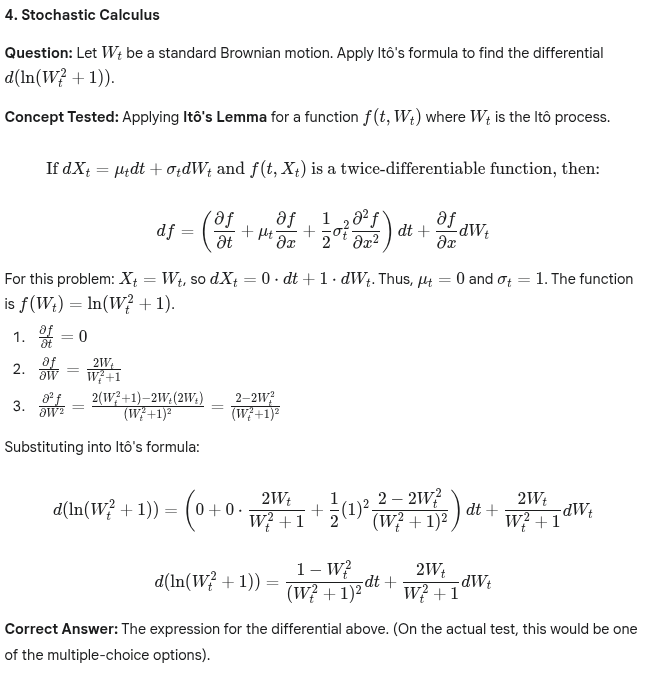
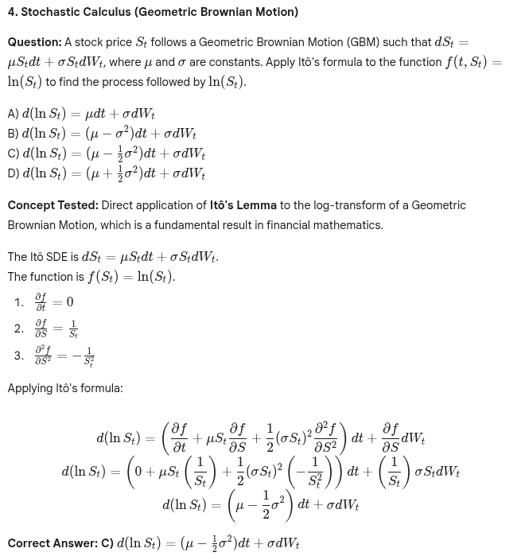

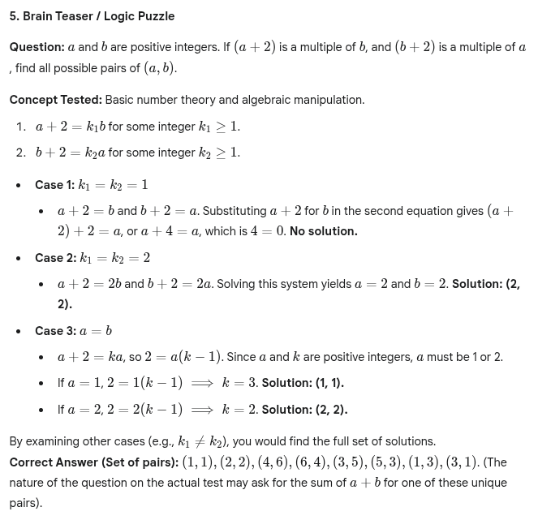
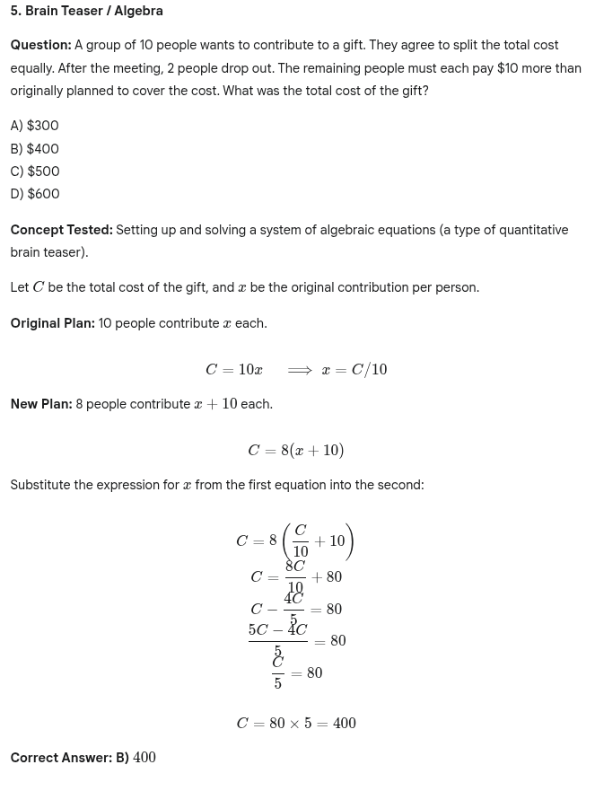

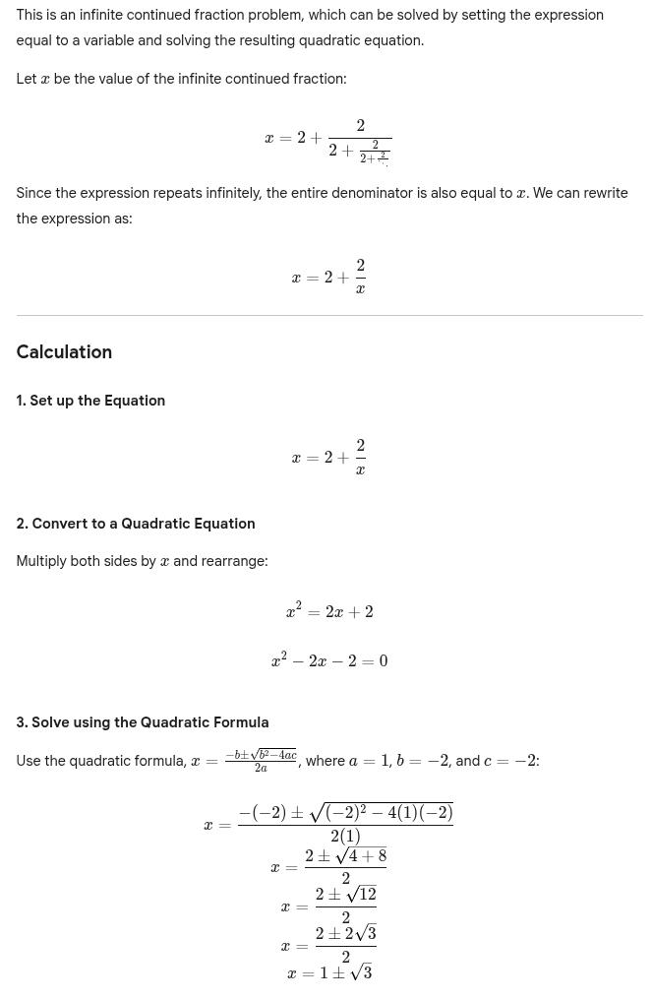

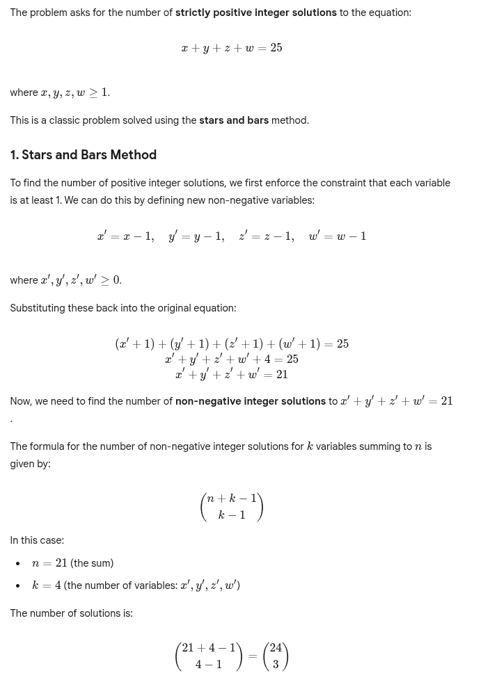
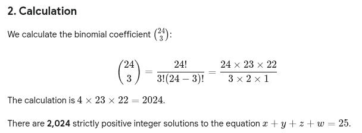