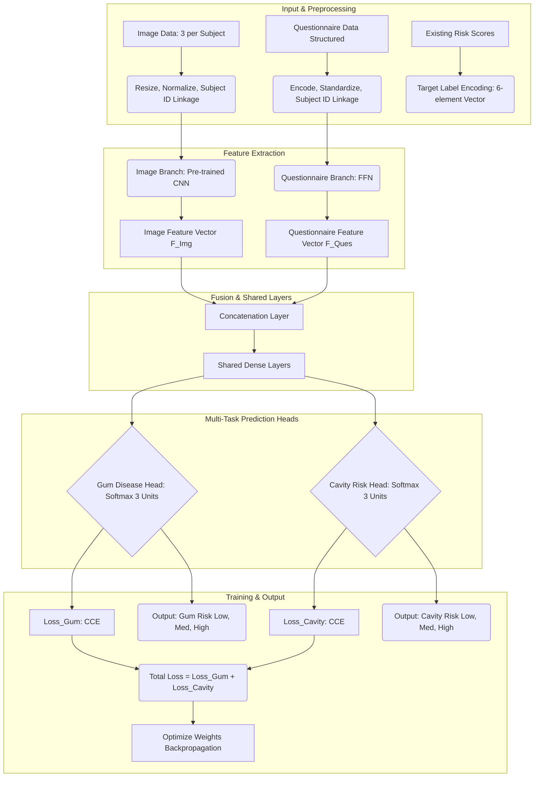

```mermaid
graph TD
    subgraph Input & Preprocessing
        A[Image Data: 3 per Subject] --> A1(Resize, Normalize, Subject ID Linkage);
        B[Questionnaire Data Structured] --> B1(Encode, Standardize, Subject ID Linkage);
        C[Existing Risk Scores] --> C1(Target Label Encoding: 6-element Vector);
    end

    subgraph Feature Extraction 
        A1 --> D(Image Branch: Pre-trained CNN);
        B1 --> E(Questionnaire Branch: FFN);
        D --> F1[Image Feature Vector F_Img];
        E --> F2[Questionnaire Feature Vector F_Ques];
    end

    subgraph Fusion & Shared Layers
        F1 & F2 --> G[Concatenation Layer];
        G --> H[Shared Dense Layers];
    end

    subgraph Multi-Task Prediction Heads
        H --> I1{Gum Disease Head: Softmax 3 Units};
        H --> I2{Cavity Risk Head: Softmax 3 Units};
    end

    subgraph Training & Output
        I1 --> J1[Loss_Gum: CCE];
        I2 --> J2[Loss_Cavity: CCE];
        J1 & J2 --> K(Total Loss = Loss_Gum + Loss_Cavity);
        K --> L[Optimize Weights Backpropagation];
        I1 --> M1(Output: Gum Risk Low, Med, High);
        I2 --> M2(Output: Cavity Risk Low, Med, High);
    end

    A[Image Data: 3 per Subject]
    B[Questionnaire Data Structured]
    C[Existing Risk Scores]
```    