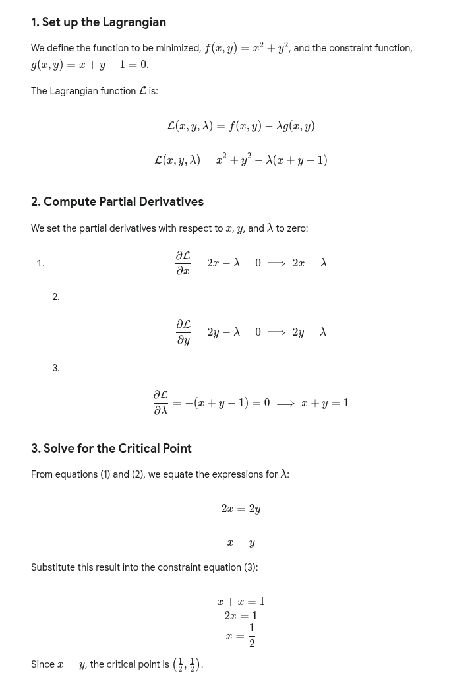

# Math Sample Questions

- [Calculus](#calculus)

  - [Derivative](#1-derivative)
  - [Derivative 2](#derivative-2)
  - [Multivariable](#2-multivariable)
  - [Optimization](#3-optimization)
  - [Optimization 2](#optimization-2)
  - [Integration](#4-integration)
  - [Multivariable Optimization](#5-multivariable-optimization)
  - Differential equations.
  - Series expansions and function approximation.

- [Linear Algebra](#linear-algebra)

  - [Matrix operations](#matrix-operations)
  - [Eigenvalues](#eigenvalues)
  - [Eigenvalues 2](#eigenvalues-2)
  - [Matrix properties](#matrix-properties)
  - [Eigenvectors and determinants](#eigenvectors-and-determinants)
  - Systems of linear equations.

- [Probability and Statistics](#probability-and-statistics)

  - [Basic Selection](#basic-selection)
  - [Bayes Theorem](#bayes-theorem)
  - [Bayes Theorem 2](#bayes-theorem-2)
  - [Conditional Probability](#conditional-probability)
  - [Conditional Probability 2](#conditional-probability-2)
  - [Binomial Probability](#binomial-probability)
  - [Binomial Probability 2](#binomial-probability-2)
  - [Geometric Distribution](#geometric-distribution)
  - [Standard Normal Distribution](#standard-normal-distribution)
  - [Conditional Expectation](#conditional-expectation)
  - [Statistics Mean](#statistics-mean)
  - Moments of distributions (mean, variance, covariance, correlation).
  - Law of Large Numbers and Central Limit Theorem.
  - Parameter estimation and hypothesis tests.
  - Linear Regression Models (OLS).

- [Stochastic Calculus](#stochastic-calculus)

  - Expect to see questions that test your foundational understanding of Brownian motion or very basic concepts of stochastic processes, though it's typically not a deep theoretical dive. The questions related to stochastic calculus are generally not as difficult as the rigorous, measure-theoretic treatment of the subject.
  - [Standard Brownian Motion](#standard-brownian-motion)
  - [Standard Brownian Motion 2](#standard-brownian-motion-2)
  - [Geometric Brownian Motion](#geometric-brownian-motion)
  - [Ito Integral](#ito-integral)

- [Brain Teasers/Puzzles](#brain-teasers)
  - [Pair of Numbers](#pair-of-numbers)
  - [Algebra](#algebra)
  - [Infinite Fraction](#infinite-fraction)
  - [Stars and Bars Method](#stars-and-bars-method)
  - [Optimization](#optimization)

- Econometrics 
  - Some questions may cover introductory econometrics concepts.

## Calculus
### 1. Derivative
Derivative of x^x

### Derivative 2

### 2. Multivariable
Compute the gradient ∇f at (1,0) for f(x,y) = x²y + e^{xy}.
- A) (2, 1)
- B) (2, 0)
- C) (0, 2)
- D) (1, 2)
- E) (2, 1 + e)

(0,2). Answer: C

### 3. Optimization
Minimize f(x,y) = x² + y² subject to x + y = 1 using Lagrange multipliers. What is the minimum value?
- A) 0.5
- B) 1
- C) 0
- D) 2
- E) 0.25

0.5. Answer: A

### Optimization 2

### 4. Integration

### 5. Multivariable Optimization

## Linear Algebra

### Matrix Operations
Given matrix A = \begin{pmatrix} 0 & 1 & 0 \ 0 & 0 & 1 \ 1 & 0 & 0 \end{pmatrix}, compute A³

### Eigenvalues
For A = \begin{pmatrix} 2 & 1 \ 0 & 2 \end{pmatrix}, find the eigenvalues.

### Eigenvalues 2

### Matrix Properties

### Eigenvectors and Determinants

## Probability and Statistics

### Basic Selection

### Bayes Theorem

### Bayes Theorem 2

### Conditional Probability 

### Conditional Probability 2

### Binomial Probability

### Binomial Probability 2

### Geometric Distribution
A fair coin is flipped until the first heads. Let X be the number of flips. P(X ≤ 2) = ?

### Standard Normal Distribution
For a standard normal Z, P(|Z| > 1.96) ≈ ? (Use 95% CI knowledge)

### Conditional Expectation

### Statistics Mean

- Question: The average (arithmetic mean) of five numbers is 20. If four of the numbers are 15, 18, 22, and 25, what is the fifth number?
- Solution Approach:
  1. The sum of the five numbers is $\text{Average} \times \text{Count} = 20 \times 5 = 100$.
  2. The sum of the four known numbers is $15 + 18 + 22 + 25 = 80$.
  3. The fifth number is the total sum minus the sum of the four known numbers: $100 - 80 = 20$.
  
- Answer: $\mathbf{20}$

## Stochastic Calculus
### Standard Brownian Motion
For standard Brownian motion B(t), compute E[B(t)²].

### Standard Brownian Motion 2

### Geometric Brownian Motion

### Ito Integral
Using Itô's lemma, if dX_t = μ dt + σ dB_t, what is d(X_t²)? (Ignore higher orders)

## Brain Teasers
### Pair of Numbers

Two positive integers a, b: a + 2 is divisible by b, b + 2 divisible by a. Maximize a + b.
- A) 6
- B) 10
- C) 14
- D) 4
- E) 8

Answer is B) 10. 

### Algebra

### Infinite Fraction

### Stars and Bars Method

### Optimization
You have 100 units of resource A and 50 of B. Product X needs 2A + 1B, Y needs 1A + 3B. Maximize X + Y.

- A) 25
- B) 33
- C) 40
- D) 50
- E) 30

Answer is D) 50. Resource A is 2 times of B. Maximize product X will the most efficiently utilize all resources. 