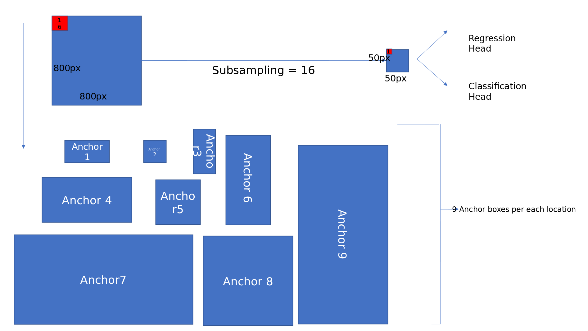
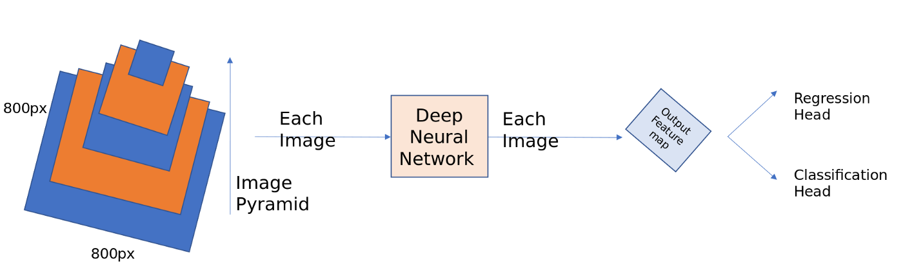
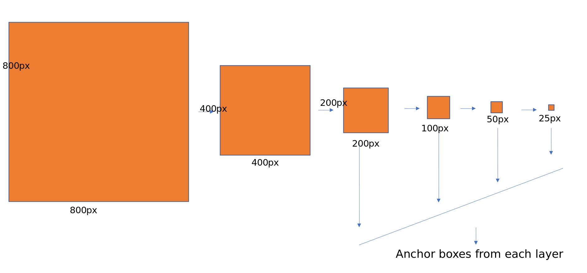
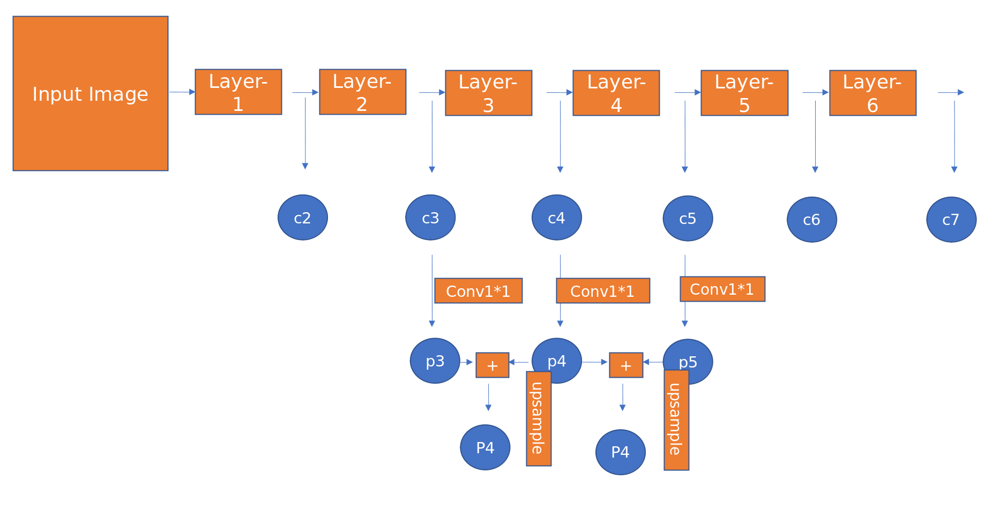
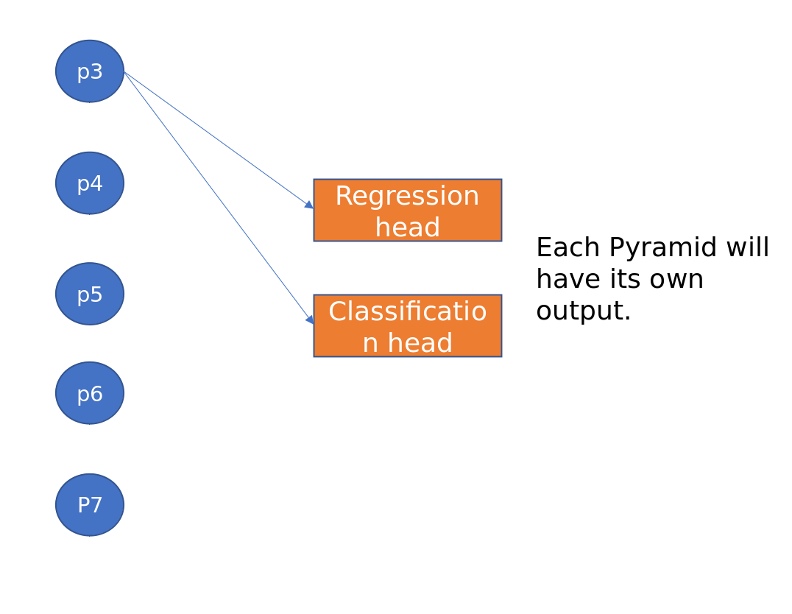

# Object Detection
  * Anchor boxes
  
     Anchor boxes were first introduced in Faster RCNN paper and later became a common element in all the following papers like yolov2, ssd and RetinaNet. Previously selective search and edge boxes used to generate region proposals of various sizes and shapes depending on the objects in the image, with standard convolutions it is highly impossible to generate region proposals of varied shapes, so anchor boxes comes to our rescue.
     

        
     

     
  * RPN - Region Proposal Network
     
     * <b>Regression head</b>: The output of the Faster RPN network as discussed and shown in the image above is a 50*50 feature map. A conv layer [kernal 3*3] strides through this image, At each location it predicts the 4 [x1, y1, h1, w1] values for each anchor boxes (9). In total, the output layer has 50*50*9*4 output probability scores. Usually this is represented in numpy as np.array(2500, 36).
     
     * <b>Classification head</b>: Similar to the Regression head, this will predict the probability of an object present or not at each location for each anchor bos. This is represented in numpy array as np.array(2500, 9).
     

        
     

     
      * Problems with RPN
      
         * The Feature map created after a lot of subsampling losses a lot of semantic information at low level, thus unable to detect small objects in the image. <b>[Feature Pyramid networks solves this]</b>
          
         * The loss functions uses negative hard-mining by taking 128 +ve samples, 128 -ve samples because using all the labels hampers training as it is highly imbalanced and there will be many easily classified examples. <b>[Focal loss solves this]</b>
         
    * Feature Pyramid Network
    
       In RPN, we have built anchor boxes only using the top high level feature map. Though convnets are robust to variance in scale, all the top entries in ImageNet or COCO have used multi-scale testing on featurized image pyramids. Imagine taking a 800 * 800 image and detecting bounding boxes on it. Now if your are using image pyramids, we have to take images at different sizes say 256*256, 300*300, 500*500 and 800*800 etc, calculate feature maps for each of this image and then apply non-maxima supression over all these detected positive anchor boxes. This is a very costly operation and inference times gets high.
       

         
       

       
       Deep convnet computes a feature hierarchy layer by layer, and with subsampling layers the feature hierarchy has an inherent multi-scale, pyramidal shape. For example, take a Resnet architecture and instead of just using the final feature map as shown in RPN network, take feature maps before every pooling (subsampling) layer. Perform the same operations as for RPN on each of these feature maps and finally combine them using non-maxima supression. This is the crude way of building the feature pyramid networks. But there is one of the problem with this approach, there are large semantic gaps caused by different depths. The high resolution maps (earlier layers) have low-level features that harm their representational capacity for object detection.
       

         
       

       
       The goal of the authors is to naturally leverage the pyramidal shape of a Convnet feature hierarchy while creating a feature pyramid that has strong semantics at all scales. To achieve this goal, the authors relayed on a architecture that combines low-resolution, semantically strong features with high-resolution, semantically strong features via top-down pathway and lateral connection as shown in the diagram below.
       

         
       

       

         
       

       
       The predictions are made on each level independently.
       
       Important points while designing anchor boxes:
       
          * Since the pyramids are of different scales, no need to have multi-scale anchors on a specific level. We define the anchors to have size of [32, 54, 128, 256, 512] on P3, P4, P5, P6, P7 respectively. We use anchors of multiple aspect ratio [1:1, 1:2, 2:1]. so in-total there will be 15 anchors over the pyramid at each location.
          
          * All the anchor boxes outside image dimensions were ignored.
          
          * positive if the given anchor box has highest IoU with the ground truth box or if the IoU is greater than 0.7. negative if the IoU is less than 0.3.
          
          * The scales of the ground truth boxes are not used to assign them to levels of the pyramid. Instead, ground-truth boxes are associated with anchors, which have been assigned to pyramid levels. This above statement is very important to understand. I had two confusions here, weather we need to assign ground truth boxes to each level separately or compute all the anchor boxes and then assign label to the anchor box with which it has max IoU or IoU greater than 0.7. Finally I have chosen the second option to assign labels.
       
  * [SSD - Single Shot Detector](./object_detection/SSD/README.md)
  * Focal Loss  
  
      Methods like SSD or YOLO suffer from an extreme class imbalance: The detectors evaluate roughly between ten to hundred thousand candidate locations and of course most of these boxes do not contain an object. Even if the detector easily classifies these large number of boxes as negatives/background, there is still a problem.
    
    * Cross entropy loss function      
      

          
      

      
      

          
      

      
      where i is the index of the class, y_i the label (1 if the object belongs to class i, 0 otherwise), and p_i is the predicted probability that the object belongs to class i.
      
      Let’s say a box contains background and the network is 80% sure that it actually is only background. In this case y(background)=1, all other y_i are 0 and p(background)=0.8.
      
      You can see that at 80% certainty that the box contains only background, the loss is still ~0.22. The large number of easily classified examples absolutely dominates the loss and thus the gradients and therefore overwhelms the few interesting cases the network still has difficulties with and should learn from.
      
    * Focal Loss Function
    
        Lin et al. (2017) [Focal Loss for Dense Object Detection](https://arxiv.org/abs/1708.02002) had the beautiful idea to scale the cross entropy loss so that all the easy examples the network is already very sure about contribute less to the loss so that the learning can focus on the few interesting cases. The authors called their loss function <i>Focal loss </i>and their architecture <b>RetinaNet</b> (note that RetinaNet also includes <b>Feature Pyramid Networks (FPN)</b> which is basically a new name for U-Net).
        

           
        

        
        

           
        

        
        With this rescaling, the large number of easily classified examples (mostly background) does not dominate the loss anymore and learning can concentrate on the few interesting cases.
    
* [Quantization](./quantization/README.md) 
* Neural Network Exchange
  * [NNEF and ONNX: Similarities and Differences](https://www.khronos.org/blog/nnef-and-onnx-similarities-and-differences)
     
## References

### Documentation

### Sites

### Conferences

### Online Courses
