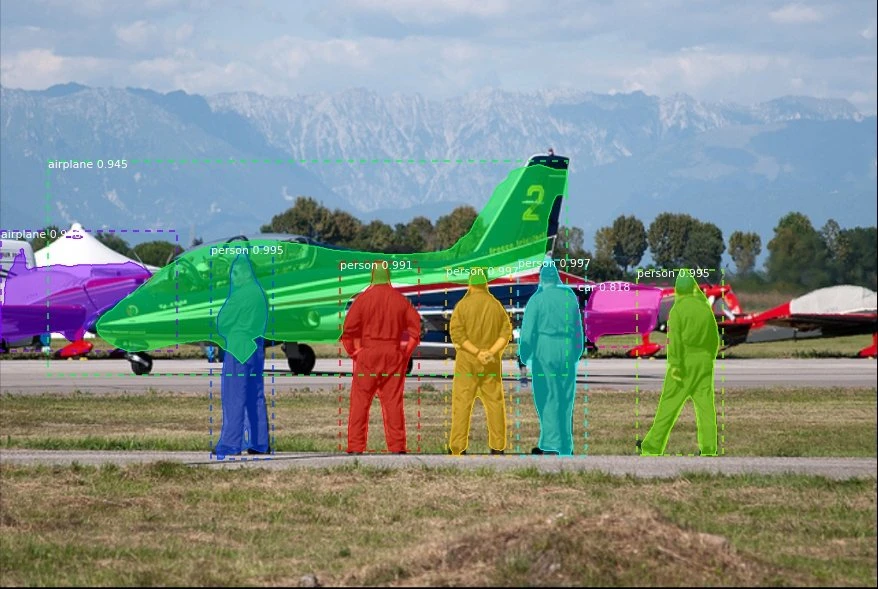

# Object Detection
       
## What is Object Detection? 

Object detection is an important computer vision task used to detect instances of visual objects of certain classes (for example, humans, animals, cars, or buildings) in digital images such as photos or video frames. The goal of object detection is to develop computational models that provide the most fundamental information needed by computer vision applications: “What objects are where?”.

Object Detection is a basic Computer Vision task to detect and localize objects in images and video.

### Person Detection 

Person detection is a variant of object detection used to detect a primary class “person” in images or video frames. Detecting people in video streams is an important task in modern `video surveillance systems`. The recent deep learning algorithms provide robust person detection results. Most modern person detector techniques are trained on frontal and asymmetric views. 

However, deep learning models such as `YOLO` that are trained for person detection on a frontal view data set still provides significantly good results when applied for overhead view person counting.  

### Why is Object Detection important? 

Object detection is one of the fundamental problems of computer vision. It forms the basis of many other downstream computer vision tasks, for example, `instance segmentation`, `image captioning`, `object tracking`, and more. Specific object detection applications include `pedestrian detection`, `animal detection`, `vehicle detection`, `people counting`, `face detection`, `text detection`, `pose detection`, or `number-plate recognition`.

### Object Detection and Deep Learning 

In the last few years, the rapid advances of deep learning techniques have greatly accelerated the momentum of object detection. With deep learning networks and the computing power of GPU’s, the performance of object detectors and trackers has greatly improved, achieving significant breakthroughs in object detection. 

Machine learning (ML) is a branch of artificial intelligence (AI), and it essentially involves learning patterns from examples or sample data as the machine accesses the data and has the ability to learn from it (supervised learning on annotated images). Deep Learning is a specialized form of machine learning which involves learning in different stages. 

### Latest technological advances in computer vision 

A wide range of computer vision applications has become available for object detection and tracking. As a result, numerous real-world applications, such as `healthcare monitoring`, `autonomous driving`, `video surveillance`, `anomaly detection`, or `robot vision`, are based on deep learning object detection. 

Imaging technology has greatly progressed in recent years. Cameras are smaller, cheaper, and of higher quality than ever before. Meanwhile, computing power has dramatically increased and became much more efficient. In past years, computing platforms moved toward parallelization through multi-core processing, graphical processing unit (GPU), and AI accelerators such as tensor processing units (TPU) 

Such hardware allows to perform computer vision for object detection and tracking in near real-time implementations. Hence, rapid development in deep convolutional neural networks (CNN) and GPU’s enhanced computing power are the main drivers behind the great advancement of computer vision based object detection. 

## How Object Detection works 

Object detection can be performed using either traditional (1) image processing techniques or modern (2) deep learning networks. 

1. Image processing techniques generally don’t require historical data for training and are unsupervised in nature. `OpenCV` is a popular tool for image processing tasks. 
    - Pro’s: Hence, those tasks do not require annotated images, where humans labeled data manually (for supervised training). 
    - Con’s: These techniques are restricted to multiple factors, such as complex scenarios (without unicolor background), occlusion (partially hidden objects), illumination and shadows, and clutter effect. 

2. Deep Learning methods generally depend on supervised or unsupervised learning, with supervised methods being the standard in computer vision tasks. 
    - Pro’s: Deep learning object detection is significantly more robust to occlusion, complex scenes, and challenging illumination. 
    - Con’s: A huge amount of training data is required; the process of `image annotation` is labor-intensive and expensive. For example, labeling 500’000 images to train a custom DL object detection algorithm is considered a small dataset. However, many benchmark datasets (MS COCO, Caltech, KITTI, PASCAL VOC, V5) provide the availability of labeled data. 

Today, deep learning object detection is widely accepted by researchers and adopted by computer vision companies to build commercial products.

## Milestones in state-of-the-art Object Detection

The field of object detection is not as new as it may seem. In fact, object detection has evolved over the past 20 years. The progress of object detection is usually separated into two separate historical periods (before and after the introduction of Deep Learning): 

__Before 2014__ – Traditional Object Detection period 
1. Viola-Jones Detector (2001), the pioneering work that started the development of traditional object detection methods 
2. HOG Detector (2006), a popular feature descriptor for object detection in computer vision and image processing 
3. DPM (2008) with the first introduction of bounding box regression 

__After 2014__ – Deep Learning Detection period 

Most important __two-stage__ object detection algorithms 
1. RCNN and SPPNet (2014) 
2. Fast RCNN and Faster RCNN (2015) 
3. Mask R-CNN (2017) 
4. Pyramid Networks/FPN (2017) 
5. G-RCNN (2021) 

Most important __one-stage__ object detection algorithms 
1. YOLO (2016) 
2. SSD (2016) 3. 
3. RetinaNet (2017)
4. YOLOv3 (2018) 
5. YOLOv4 (2020) 
6. YOLOv5 (2020)
7. YOLOR (2021) 
8. YOLOv7 (2022)

To understand which algorithm is the best for a given use case, it is important to understand the main characteristics. First, we will look into the key differences of the relevant image recognition algorithms for object detection before discussing the individual algorithms. 

### One-stage vs. two-stage deep learning object detectors 

As you can see in the list above, state-of-the-art object detection methods can be categorized into two main types: One-stage vs. two-stage object detectors. I

n general, deep learning based object detectors extract features from the input image or video frame. An object detector solves two subsequent tasks: 

- Task #1: Find an arbitrary number of objects (possibly even zero), and 
- Task #2: Classify every single object and estimate its size with a bounding box. 

To simplify the process, you can separate those tasks into two stages. Other methods combine both tasks into one step (single-stage detectors) to achieve higher performance at the cost of accuracy. 

__Two-stage detectors__: In two-stage object detectors, the approximate object regions are proposed using deep features before these features are used for the classification as well as bounding box regression for the object candidate. 

- The two-stage architecture involves 
    1. object region proposal with conventional Computer Vision methods or deep networks, followed by 
    2. object classification based on features extracted from the proposed region with bounding-box regression. 
    
- Two-stage methods achieve the highest detection accuracy but are typically slower. Because of the many inference steps per image, the performance (frames per second) is not as good as one-stage detectors. 

- Various two-stage detectors include region convolutional neural network (RCNN), with evolutions Faster R-CNN or Mask R-CNN. The latest evolution is the granulated RCNN (G-RCNN). 

- Two-stage object detectors first find a region of interest and use this cropped region for classification. However, such multi-stage detectors are usually not end-to-end trainable because cropping is a non-differentiable operation. 

__One-stage detectors__: One-stage detectors predict bounding boxes over the images without the region proposal step. This process consumes less time and can therefore be used in real-time applications. 

- One-stage object detectors prioritize inference speed and are super fast but not as good at recognizing irregularly shaped objects or a group of small objects. 

- The most popular one-stage detectors include the YOLO, SSD, and RetinaNet. The latest real-time detectors are YOLOv7 (2022), YOLOR (2021) and YOLOv4-Scaled (2020). View the benchmark comparisons below. 

- The main advantage of single-stage is that those algorithms are generally faster than multi-stage detectors and structurally simpler.  

## How to compare object detection algorithms 

The most popular benchmark is the Microsoft COCO dataset. Different models are typically evaluated according to a Mean Average Precision (mAP) metric. In the following, we will compare the best real-time object detection algorithms. It’s important to note that the algorithm selection depends on the use case and application; different algorithms excel at different tasks (e.g., Beta R-CNN shows best results for Pedestrian Detection).   

### The best real-time object detection algorithm (Accuracy) 

On the MS COCO dataset and based on the Average Precision (AP), the best real-time object detection algorithm in 2022 is YOLOv7, followed by Vision Transformer (ViT) such as Swin and DualSwin, PP-YOLOE, YOLOR, YOLOv4, and EfficientDet.

### The fastest real-time object detection algorithm (Inference time) 

Also, on the MS COCO dataset, an important benchmark metric is inference time (ms/Frame, lower is better) or Frames per Second (FPS, higher is better).  The rapid advances in computer vision technology are very visible when looking at inference time comparisons. Based on current inference times (lower is better), YOLOv7 achieves 3.5ms per frame, compared to YOLOv4 12ms, or the popular YOLOv3 29ms. Note how the introduction of YOLO (one-stage detector) led to dramatically faster inference times compared to any previously established methods, such as the two-stage method Mask R-CNN (333ms). 

On a technical level, it is pretty complex to compare different architectures and model versions in a meaningful way. 

## Most Popular Object Detection Algorithms 

Popular algorithms used to perform object detection include convolutional neural networks (R-CNN, Region-Based Convolutional Neural Networks), Fast R-CNN, and YOLO (You Only Look Once). The R-CNN’s are in the R-CNN family, while YOLO is part of the single-shot detector family. In the following, we will provide an overview and differences between the popular object detection algorithms.

### YOLO – You Only Look Once 

YOLO stands for “You Only Look Once”, it is a popular type of real-time object detection algorithms used in many commercial products by the largest tech companies that use computer vision. The original YOLO object detector was first released in 2016 and the new architecture was significantly faster than any other object detector. 

Since then, multiple versions and variants of YOLO have been released, each providing a significant increase in performance and efficiency. Because various research teams released their own YOLO version, there were several controversies, for example, about YOLOv5. YOLOv4 is an improved version of  YOLOv3. The main innovations are mosaic data enhancement, self-adversarial training, and cross mini-batch normalization. YOLOv7 is the fastest and most accurate real-time object detection model for computer vision tasks. The official YOLOv7 paper was released in July 2022 by Chien-Yao Wang, Alexey Bochkovskiy, and Hong-Yuan Mark Liao. 

### SSD – Single-shot detector 

SSD is a popular one-stage detector that can predict multiple classes. The method detects objects in images using a single deep neural network by discretizing the output space of bounding boxes into a set of default boxes over different aspect ratios and scales per feature map location. The object detector generates scores for the presence of each object category in each default box and adjusts the box to better fit the object shape. Also, the network combines predictions from multiple feature maps with different resolutions to handle objects of different sizes. The SSD detector is easy to train and integrate into software systems that require an object detection component. In comparison to other single-stage methods, SSD has much better accuracy, even with smaller input image sizes.

### R-CNN – Region-based Convolutional Neural Networks 

Region-based convolutional neural networks or regions with CNN features (R-CNNs) are pioneering approaches that apply deep models to object detection. R-CNN models first select several proposed regions from an image (for example, anchor boxes are one type of selection method) and then label their categories and bounding boxes (e.g., offsets). These labels are created based on predefined classes given to the program. They then use a convolutional neural network to perform forward computation to extract features from each proposed area. 

In R-CNN, the inputted image is first divided into nearly two thousand region sections, and then a convolutional neural network is applied for each region, respectively. The size of the regions is calculated, and the correct region is inserted into the neural network. It can be inferred that a detailed method like that can produce time constraints. Training time is significantly greater compared to YOLO because it classifies and creates bounding boxes individually, and a neural network is applied to one region at a time. 

In 2015, Fast R-CNN was developed with the intention to cut down significantly on train time. While the original R-CNN independently computed the neural network features on each of as many as two thousand regions of interest, Fast R-CNN runs the neural network once on the whole image. This is very comparable to YOLO’s architecture, but YOLO remains a faster alternative to Fast R-CNN because of the simplicity of the code. 

At the end of the network is a novel method known as Region of Interest (ROI) Pooling, which slices out each Region of Interest from the network’s output tensor, reshapes, and classifies it. This makes Fast R-CNN more accurate than the original R-CNN. However, because of this recognition technique, fewer data inputs are required to train Fast R-CNN and R-CNN detectors.  

### Mask R-CNN 

Mask R-CNN is an advancement of Fast R-CNN. The difference between the two is that Mask R-CNN added a branch for predicting an object mask in parallel with the existing branch for bounding box recognition. Mask R-CNN is simple to train and adds only a small overhead to Faster R-CNN.

### SqueezeDet 

SqueezeDet is the name of a deep neural network for computer vision that was released in 2016. SqueezeDet was specifically developed for autonomous driving, where it performs object detection using computer vision techniques. Like YOLO, it is a single-shot detector algorithm. 

In SqueezeDet, convolutional layers are used only to extract feature maps but also as the output layer to compute bounding boxes and class probabilities. The detection pipeline of SqueezeDet models only contains single forward passes of neural networks, allowing them to be extremely fast.  

### YOLOR 

YOLOR is a novel object detector introduced in 2021. The algorithm applies implicit and explicit knowledge to the model training at the same time. Herefore, YOLOR can learn a general representation and complete multiple tasks through this general representation. 

Implicit knowledge is integrated into explicit knowledge through kernel space alignment, prediction refinement, and multi-task learning. Through this method, YOLOR achieves greatly improved object detection performance results. 

Compared to other object detection methods on the COCO dataset benchmark, the MAP of YOLOR is 3.8% higher than the PP-YOLOv2 at the same inference speed. Compared with the Scaled-YOLOv4, the inference speed has been increased by 88%, making it the fastest real-time object detector available today. 

## References

- [Object Detection in 2022: The Definitive Guide](https://viso.ai/deep-learning/object-detection/)