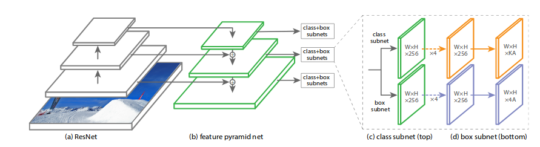

# RetinaNet

## Need of RetinaNet

Both classic one stage detection methods, like boosted detectors, DPM & more recent methods like SSD evaluate almost 104 to 105 candidate locations per image but only a few locations contain objects (i.e. Foreground) and rest are just background objects. This leads to class imbalance problem.

And this turn out to be the central cause of making performance of one stage detectors inferior to two stage detectors.

Hence , researchers have introduced RetinaNet Model with concept called <b>Focal Loss</b> to fill in for the class imbalances and inconsistencies of the single shot object detectors like YOLO and SSD ,while dealing with extreme foreground-background classes.

## Architecture of RetinaNet

<b>RetinaNet</b> is a single, unified network composed of a backbone network and two task-specific subnetworks. The backbone is responsible for computing a conv feature map over an entire input image and is an off-the-self convolution network. The first subnet performs classification on the backbones output; the second subnet performs convolution bounding box regression.

<b>Backbone</b>: Feature Pyramid network built on top of ResNet50 or ResNet101. However we can use any classifier of your choice; just follow the instructions given in FPN section when designing the network. It includes Bottom up pathway + Top down pathway with lateral connections, eg. ResNet + FPN.

  * Bottom up pathway: Bottom up pathway (eg. ResNet) is used for feature extraction. So, it caculates the feature maps at different scales, irrespective of the input image size.

  * Top down pathway with lateral connections: The top down pathway up samples the spatially coarser feature maps from higher pyramid levels, and the lateral connections merge the top-down layers and the bottom-up layers with the same spatial size.

    Higher level feature maps tend to have small resolution though semantically stronger and is therefore more suitable for detecting larger objects; on the contrary, grid cells from lower level feature maps have high resolution and hence are better at detecting smaller objects

    So, with combination of the top-down pathway and its lateral connections with bottom up pathway, which do not require much extra computation, every level of the resulting feature maps can be both semantically and spatially strong

    Hence this architecture is scale-invariant and can provide better performance both in terms of speed and accuracy.

<b>Classification subnet</b>: It predicts the probability of object presence at each spatial position for each of the A anchors and K object classes. Takes a input feature map with C channels from a pyramid level, the subnet applies four 3x3 conv layers, each with C filters amd each followed by ReLU activations. Finally sigmoid activations are attached to the outputs. Focal loss is applied as the loss function.

<b>Box Regression Subnet</b>: Similar to classification net used but the parameters are not shared. Outputs the object location with respect to anchor box if an object exists. smooth_l1_loss with sigma equal to 3 is applied as the loss function to this part of the sub-network.

## Training RetinaNet
  
Initialization of the network is very important. The authors have assumed a prior probability of 0.01 for all the anchor boxes and assigned this to the bias of last conv layer of classification sub net. The loss function blows up if you don’t take care of this. The intuition behind attaching this prior probability is that the foreground (All positive anchor boxes) to background objects (All negative anchor boxes) in image is 1000/100000 = 0.01.
     
## Inference on RetinaNet
   
* To improve speed, Decode box predictions from at most 1k top-scoring predictions per FPN level, after thresholding the detector confidence at 0.05.

* The top predictions from all levels are merged and non-maximum suppression with a threshold of 0.5 is applied to yield the final decisions.
