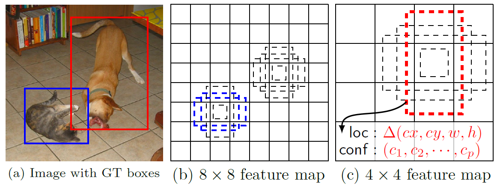
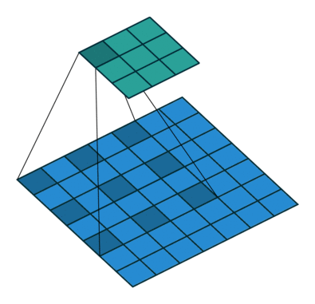

# SSD-Single Shot Detector
By using SSD, we only need to <b>take one single shot to detect multiple objects within the image</b>, while regional proposal network (RPN) based approaches such as R-CNN series that need two shots, one for generating region proposals, one for detecting the object of each proposal. Thus, SSD is much faster compared with two-shot RPN-based approaches.
  * <b>MultiBox Detector</b>
    

       
    

                                                                                                  
    * After going through a certain of convolutions for feature extraction, we obtain <b>a feature layer of size m×n with p channels</b>, such as 8×8 or 4×4 above. And a 3×3 conv is applied on this m×n×p feature layer.
    
    * <b>For each location, we got k bounding boxes</b>. These k bounding boxes have different sizes and aspect ratios. The concept is, maybe a vertical rectangle is more fit for human, and a horizontal rectangle is more fit for car.
    
    * <b>For each of the bounding box, we will compute c class scores and 4 offsets relative to the original default bounding box shape</b>.
    
    * Thus, we got <b>(c+4)kmn outputs</b>.
    
  * <b>SSD Network Architecture</b>
     

        
     

    
    To have more accurate detection, different layers of feature maps are also going through a small 3×3 convolution for object detection as shown above.
    * Say for example, at Conv4_3, it is of size 38×38×512. 3×3 conv is applied. And there are 4 bounding boxes and each bounding box will have (classes + 4) outputs. Thus, at Conv4_3, the output is 38×38×4×(c+4). Suppose there are 20 object classes plus one background class, the output is 38×38×4×(21+4) = 144,400. In terms of number of bounding boxes, there are 38×38×4 = 5776 bounding boxes.
    
    Similarly for other conv layers:
   
    * Conv7: 19×19×6 = 2166 boxes (6 boxes for each location)
    
    * Conv8_2: 10×10×6 = 600 boxes (6 boxes for each location)
    
    * Conv9_2: 5×5×6 = 150 boxes (6 boxes for each location)
    
    * Conv10_2: 3×3×4 = 36 boxes (4 boxes for each location)
    
    * Conv11_2: 1×1×4 = 4 boxes (4 boxes for each location)
    
    If we sum them up, we got 5776 + 2166 + 600 + 150 + 36 +4 = 8732 boxes in total. If we remember YOLO, there are 7×7 locations at the end with 2 bounding boxes for each location. YOLO only got 7×7×2 = 98 boxes. Hence, SSD has 8732 bounding boxes which is more than that of YOLO.

  * <b>Loss Function</b>
    * The loss function consists of two terms: Lconf and Lloc
    
    * Lloc is the localization loss which is the smooth L1 loss between the predicted box (l) and the ground-truth box (g) parameters.
    
    * Lconf is the confidence loss which is the softmax loss over multiple classes confidences (c).
  
  * <b>Some Details of Training</b>
    * <b>Hard Negative Mining</b>
      Instead of using all the negative examples, we sort them using the highest confidence loss for each default box and pick the top ones so that the ratio between the negatives and positives is at most 3:1.
      
      This can lead to faster optimization and a more stable training.
      
    * <b>Atrous Convolution (Hole Algorithm / Dilated Convolution)</b>
    
      The base network is VGG16 and pre-trained using ILSVRC classification dataset. <b>FC6 and FC7 are changed to convolution layers as Conv6 and Conv7 </b>which is shown in the figure above.
     
      Furthermore, <b>FC6 and FC7 use Atrous convolution </b>(a.k.a Hole algorithm or dilated convolution) instead of conventional convolution. 
      

          
      

      As we can see, the feature maps are large at Conv6 and Conv7, using Atrous convolution as shown above can <b>increase the receptive field while keeping number of parameters relatively fewer </b>compared with conventional convolution. 
  
