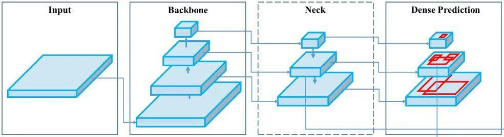
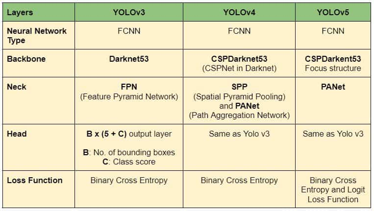

# YOLOv5

YOLOv5 is fast and easy to use. It is based on the `PyTorch` framework, which has a larger community than __Yolo v4 Darknet__. 

You can choose from ten available multi-scale models having speed/accuracy tradeoffs. It supports 11 different formats (both export and run time). Due to the advantages of Python-based core, it can be easily implemented in EDGE devices.

## A Brief Overview of YOLOv5

The name YOLOv5 does tend to confuse the CV community, given that it is not exactly the updated version of YOLOv4. In fact, three major versions of YOLO were released in a short period in 2020.

- April: YOLOv4  by Alexey Bochkovskiy et al.
- June: YOLOv5 by Glenn Joscher, Ultralytics. GitHub
- July: PP-YOLO by Xiang Long et al.

Although they are based on YOLOv3, all are independent development. The architecture of a Fully Connected Neural Network comprises the following.

- __Backbone__: The model backbone primarily extracts the essential features of an image.
- __Head__: The head contains the output layers that have final detections.
- __Neck__: The neck connects the backbone and the head. It mostly creates feature pyramids. The role of the neck is to collect feature maps of different stages.

  

The following table summarizes the architecture of v3, v4, and v5.

  

YOLOv4 is the official successor of YOLOv3 as it has been forked from the main repository __pjredii/darknet__. Written in C++, the framework is Darknet. YOLOv5, on the other hand, is different from previous releases. It is based on the `Pytorch` framework. The major improvements in YOLOv5 are,

- Mosaic Data Augmentation
- Auto Learning Bounding Box Anchors

YOLOv5 was released with four models at first. Small, Medium, Large, and Extra large. __Recently, YOLOv5 Nano and support for OpenCV DNN were introduced__. Currently, each model has two versions, P5 and P6.

- P5: Three output layers, P3, P4, and P5. Trained on 640×640 images.
- P6: Four output layers, P3, P4, P5, and P6. Trained on 1280×1280 images.

|Models|Nano|Small|Medium|Large|Extra-Large|
|---|---|---|---|---|---|
|P5|YOLOv5n|YOLOv5s|YOLOv5m|YOLOv5l|YOLOv5x|
|P6|YOLOv5n6|YOLOv5s6|YOLOv5m6|YOLOv5l6|YOLOv5x6|

