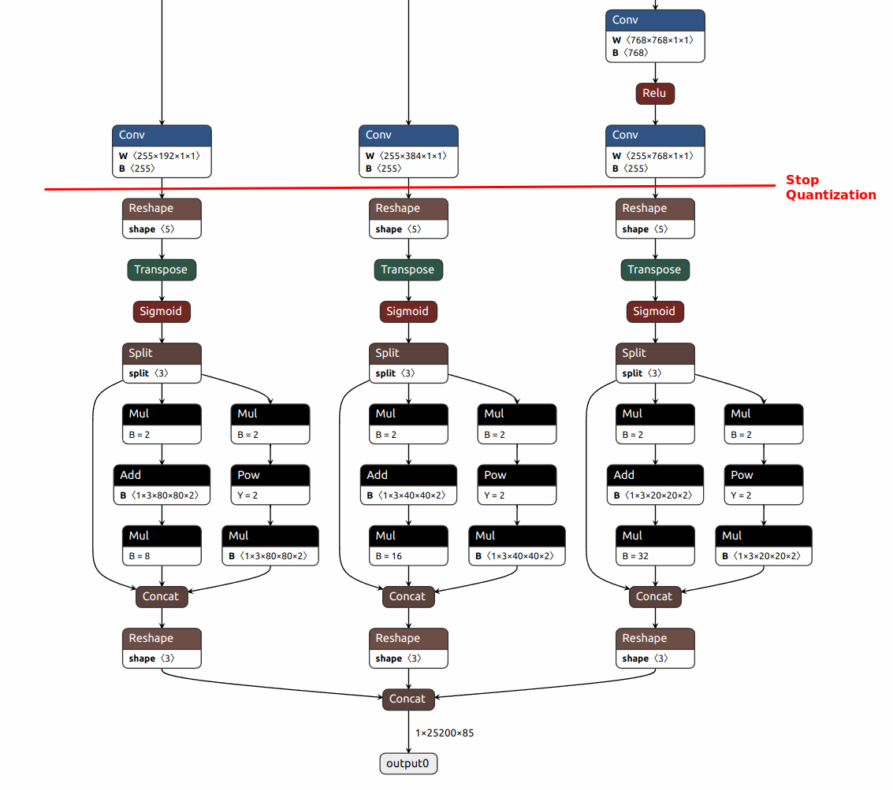

# YOLOv5 QAT

## 0. Prepare Environment

- QAT requires PyTorch version 1.9.1.
  - For YOLOv5, before install requirements.txt, please install torchvision version 0.10.1 first
    ```
    pip install torchvision==0.10.1
    pip install -r requirements.txt  
    ```

### 0.1 Create a virtual environment with PyTorch 1.9.1

```
python3 -m venv ./venv/torch1.9.1

source ~/venv/torch1.9.1/bin/activate

pip install setuptools numpy==1.23.5

pip install torch==1.9.1

pip install torchvision==0.10.1
```

### 0.2 QAT setup

- Remove the Tensorflow installation

```
install_requires.extend([
    'torch==1.9.1',
    'torchviz',
    'onnx==1.9.0',
    'onnxoptimizer==0.2.6',
    'onnxruntime-gpu==1.9.0',
    'tf2onnx==1.9.2',
    # 'tensorflow==1.15.2',
    'tqdm'
])
```

- Setup
```
pip install Cython

python setup.py develop
```

- In case there are some errors:
```
AttributeError: module 'numpy' has no attribute 'object'
```

It seems numpy 1.24.0 has some errors. Try:
```
pip install numpy==1.23.5

1 - pip uninstall -y numpy
2 - pip uninstall -y setuptools
3 - pip install setuptools
4 - pip install numpy
```

### 0.3 YOLOv5 installation
```
pip install -r requirements.txt
```

## 1. Modify YOLOv5 for QAT

### 1.1 common.py

#### 1.1.0 Import necessary package

```
from bstnnx_training.PyTorch.QAT import modules as bstnn
# We are going to replace Concat module with BstConcat. QAT will quantize BstConcat
from bstnnx_training.PyTorch.QAT.modules import BstConcat 
```

#### 1.1.1 Replacing SiLU with ReLU

- ReLU can be fused into Conv. It is processed by MACA. SiLU is processed by EDP. ReLU has better performance on FPS.

```
class Conv(nn.Module):
    # Standard convolution with args(ch_in, ch_out, kernel, stride, padding, groups, dilation, activation)
    # default_act = nn.SiLU()  # default activation
    # Hardware has better performance with ReLU than with SiLU
    default_act = nn.ReLU()
```  

#### 1.1.2 Replacing functional add with bstnn.Add module

```
class Bottleneck(nn.Module):
    # Standard bottleneck
    def __init__(self, c1, c2, shortcut=True, g=1, e=0.5):  # ch_in, ch_out, shortcut, groups, expansion
        super().__init__()
        c_ = int(c2 * e)  # hidden channels
        self.cv1 = Conv(c1, c_, 1, 1)
        self.cv2 = Conv(c_, c2, 3, 1, g=g)
        self.add = shortcut and c1 == c2
        self.skip_add = bstnn.Add()        

    def forward(self, x):
        # return x + self.cv2(self.cv1(x)) if self.add else self.cv2(self.cv1(x))
        return self.skip_add(x, self.cv2(self.cv1(x)) if self.add else self.cv2(self.cv1(x)))
```

```
class CrossConv(nn.Module):
    # Cross Convolution Downsample
    def __init__(self, c1, c2, k=3, s=1, g=1, e=1.0, shortcut=False):
        # ch_in, ch_out, kernel, stride, groups, expansion, shortcut
        super().__init__()
        c_ = int(c2 * e)  # hidden channels
        self.cv1 = Conv(c1, c_, (1, k), (1, s))
        self.cv2 = Conv(c_, c2, (k, 1), (s, 1), g=g)
        self.add = shortcut and c1 == c2
        self.skip_add = bstnn.Add()

    def forward(self, x):
        # return x + self.cv2(self.cv1(x)) if self.add else self.cv2(self.cv1(x))
        return self.skip_add(x, self.cv2(self.cv1(x)) if self.add else self.cv2(self.cv1(x)))
```

#### 1.1.3 Replacing torch.cat functional with bstnn.CatChannel module

```
class C3(nn.Module):
    # CSP Bottleneck with 3 convolutions
    def __init__(self, c1, c2, n=1, shortcut=True, g=1, e=0.5):  # ch_in, ch_out, number, shortcut, groups, expansion
        super().__init__()
        c_ = int(c2 * e)  # hidden channels
        self.cv1 = Conv(c1, c_, 1, 1)
        self.cv2 = Conv(c1, c_, 1, 1)
        self.cv3 = Conv(2 * c_, c2, 1)  # optional act=FReLU(c2)
        self.m = nn.Sequential(*(Bottleneck(c_, c_, shortcut, g, e=1.0) for _ in range(n)))
        self.concat = bstnn.CatChannel()

    def forward(self, x):
        # return self.cv3(torch.cat((self.m(self.cv1(x)), self.cv2(x)), 1))
        return self.cv3(self.concat(self.m(self.cv1(x)), self.cv2(x)))
```        

```class SPPF(nn.Module):
    # Spatial Pyramid Pooling - Fast (SPPF) layer for YOLOv5 by Glenn Jocher
    def __init__(self, c1, c2, k=5):  # equivalent to SPP(k=(5, 9, 13))
        super().__init__()
        c_ = c1 // 2  # hidden channels
        self.cv1 = Conv(c1, c_, 1, 1)
        self.cv2 = Conv(c_ * 4, c2, 1, 1)
        self.m = nn.MaxPool2d(kernel_size=k, stride=1, padding=k // 2)
        self.concat = bstnn.CatChannel()

    def forward(self, x):
        x = self.cv1(x)
        with warnings.catch_warnings():
            warnings.simplefilter('ignore')  # suppress torch 1.9.0 max_pool2d() warning
            y1 = self.m(x)
            y2 = self.m(y1)
            # return self.cv2(torch.cat((x, y1, y2, self.m(y2)), 1))
            return self.cv2(self.concat(x, y1, y2, self.m(y2)))
```

#### 1.1.4 Replacing Concat module with bstnn.BstConcat module

- This is the most confusing part. It caused lots of trouble. It requires QAT softmare to make related changes also.
  - bstnn.CatChannel with multiple tensors as inputs
  - bstnn.BstConcat with one tensor list as the input.


```
# bstnn.CatChannel takes multiple tensors as inputs
# bstnn.BstConcat takes one tensor array as the input
# We can't reuse bstnn.CatChannel here and have to redefine another module in QAT software package
Concat = BstConcat

# class Concat(nn.Module):
#     # Concatenate a list of tensors along dimension
#     def __init__(self, dimension=1):
#         super().__init__()
#         self.d = dimension

#     def forward(self, x):
#         return torch.cat(x, self.d)
```

### 1.2 yolo.py

#### 1.2.0 Import packages

```
from torch.quantization import QuantStub, DeQuantStub
```

#### 1.2.1 Add QuantStub

- Set the quantization starting point at the beginning of the model

```
class DetectionModel(BaseModel):
    # YOLOv5 detection model
    def __init__(self, cfg='yolov5s.yaml', ch=3, nc=None, anchors=None):  # model, input channels, number of classes
        super().__init__()
        if isinstance(cfg, dict):
            self.yaml = cfg  # model dict
        else:  # is *.yaml
            import yaml  # for torch hub
            self.yaml_file = Path(cfg).name
            with open(cfg, encoding='ascii', errors='ignore') as f:
                self.yaml = yaml.safe_load(f)  # model dict

        # Define model
        ch = self.yaml['ch'] = self.yaml.get('ch', ch)  # input channels
        if nc and nc != self.yaml['nc']:
            LOGGER.info(f"Overriding model.yaml nc={self.yaml['nc']} with nc={nc}")
            self.yaml['nc'] = nc  # override yaml value
        if anchors:
            LOGGER.info(f'Overriding model.yaml anchors with anchors={anchors}')
            self.yaml['anchors'] = round(anchors)  # override yaml value
        self.model, self.save = parse_model(deepcopy(self.yaml), ch=[ch])  # model, savelist
        self.names = [str(i) for i in range(self.yaml['nc'])]  # default names
        self.inplace = self.yaml.get('inplace', True)

        self.quant = QuantStub()

        # Build strides, anchors
        m = self.model[-1]  # Detect()
        if isinstance(m, (Detect, Segment)):
            s = 256  # 2x min stride
            m.inplace = self.inplace
            forward = lambda x: self.forward(x)[0] if isinstance(m, Segment) else self.forward(x)
            m.stride = torch.tensor([s / x.shape[-2] for x in forward(torch.zeros(1, ch, s, s))])  # forward
            check_anchor_order(m)
            m.anchors /= m.stride.view(-1, 1, 1)
            self.stride = m.stride
            self._initialize_biases()  # only run once

        # Init weights, biases
        initialize_weights(self)
        self.info()
        LOGGER.info('')

    def forward(self, x, augment=False, profile=False, visualize=False):

        x = self.quant(x)

        if augment:
            return self._forward_augment(x)  # augmented inference, None
        return self._forward_once(x, profile, visualize)  # single-scale inference, train
```

#### 1.2.2 Add DeQuantStub

We are not going to do QAT for the last several layers. Thoese layers will be processed by DSP.

```
class Detect(nn.Module):
    # YOLOv5 Detect head for detection models
    stride = None  # strides computed during build
    dynamic = False  # force grid reconstruction
    export = False  # export mode

    def __init__(self, nc=80, anchors=(), ch=(), inplace=True):  # detection layer
        super().__init__()
        self.nc = nc  # number of classes
        self.no = nc + 5  # number of outputs per anchor
        self.nl = len(anchors)  # number of detection layers
        self.na = len(anchors[0]) // 2  # number of anchors
        self.grid = [torch.empty(0) for _ in range(self.nl)]  # init grid
        self.anchor_grid = [torch.empty(0) for _ in range(self.nl)]  # init anchor grid
        self.register_buffer('anchors', torch.tensor(anchors).float().view(self.nl, -1, 2))  # shape(nl,na,2)
        self.m = nn.ModuleList(nn.Conv2d(x, self.no * self.na, 1) for x in ch)  # output conv
        self.inplace = inplace  # use inplace ops (e.g. slice assignment)

        self.dequant = DeQuantStub()

    def forward(self, x):
        z = []  # inference output
        for i in range(self.nl):
            x[i] = self.m[i](x[i])  # conv

            x[i] = self.dequant(x[i])

            bs, _, ny, nx = x[i].shape  # x(bs,255,20,20) to x(bs,3,20,20,85)
            x[i] = x[i].view(bs, self.na, self.no, ny, nx).permute(0, 1, 3, 4, 2).contiguous()

            if not self.training:  # inference
                if self.dynamic or self.grid[i].shape[2:4] != x[i].shape[2:4]:
                    self.grid[i], self.anchor_grid[i] = self._make_grid(nx, ny, i)

                if isinstance(self, Segment):  # (boxes + masks)
                    xy, wh, conf, mask = x[i].split((2, 2, self.nc + 1, self.no - self.nc - 5), 4)
                    xy = (xy.sigmoid() * 2 + self.grid[i]) * self.stride[i]  # xy
                    wh = (wh.sigmoid() * 2) ** 2 * self.anchor_grid[i]  # wh
                    y = torch.cat((xy, wh, conf.sigmoid(), mask), 4)
                else:  # Detect (boxes only)
                    xy, wh, conf = x[i].sigmoid().split((2, 2, self.nc + 1), 4)
                    xy = (xy * 2 + self.grid[i]) * self.stride[i]  # xy
                    wh = (wh * 2) ** 2 * self.anchor_grid[i]  # wh
                    y = torch.cat((xy, wh, conf), 4)
                z.append(y.view(bs, self.na * nx * ny, self.no))

        return x if self.training else (torch.cat(z, 1),) if self.export else (torch.cat(z, 1), x)
```



## 2. Retrain float YOLOv5

- Assume we have replacing SiLU with ReLU pretrained model at `runs/train/act_relu/weights/best.pt`. If not, starting from `yolov5m.pt`. 

```
python train.py --data coco.yaml --epochs 300 --weights runs/train/act_relu/weights/best.pt --hyp data/hyps/hyp.m-relu-tune.yaml --batch-size 64
```

## 1. Retrain YOLOv5 by replacing SiLU with ReLU

### 1.1 Change default activation to ReLU
```
class Conv(nn.Module):
    # Standard convolution with args(ch_in, ch_out, kernel, stride, padding, groups, dilation, activation)
    # default_act = nn.SiLU()  # default activation
    default_act = nn.ReLU()

    def __init__(self, c1, c2, k=1, s=1, p=None, g=1, d=1, act=True):
        super().__init__()
        self.conv = nn.Conv2d(c1, c2, k, s, autopad(k, p, d), groups=g, dilation=d, bias=False)
        self.bn = nn.BatchNorm2d(c2)
        self.act = self.default_act if act is True else act if isinstance(act, nn.Module) else nn.Identity()

    def forward(self, x):
        return self.act(self.bn(self.conv(x)))

    def forward_fuse(self, x):
        return self.act(self.conv(x))
```

- Once we changed the default_act to ReLU, we can't use auto batch size anymore. 
- We need specifiy the `batch-size`

### 1.2 Retrain on the COCO

- Make sure to change learning rate, otherwise it will long time to converge.
- Also we can change the default `batch-size` from 16 to 64

```
python train.py --data coco.yaml --epochs 50 --weights yolov5m.pt --hyp data/hyps/hyp.m-relu-tune.yaml --batch-size 64
```

```
      Epoch    GPU_mem   box_loss   obj_loss   cls_loss  Instances       Size
       0/49      6.16G    0.04115    0.06202    0.01698        150        640: 100%|██████████| 1849/1849 [51:50<00:00,  1.68s/it]
                 Class     Images  Instances          P          R      mAP50   mAP50-95: 100%|██████████| 40/40 [01:26<00:00,  2.17s/it]
                   all       5000      36335      0.701      0.557      0.609      0.416

      Epoch    GPU_mem   box_loss   obj_loss   cls_loss  Instances       Size
       1/49      8.82G    0.03956    0.06001    0.01587        172        640: 100%|██████████| 1849/1849 [51:39<00:00,  1.68s/it]
                 Class     Images  Instances          P          R      mAP50   mAP50-95: 100%|██████████| 40/40 [01:25<00:00,  2.14s/it]
                   all       5000      36335      0.695      0.561      0.606      0.416

      Epoch    GPU_mem   box_loss   obj_loss   cls_loss  Instances       Size
       2/49      8.82G    0.03969    0.05995    0.01596        243        640: 100%|██████████| 1849/1849 [51:39<00:00,  1.68s/it]
                 Class     Images  Instances          P          R      mAP50   mAP50-95: 100%|██████████| 40/40 [01:25<00:00,  2.15s/it]
                   all       5000      36335      0.694      0.553        0.6      0.409

      Epoch    GPU_mem   box_loss   obj_loss   cls_loss  Instances       Size
       3/49      8.82G    0.04005    0.06077    0.01636        185        640: 100%|██████████| 1849/1849 [51:37<00:00,  1.68s/it]
                 Class     Images  Instances          P          R      mAP50   mAP50-95: 100%|██████████| 40/40 [01:25<00:00,  2.14s/it]
                   all       5000      36335      0.698      0.551      0.601      0.411

      Epoch    GPU_mem   box_loss   obj_loss   cls_loss  Instances       Size
       4/49      8.82G    0.04003     0.0608    0.01642        229        640: 100%|██████████| 1849/1849 [51:38<00:00,  1.68s/it]
                 Class     Images  Instances          P          R      mAP50   mAP50-95: 100%|██████████| 40/40 [01:25<00:00,  2.14s/it]
                   all       5000      36335      0.705      0.551      0.604      0.417

      Epoch    GPU_mem   box_loss   obj_loss   cls_loss  Instances       Size
       5/49      10.2G    0.04002    0.06061    0.01638        190        640: 100%|██████████| 1849/1849 [51:38<00:00,  1.68s/it]
                 Class     Images  Instances          P          R      mAP50   mAP50-95: 100%|██████████| 40/40 [01:26<00:00,  2.15s/it]
                   all       5000      36335      0.698      0.556      0.604      0.417

      Epoch    GPU_mem   box_loss   obj_loss   cls_loss  Instances       Size
       6/49      10.2G    0.03997    0.06054     0.0163        168        640: 100%|██████████| 1849/1849 [51:39<00:00,  1.68s/it]
                 Class     Images  Instances          P          R      mAP50   mAP50-95: 100%|██████████| 40/40 [01:25<00:00,  2.14s/it]
                   all       5000      36335      0.692      0.564      0.607      0.419

      Epoch    GPU_mem   box_loss   obj_loss   cls_loss  Instances       Size
       7/49      10.2G    0.03988    0.06046     0.0161        195        640: 100%|██████████| 1849/1849 [51:41<00:00,  1.68s/it]
                 Class     Images  Instances          P          R      mAP50   mAP50-95: 100%|██████████| 40/40 [01:26<00:00,  2.15s/it]
                   all       5000      36335      0.701      0.563      0.611      0.423

      Epoch    GPU_mem   box_loss   obj_loss   cls_loss  Instances       Size
       8/49      10.2G    0.03989    0.06048    0.01611        235        640: 100%|██████████| 1849/1849 [51:39<00:00,  1.68s/it]
                 Class     Images  Instances          P          R      mAP50   mAP50-95: 100%|██████████| 40/40 [01:25<00:00,  2.15s/it]
                   all       5000      36335      0.705      0.564      0.613      0.424

      Epoch    GPU_mem   box_loss   obj_loss   cls_loss  Instances       Size
       9/49      10.2G    0.03974    0.06024    0.01594        197        640: 100%|██████████| 1849/1849 [51:41<00:00,  1.68s/it]
                 Class     Images  Instances          P          R      mAP50   mAP50-95: 100%|██████████| 40/40 [01:26<00:00,  2.15s/it]
                   all       5000      36335      0.705      0.565      0.615      0.426

      Epoch    GPU_mem   box_loss   obj_loss   cls_loss  Instances       Size
      10/49      10.2G    0.03971    0.06037    0.01588        168        640: 100%|██████████| 1849/1849 [51:38<00:00,  1.68s/it]
                 Class     Images  Instances          P          R      mAP50   mAP50-95: 100%|██████████| 40/40 [01:25<00:00,  2.13s/it]
                   all       5000      36335      0.707      0.565      0.616      0.426

      Epoch    GPU_mem   box_loss   obj_loss   cls_loss  Instances       Size
      11/49      10.2G    0.03967    0.06023    0.01582        213        640: 100%|██████████| 1849/1849 [51:36<00:00,  1.67s/it]
                 Class     Images  Instances          P          R      mAP50   mAP50-95: 100%|██████████| 40/40 [01:25<00:00,  2.13s/it]
                   all       5000      36335      0.706      0.567      0.617      0.427

      Epoch    GPU_mem   box_loss   obj_loss   cls_loss  Instances       Size
      12/49      10.2G    0.03958    0.06006     0.0157        171        640: 100%|██████████| 1849/1849 [51:35<00:00,  1.67s/it]
                 Class     Images  Instances          P          R      mAP50   mAP50-95: 100%|██████████| 40/40 [01:25<00:00,  2.13s/it]
                   all       5000      36335      0.706      0.568      0.617      0.428

      Epoch    GPU_mem   box_loss   obj_loss   cls_loss  Instances       Size
      13/49      10.2G    0.03954    0.05978    0.01563        198        640: 100%|██████████| 1849/1849 [51:32<00:00,  1.67s/it]
                 Class     Images  Instances          P          R      mAP50   mAP50-95: 100%|██████████| 40/40 [01:25<00:00,  2.13s/it]
                   all       5000      36335      0.709      0.567      0.617      0.428

      Epoch    GPU_mem   box_loss   obj_loss   cls_loss  Instances       Size
      14/49      10.2G    0.03948    0.05968    0.01557        240        640: 100%|██████████| 1849/1849 [51:30<00:00,  1.67s/it]
                 Class     Images  Instances          P          R      mAP50   mAP50-95: 100%|██████████| 40/40 [01:25<00:00,  2.13s/it]
                   all       5000      36335      0.708      0.568      0.618      0.429

      Epoch    GPU_mem   box_loss   obj_loss   cls_loss  Instances       Size
      15/49      10.2G    0.03943     0.0597    0.01547        140        640: 100%|██████████| 1849/1849 [51:28<00:00,  1.67s/it]
                 Class     Images  Instances          P          R      mAP50   mAP50-95: 100%|██████████| 40/40 [01:25<00:00,  2.13s/it]
                   all       5000      36335      0.709       0.57      0.618      0.429

      Epoch    GPU_mem   box_loss   obj_loss   cls_loss  Instances       Size
      16/49      10.2G    0.03936    0.05952    0.01537        145        640: 100%|██████████| 1849/1849 [51:25<00:00,  1.67s/it]
                 Class     Images  Instances          P          R      mAP50   mAP50-95: 100%|██████████| 40/40 [01:25<00:00,  2.13s/it]
                   all       5000      36335      0.713      0.568      0.618       0.43

      Epoch    GPU_mem   box_loss   obj_loss   cls_loss  Instances       Size
      17/49      10.2G     0.0393    0.05943    0.01529        193        640: 100%|██████████| 1849/1849 [51:24<00:00,  1.67s/it]
                 Class     Images  Instances          P          R      mAP50   mAP50-95: 100%|██████████| 40/40 [01:25<00:00,  2.13s/it]
                   all       5000      36335      0.705      0.571      0.619       0.43

      Epoch    GPU_mem   box_loss   obj_loss   cls_loss  Instances       Size
      18/49      10.2G    0.03926    0.05949    0.01524        192        640: 100%|██████████| 1849/1849 [51:23<00:00,  1.67s/it]
                 Class     Images  Instances          P          R      mAP50   mAP50-95: 100%|██████████| 40/40 [01:24<00:00,  2.12s/it]
                   all       5000      36335      0.707      0.569      0.619       0.43

      Epoch    GPU_mem   box_loss   obj_loss   cls_loss  Instances       Size
      19/49      10.2G    0.03922    0.05922    0.01519        162        640: 100%|██████████| 1849/1849 [51:23<00:00,  1.67s/it]
                 Class     Images  Instances          P          R      mAP50   mAP50-95: 100%|██████████| 40/40 [01:25<00:00,  2.13s/it]
                   all       5000      36335      0.713      0.567       0.62       0.43

      Epoch    GPU_mem   box_loss   obj_loss   cls_loss  Instances       Size
      20/49      10.2G    0.03911    0.05934    0.01513        228        640: 100%|██████████| 1849/1849 [51:33<00:00,  1.67s/it]
                 Class     Images  Instances          P          R      mAP50   mAP50-95: 100%|██████████| 40/40 [01:25<00:00,  2.13s/it]
                   all       5000      36335      0.707      0.569      0.619      0.431

      Epoch    GPU_mem   box_loss   obj_loss   cls_loss  Instances       Size
      21/49      10.2G    0.03903    0.05904      0.015        160        640: 100%|██████████| 1849/1849 [51:35<00:00,  1.67s/it]
                 Class     Images  Instances          P          R      mAP50   mAP50-95: 100%|██████████| 40/40 [01:25<00:00,  2.13s/it]
                   all       5000      36335      0.701      0.572      0.619      0.431

      Epoch    GPU_mem   box_loss   obj_loss   cls_loss  Instances       Size
      22/49      10.2G    0.03905    0.05885    0.01492        156        640: 100%|██████████| 1849/1849 [51:35<00:00,  1.67s/it]
                 Class     Images  Instances          P          R      mAP50   mAP50-95: 100%|██████████| 40/40 [01:25<00:00,  2.13s/it]
                   all       5000      36335      0.706      0.569      0.619      0.431

      Epoch    GPU_mem   box_loss   obj_loss   cls_loss  Instances       Size
      23/49      10.2G    0.03893    0.05877    0.01485        170        640: 100%|██████████| 1849/1849 [51:36<00:00,  1.67s/it]
                 Class     Images  Instances          P          R      mAP50   mAP50-95: 100%|██████████| 40/40 [01:25<00:00,  2.13s/it]
                   all       5000      36335       0.71      0.568      0.619      0.431
```
### 1.3 Export to ONNX

- It is weird, that after changing `Add` to add module, the accuracy dramastically dropped. Let's see what are the differences.

- Using torch1.13.0 doesn't solve the issue.

```
python export.py --weights runs/train/exp/weights/best.pt --include onnx --opset 13
```

- After changing `Add` to add module, export again. `best.pt` includes model structure. We need to get state_dict, then export.

- After changing `Concat` to bst Concat:
  - Without quantization, it is OK.
  - After `fuse_modules`, still OK. 
  - What happend in `quantizer.prepare_qat()`?

```
python train.py --data coco128.yaml --epochs 1 --weights runs/train/exp/weights/best.pt --hyp data/hyps/hyp.m-relu-tune.yaml --batch-size 16
```

