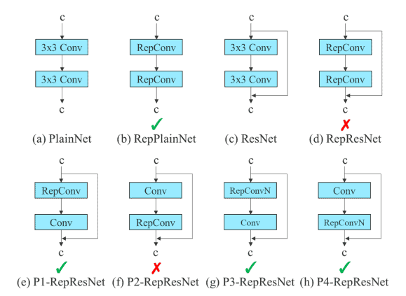

# YOLOv7

YOLOv7 is a single-stage real-time object detector. It was introduced to the YOLO family in July’22. The YOLOv7 algorithm is making big waves in the computer vision and machine learning communities. The newest YOLO algorithm surpasses all previous object detection models and YOLO versions in both speed and accuracy.

An object detector is an object detection algorithm that performs image recognition tasks by taking an image as input and then predicting bounding boxes and class probabilities for each object in the image (see the example image below). Most algorithms use a convolutional neural network (CNN) to extract features from the image to predict the probability of learned classes.

## What is YOLO? 

YOLO stands for “You Only Look Once”, it is a popular family of real-time object detection algorithms. The original YOLO object detector was first released in 2016. It was created by Joseph Redmon, Ali Farhadi, and Santosh Divvala. At release, this architecture was much faster than other object detectors and became state-of-the-art for real-time computer vision applications. 

Since then, different versions and variants of YOLO have been proposed, each providing a significant increase in performance and efficiency. The versions from YOLOv1 to the popular YOLOv3 were created by then-graduate student Joseph Redmon and advisor Ali Farhadi. YOLOv4 was introduced by Alexey Bochkovskiy, who continued the legacy. 

YOLOv7 is the latest official YOLO version created by the original authors of the YOLO architecture. We expect that many commercial networks will move directly from YOLOv4 to v7, bypassing all the other numbers.

## Unofficial YOLO versions 

There were some controversies in the computer vision community whenever other researchers and companies published their models as YOLO versions. A popular example is YOLOv5 which was created by the company Ultralytics. It’s similar to YOLOv4 but uses a different framework, PyTorch, instead of DarkNet. 

Another example is YOLOv6 which was published by the Chinese company Meituan (hence the MT prefix of YOLOv6). And there is also an unofficial YOLOv7 version that was released in the year before the official YOLOv7 (there are two YOLOv7’s). 

Both YOLOv5 and YOLOv6 are not considered part of the official YOLO series but were heavily inspired by the original one-stage YOLO architecture.

## Real-time object detectors and YOLO versions 

Currently, state-of-the-art real-time object detectors are mainly based on YOLO and FCOS (Fully Convolutional One-Stage Object Detection). The best performing object detectors are: 
- YOLOv3 model, introduced by Redmon et al. in 2018 
- YOLOv4 model, released by Bochkovskiy et al. in 2020, 
- YOLOv4-tiny model, research published in 2021 
- YOLOR (You Only Learn One Representation) model, published in 2021 
- YOLOX model, published in 2021 
- NanoDet-Plus model, published in 2021 
- PP-YOLOE, an industrial object detector, published in 2022 
- YOLOv5 model v6.1 published by Ultralytics in 2022 
- YOLOv7, published in 2022  

## YOLO Architecture in General

YOLO architecture is FCNN(Fully Convolutional Neural Network) based. 

The YOLO framework has three main components. 

- Backbone
- Head 
- Neck

The Backbone mainly extracts essential features of an image and feeds them to the Head through Neck. The Neck collects feature maps extracted by the Backbone and creates feature pyramids. Finally, the head consists of output layers that have final detections. The following table shows the architectures of YOLOv3, YOLOv4, and YOLOv5.

## The differences between the basic YOLOv7 versions 

The different basic YOLOv7 models include YOLOv7, YOLOv7-tiny, and YOLOv7-W6: 

  - YOLOv7 is the basic model that is optimized for ordinary GPU computing. 
  - YOLOv7-tiny is a basic model optimized for edge GPU. The suffix “tiny” of computer vision models means that they are optimized for Edge AI and deep learning workloads, and more lightweight to run ML on obile computing devices or distributed edge servers and devices. This model is important for distributed real-world computer vision applications. Compared to the other versions, the edge-optimized YOLOv7-tiny uses leaky ReLU as the activation function, while other models use SiLU as the activation function.
  - YOLOv7-W6 is a basic model optimized for cloud GPU computing. Such Cloud Graphics Units (GPUs) are computer instances for running applications to handle massive AI and deep learning workloads in the cloud without requiring GPUs to be deployed on the local user device. Other variations include YOLOv7-X, YOLOv7-E6, and YOLOv7-D6, which were obtained by applying the proposed compound scaling method (see YOLOv7 architecture further below) to scale up the depth and width of the entire model.  

Other variations include YOLOv7-X, YOLOv7-E6, and YOLOv7-D6, which were obtained by applying the proposed compound scaling method (see YOLOv7 architecture further below) to scale up the depth and width of the entire model.  

## What’s New in YOLOv7?

YOLOv7 improves speed and accuracy by introducing several architectural reforms. Similar to Scaled YOLOv4, YOLOv7 backbones do not use ImageNet pre-trained backbones. Rather, the models are trained using the COCO dataset entirely. The similarity can be expected because YOLOv7 is written by the same authors as Scaled YOLOv4, which is an extension of YOLOv4. The following major changes have been introduced in the YOLOv7 paper. 

- Architectural Reforms
  - E-ELAN (Extended Efficient Layer Aggregation Network)
  - Model Scaling for Concatenation-based Models 
- Trainable BoF (Bag of Freebies)
  - Planned re-parameterized convolution
  - Coarse for auxiliary and Fine for lead loss

## YOLOv7 Architecture

The architecture is derived from YOLOv4, Scaled YOLOv4, and YOLO-R. Using these models as a base, further experiments were carried out to develop new and improved YOLOv7.

### E-ELAN (Extended Efficient Layer Aggregation Network)

The computational block in the YOLOv7 backbone is named E-ELAN, standing for Extended Efficient Layer Aggregation Network. The E-ELAN architecture of YOLOv7 enables the model to learn better by using “expand, shuffle, merge cardinality” to achieve the ability to continuously improve the learning ability of the network without destroying the original gradient path.  

The E-ELAN takes inspiration from previous research on network efficiency. It has been designed by analyzing the following factors that impact speed and accuracy.

- Memory access cost
- I/O channel ratio
- Element wise operation
- Activations
- Gradient path  

In simple terms, E-ELAN architecture enables the framework to learn better. It is based on the ELAN computational block. 

### Compound Model Scaling

Different applications require different models. While some need highly accurate models, some prioritize speed. Model scaling is performed to suit these requirements and make it fit in various computing devices.

While scaling a model size, the following parameters are considered.

- Resolution ( size of the input image)
- Width (number of channels)
- Depth (number of layers)
- Stage (number of feature pyramids)

NAS (Network Architecture Search) is a commonly used model scaling method. It is used by researchers to iterate through the parameters to find the best scaling factors. However, methods like NAS do parameter-specific scaling. The scaling factors are independent in this case.

The authors of the YOLOv7 paper show that it can be further optimized with a compound model scaling approach. Here, width and depth are scaled in coherence for concatenation-based models.

### Planned Re-parameterized Convolution

Re-parameterization is a technique used after training to improve the model. It increases the training time but improves the inference results. Two types of re-parametrization are used to finalize models: Model level and Module level ensemble.

Model level re-parametrization can be done in the following two ways.

- Using different training data but the same settings, train multiple models. Then average their weights to obtain the final model.
- Take the average of the weights of models at different epochs.

Recently, Module level re-parameterization has gained a lot of traction in research. In this method, the model training process is split into multiple modules. The outputs are ensembled to obtain the final model. The authors in the YOLOv7 paper show the best possible ways to perform module-level ensemble (shown below).

In the diagram above, The 3×3 convolution layer of the E-ELAN computational block is replaced with the RepConv layer. Experiments we carried out by switching or replacing the positions of RepConv, 3×3 Conv, and Identity connection. The residual bypass arrow shown above is an identity connection. It is nothing but a 1×1 convolutional layer. We can see the configurations that work and the ones that do not.

Including RepConv, YOLOv7 also performs re-parameterization on Conv-BN (Convolution Batch Normalization), OREPA(Online Convolutional Re-parameterization), and YOLO-R to get the best results.

### Coarse for Auxiliary and Fine for Lead Loss

As you already know by now, YOLO architecture comprises a backbone, a neck, and a head. The head contains the predicted outputs. YOLOv7 does not limit itself to a single head. It has multiple heads to do whatever it wants. Interesting, isn’t it?

However, it’s not the first time a multi-headed framework was introduced. Deep Supervision, a technique used by DL models, uses multiple heads. In YOLOv7, the head responsible for final output is called the Lead Head. And the head used to assist training in the middle layers is called the Auxiliary Head.

With the help of an assistant loss, the weights of the auxiliary heads are updated. It allows for Deep Supervision, and the model learns better. These concepts are closely coupled with the Lead Head and the Label Assigner.

Label Assigner is a mechanism that considers the network prediction results together with the ground truth and then assigns soft labels. It’s important to note that the label assigner generates soft and coarse labels instead of hard ones.

#### Lead Head Guided Label Assigner and Coarse-to-Fine Lead Head Guided Label Assigner

The Lead Head Guided Label Assigner encapsulates the following three concepts.

- Lead Head
- Auxiliary Head
- Soft Label Assigner

The Lead Head in the YOLOv7 network predicts the final results. Soft labels are generated based on these final results. The important part is that the loss is calculated for both the lead head and the auxiliary head based on the same soft labels that are generated. Ultimately, both heads get trained using the soft labels. This is shown in the left image in the above figure. 

Now, coming to the coarse-to-fine labels as shown in the right image in the previous figure. In the above process, two sets of soft labels are generated.

- A fine label to train the lead head
- A set of coarse labels to train the auxiliary head.

The fine labels are the same as the directly generated soft labels. However, more grids are treated as positive targets to generate the coarse labels. This is done by relaxing the constraints of the positive sample assignment process.

## YOLOv7-mask 

The integration of YOLOv7 with BlendMask is used to perform instance segmentation. Therefore, the YOLOv7 object detection model was fine-tuned on the MS COCO instance segmentation dataset and trained for 30 epochs. It achieves state-of-the-art real-time instance segmentation results.

## YOLOv7-pose 

The integration of YOLOv7 with YOLO-Pose allows keypoint detection for Pose Estimation. The authors fine-tuned a YOLOv7-W6 people detection model on the MS COCO keypoint detection dataset and achieved state-of-the-art real-time pose estimation performance.

## YOLOv7 Experiments and Results

All the YOLOv7 models surpass the previous object detectors in speed and accuracy in the range of 5 FPS to 160 FPS. The following figure gives a pretty good idea about the Average Precision(AP) and speed of the YOLOv7 models compared to the others.

It is clear from the figure that starting from YOLOv7, there is no competition with YOLOv7 in terms of speed and accuracy.

It is worth noting that none of the YOLOv7 models are meant for mobile devices/mobile CPUs (as mentioned in the YOLOv7 paper). 

- YOLOv7-Tiny, YOLOv7, and YOLOv7-W6 are meant for edge GPU, normal (consumer) GPU, and cloud GPU, respectively.
- YOLOv7-E6 and YOLOv7-D6, and YOLOv7-E6E are also meant for high-end cloud GPUs only.
Nonetheless, all of the YOLOv7 models run at more than 30 FPS on the Tesla V100 GPU, which is more than real-time FPS.

## References

- https://github.com/WongKinYiu/yolov7
- [YOLOv7 Object Detection Paper Explanation & Inference](https://learnopencv.com/yolov7-object-detection-paper-explanation-and-inference/)
- [YOLOv7: The Most Powerful Object Detection Algorithm (2022 Guide)](https://viso.ai/deep-learning/yolov7-guide/)