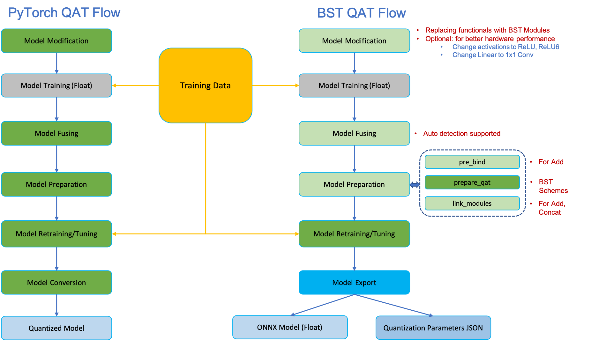

# YOLOv7 QAT



## 1. Retrain float YOLOv7

### 1.0 Accuracy check by replacing SiLU with ReLU

```
python train.py --epochs 30 --workers 4 --device 0 --batch-size 12 --data data/coco.yaml --img 640 640 --cfg cfg/training/yolov7.yaml --weights yolov7.pt --name yolov7 --hyp data/hyp.relu-tune.yaml
```

The result log is [results_act_relu.txt](./results_act_relu.txt)

```
Epoch   gpu_mem       box       obj       cls     total    labels  img_size
     20/29      7.5G   0.02685   0.02484  0.006784   0.05847       132       64
               Class      Images      Labels           P           R      mAP@.
                 all        5000       36335        0.71       0.626       0.672       0.478

     Epoch   gpu_mem       box       obj       cls     total    labels  img_size
     21/29      7.5G   0.02681   0.02476  0.006686   0.05825       219       64
               Class      Images      Labels           P           R      mAP@.5  mAP@.5:.95: 100%|█| 209/209 [00
                 all        5000       36335       0.727       0.613       0.672       0.478

     Epoch   gpu_mem       box       obj       cls     total    labels  img_size
     22/29      7.5G   0.02665   0.02459  0.006528   0.05777       146       640: 100%|█| 9857/9857 [44:32<00:00,
               Class      Images      Labels           P           R      mAP@.5  mAP@.5:.95: 100%|█| 209/209 [00
                 all        5000       36335       0.723       0.616       0.672       0.478

     Epoch   gpu_mem       box       obj       cls     total    labels  img_size
     23/29      7.5G    0.0266   0.02444   0.00648   0.05752       172       640: 100%|█| 9857/9857 [44:29<00:00,
               Class      Images      Labels           P           R      mAP@.5  mAP@.5:.95: 100%|█| 209/209 [00
                 all        5000       36335       0.733        0.61       0.671       0.478

     Epoch   gpu_mem       box       obj       cls     total    labels  img_size
     24/29      7.5G   0.02649   0.02437  0.006431   0.05729       231       640: 100%|█| 9857/9857 [44:35<00:00,
               Class      Images      Labels           P           R      mAP@.5  mAP@.5:.95: 100%|█| 209/209 [00
                 all        5000       36335       0.705       0.629       0.672       0.477

     Epoch   gpu_mem       box       obj       cls     total    labels  img_size
     25/29      7.5G   0.02644   0.02429  0.006326   0.05705       134       640: 100%|█| 9857/9857 [44:29<00:00,
               Class      Images      Labels           P           R      mAP@.5  mAP@.5:.95: 100%|█| 209/209 [00
                 all        5000       36335       0.713       0.625       0.671       0.477

     Epoch   gpu_mem       box       obj       cls     total    labels  img_size
     26/29      7.5G   0.02638   0.02428  0.006265   0.05693       159       640: 100%|█| 9857/9857 [44:33<00:00,
               Class      Images      Labels           P           R      mAP@.5  mAP@.5:.95: 100%|█| 209/209 [00
                 all        5000       36335       0.715       0.625       0.672       0.478

     Epoch   gpu_mem       box       obj       cls     total    labels  img_size
     27/29      7.5G    0.0263   0.02418  0.006242   0.05672       301       640: 100%|█| 9857/9857 [44:23<00:00,
               Class      Images      Labels           P           R      mAP@.5  mAP@.5:.95: 100%|█| 209/209 [00
                 all        5000       36335       0.718       0.625       0.672       0.478

     Epoch   gpu_mem       box       obj       cls     total    labels  img_size
     28/29      7.5G   0.02625   0.02415  0.006144   0.05654        87       640: 100%|█| 9857/9857 [44:26<00:00,
               Class      Images      Labels           P           R      mAP@.5  mAP@.5:.95: 100%|█| 209/209 [00
                 all        5000       36335       0.714       0.627       0.672       0.478

     Epoch   gpu_mem       box       obj       cls     total    labels  img_size
     29/29      7.5G   0.02617     0.024  0.006058   0.05623       122       640: 100%|█| 9857/9857 [44:30<00:00,
               Class      Images      Labels           P           R      mAP@.5  mAP@.5:.95: 100%|█| 209/209 [00
                 all        5000       36335       0.714       0.627       0.672       0.478
30 epochs completed in 22.593 hours.

Fusing layers... 
RepConv.fuse_repvgg_block
RepConv.fuse_repvgg_block
RepConv.fuse_repvgg_block
IDetect.fuse
Model Summary: 314 layers, 36907898 parameters, 6194944 gradients, 104.5 GFLOPS
               Class      Images      Labels           P           R      mAP@.5  mAP@.5:.95: 100%|█| 209/209 [00
                 all        5000       36335       0.703       0.627       0.668       0.476

Evaluating pycocotools mAP... saving runs/train/yolov76/_predictions.json...
loading annotations into memory...
Done (t=0.30s)
creating index...
index created!
Loading and preparing results...
DONE (t=4.33s)
creating index...
index created!
Running per image evaluation...
Evaluate annotation type *bbox*
DONE (t=59.54s).
Accumulating evaluation results...
DONE (t=9.48s).
 Average Precision  (AP) @[ IoU=0.50:0.95 | area=   all | maxDets=100 ] = 0.493
 Average Precision  (AP) @[ IoU=0.50      | area=   all | maxDets=100 ] = 0.676
 Average Precision  (AP) @[ IoU=0.75      | area=   all | maxDets=100 ] = 0.538
 Average Precision  (AP) @[ IoU=0.50:0.95 | area= small | maxDets=100 ] = 0.335
 Average Precision  (AP) @[ IoU=0.50:0.95 | area=medium | maxDets=100 ] = 0.540
 Average Precision  (AP) @[ IoU=0.50:0.95 | area= large | maxDets=100 ] = 0.641
 Average Recall     (AR) @[ IoU=0.50:0.95 | area=   all | maxDets=  1 ] = 0.375
 Average Recall     (AR) @[ IoU=0.50:0.95 | area=   all | maxDets= 10 ] = 0.621
 Average Recall     (AR) @[ IoU=0.50:0.95 | area=   all | maxDets=100 ] = 0.677
 Average Recall     (AR) @[ IoU=0.50:0.95 | area= small | maxDets=100 ] = 0.529
 Average Recall     (AR) @[ IoU=0.50:0.95 | area=medium | maxDets=100 ] = 0.728
 Average Recall     (AR) @[ IoU=0.50:0.95 | area= large | maxDets=100 ] = 0.820
Fusing layers... 
RepConv.fuse_repvgg_block
RepConv.fuse_repvgg_block
RepConv.fuse_repvgg_block
IDetect.fuse
Model Summary: 314 layers, 36907898 parameters, 6194944 gradients, 104.5 GFLOPS
               Class      Images      Labels           P           R      mAP@.5  mAP@.5:.95: 100%|█| 209/209 [00
                 all        5000       36335       0.703       0.625       0.668       0.476

Evaluating pycocotools mAP... saving runs/train/yolov76/_predictions.json...
loading annotations into memory...
Done (t=0.76s)
creating index...
index created!
Loading and preparing results...
DONE (t=4.51s)
creating index...
index created!
Running per image evaluation...
Evaluate annotation type *bbox*
DONE (t=61.17s).
Accumulating evaluation results...
DONE (t=10.01s).
 Average Precision  (AP) @[ IoU=0.50:0.95 | area=   all | maxDets=100 ] = 0.493
 Average Precision  (AP) @[ IoU=0.50      | area=   all | maxDets=100 ] = 0.675
 Average Precision  (AP) @[ IoU=0.75      | area=   all | maxDets=100 ] = 0.537
 Average Precision  (AP) @[ IoU=0.50:0.95 | area= small | maxDets=100 ] = 0.330
 Average Precision  (AP) @[ IoU=0.50:0.95 | area=medium | maxDets=100 ] = 0.544
 Average Precision  (AP) @[ IoU=0.50:0.95 | area= large | maxDets=100 ] = 0.643
 Average Recall     (AR) @[ IoU=0.50:0.95 | area=   all | maxDets=  1 ] = 0.376
 Average Recall     (AR) @[ IoU=0.50:0.95 | area=   all | maxDets= 10 ] = 0.623
 Average Recall     (AR) @[ IoU=0.50:0.95 | area=   all | maxDets=100 ] = 0.679
 Average Recall     (AR) @[ IoU=0.50:0.95 | area= small | maxDets=100 ] = 0.522
 Average Recall     (AR) @[ IoU=0.50:0.95 | area=medium | maxDets=100 ] = 0.734
 Average Recall     (AR) @[ IoU=0.50:0.95 | area= large | maxDets=100 ] = 0.824
Optimizer stripped from runs/train/yolov76/weights/last.pt, 75.6MB
Optimizer stripped from runs/train/yolov76/weights/best.pt, 75.6MB
```

