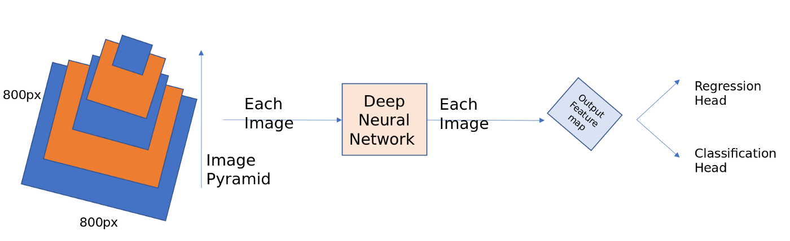
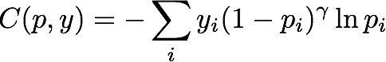

# Concept 
   * [Anchor Boxes](./README.md#anchor-boxes)
   * [Feature Pyramid Network (FPN)](./README.md#feature-pyramid-network-fpn)   
   * [Focal Loss](./README.md#focal-loss)   
   * [Intersection over Union (IoU)](./README.md#intersection-over-union-iou)
     * [IoU sample notebook](./IoU.ipynb)
   * [Mean Average Precision (mAP)](./mAP.md)
   * [Non Maximum Suppression (NMS)](./README.md#non-maximum-suppression-nms)
     * [NMS in PyTorch](./nms_pytorch.ipynb)
   * [Region Proposal Network (RPN)](./README.md#region-proposal-network-rpn)   
 
## Anchor Boxes
  
  Anchor boxes were first introduced in Faster RCNN paper and later became a common element in all the following papers like yolov2, ssd and RetinaNet. Previously selective search and edge boxes used to generate region proposals of various sizes and shapes depending on the objects in the image, with standard convolutions it is highly impossible to generate region proposals of varied shapes, so anchor boxes comes to our rescue.
     

        
     

## Feature Pyramid Network (FPN)
    
In RPN, we have built anchor boxes only using the top high level feature map. Though convnets are robust to variance in scale, all the top entries in ImageNet or COCO have used multi-scale testing on featurized image pyramids. Imagine taking a 800 * 800 image and detecting bounding boxes on it. Now if your are using image pyramids, we have to take images at different sizes say 256*256, 300*300, 500*500 and 800*800 etc, calculate feature maps for each of this image and then apply non-maxima supression over all these detected positive anchor boxes. This is a very costly operation and inference times gets high.
      

        
      

       
Deep convnet computes a feature hierarchy layer by layer, and with subsampling layers the feature hierarchy has an inherent multi-scale, pyramidal shape. For example, take a Resnet architecture and instead of just using the final feature map as shown in RPN network, take feature maps before every pooling (subsampling) layer. Perform the same operations as for RPN on each of these feature maps and finally combine them using non-maxima supression. This is the crude way of building the feature pyramid networks. But there is one of the problem with this approach, there are large semantic gaps caused by different depths. The high resolution maps (earlier layers) have low-level features that harm their representational capacity for object detection.
     

       
     

       
The goal of the authors is to naturally leverage the pyramidal shape of a Convnet feature hierarchy while creating a feature pyramid that has strong semantics at all scales. To achieve this goal, the authors relayed on a architecture that combines low-resolution, semantically strong features with high-resolution, semantically strong features via top-down pathway and lateral connection as shown in the diagram below.
     

       
     

     

       
     

       
The predictions are made on each level independently.
       
Important points while designing anchor boxes:
       
* Since the pyramids are of different scales, no need to have multi-scale anchors on a specific level. We define the anchors to have size of [32, 54, 128, 256, 512] on P3, P4, P5, P6, P7 respectively. We use anchors of multiple aspect ratio [1:1, 1:2, 2:1]. so in-total there will be 15 anchors over the pyramid at each location.

* All the anchor boxes outside image dimensions were ignored.

* positive if the given anchor box has highest IoU with the ground truth box or if the IoU is greater than 0.7. negative if the IoU is less than 0.3.

* The scales of the ground truth boxes are not used to assign them to levels of the pyramid. Instead, ground-truth boxes are associated with anchors, which have been assigned to pyramid levels. This above statement is very important to understand. I had two confusions here, weather we need to assign ground truth boxes to each level separately or compute all the anchor boxes and then assign label to the anchor box with which it has max IoU or IoU greater than 0.7. Finally I have chosen the second option to assign labels.       

## Focal Loss  
  
Methods like SSD or YOLO suffer from an extreme class imbalance: The detectors evaluate roughly between ten to hundred thousand candidate locations and of course most of these boxes do not contain an object. Even if the detector easily classifies these large number of boxes as negatives/background, there is still a problem.
    
### Cross entropy loss function      

          

      

          

      
where i is the index of the class, y_i the label (1 if the object belongs to class i, 0 otherwise), and p_i is the predicted probability that the object belongs to class i.
      
Let’s say a box contains background and the network is 80% sure that it actually is only background. In this case y(background)=1, all other y_i are 0 and p(background)=0.8.
      
You can see that at 80% certainty that the box contains only background, the loss is still ~0.22. The large number of easily classified examples absolutely dominates the loss and thus the gradients and therefore overwhelms the few interesting cases the network still has difficulties with and should learn from.
      
### Focal Loss Function
    
Lin et al. (2017) [Focal Loss for Dense Object Detection](https://arxiv.org/abs/1708.02002) had the beautiful idea to scale the cross entropy loss so that all the easy examples the network is already very sure about contribute less to the loss so that the learning can focus on the few interesting cases. The authors called their loss function <i>Focal loss </i>and their architecture <b>RetinaNet</b> (note that RetinaNet also includes <b>Feature Pyramid Networks (FPN)</b> which is basically a new name for U-Net).

         

         

        
With this rescaling, the large number of easily classified examples (mostly background) does not dominate the loss anymore and learning can concentrate on the few interesting cases.

## Intersection over Union (IoU)

__Intersection Over Union (IoU)__ is a number that quantifies the degree of overlap between two boxes. In the case of object detection and segmentation, __IoU__ evaluates the overlap of the __Ground Truth__ and __Prediction__ region.

For example, in the image below:

  * The predicted bounding box (the coordinates delimiting where the model predicts the night table in the painting is located) is outlined in purple.
  
  * The ground-truth bounding box (the coordinates delimiting where the night table in the painting is actually located) is outlined in green.

Here, the intersection of the bounding boxes for prediction and ground truth (below left) is 1, and the union of the bounding boxes for prediction and ground truth (below right) is 7, so the IoU is 1/7.

Let’s go through the following example to understand how IoU is calculated. Let there be three models- A, B, and C, trained to predict birds. We pass an image through the models where we already know the __Ground Truth (marked in red)__. The image below shows __predictions__ of the models __(marked in cyan)__.

IoU is the ratio of the __overlap area__ to the __combined area of prediction__ and __ground truth__.

IoU values range from 0 to 1. Where 0 means no overlap and 1 means perfect overlap.

Looking closely, we are adding the area of the intersection __twice__ in the denominator. So actually we calculate IoU as shown in the illustration below.

### Qualitative Analysis of Predictions

With the help of the IoU threshold, we can decide whether the prediction is __True Positive(TP)__, __False Positive(FP)__, or __False Negative(FN)__. The example below shows predictions with the IoU threshold __ɑ__ set at __0.5__.

The decision of making a detection as __True Positive__ or __False Positive__, completely depends on the requirement.

- The first prediction is __True Positive__ as the IoU threshold is 0.5.
- If we set the threshold at 0.97, then it becomes a __False Positive__.
- Similarly, the second prediction shown above is __False Positive__ due to the threshold but can be __True Positive__ if we set the threshold at 0.20.
- Theoretically, the third prediction can also be __True Positive__, given that we lower the threshold all the way to 0.

### Intersection over Union in Image Segmentation

__IoU in object detection is a helper metric__. However, in image segmentation; IoU is the primary metric to evaluate model accuracy.

In the case of Image Segmentation, the area is not necessarily rectangular. It can have any regular or irregular shape. That means the predictions are segmentation masks and not bounding boxes. Therefore, pixel-by-pixel analysis is done here. Moreover, the definition of TP, FP, and FN is slightly different as it is not based on a predefined threshold.

(a) __True Positive__: The area of intersection between Ground Truth(__GT__) and segmentation mask(__S__). Mathematically, this is __logical AND__ operation of GT and S i.e., 

$$TP = GT.S$$

(b) __False Positive__: The predicted area outside the Ground Truth. This is the __logical OR__ of GT and segmentation minus GT. 

$$FP = (GT + S) - GT$$

(c) __False Negative__: Number of pixels in the Ground Truth area that the model failed to predict. This is the __logical OR__ of GT and segmentation minus S.

$$FN = (GT + S) - S$$

We know from Object Detection that IoU is the ratio of the __intersected area__ to the __combined area__ of __prediction__ and __ground truth__. Since the values of TP, FP, and FN are nothing but areas or number of pixels; we can write IoU as follows.

$$IoU = \dfrac{TP} {TP + FP + FN} $$

## Non Maximum Suppression (NMS)

Non Maximum Suppression (NMS) is a technique used in numerous computer vision tasks. It is a class of algorithms to select one entity (e.g., bounding boxes) out of many overlapping entities. We can choose the selection criteria to arrive at the desired results. The criteria are most commonly some form of probability number and some form of overlap measure (e.g. Intersection over Union).

  

### Why we need it?

Most object detection algorithms use NMS to whittle down many detected bounding boxes to only a few. At the most basic level, most object detectors do some form of __windowing__. Thousands of windows (__anchors__) of various __sizes and shapes__ are generated.

These windows supposedly contain only one object, and a classifier is used to obtain a probability/score for each class. Once the detector outputs a large number of bounding boxes, it is necessary to filter out the best ones. NMS is the most commonly used algorithm for this task.

### The NMS Algorithm

Let us get to the nitty-gritty of this post, the actual algorithm. I will divide this into three parts, what we need as input, what we get after applying the algorithm and the actual algorithm itself.

#### Input
We get a list `P` of prediction BBoxes of the form `(x1,y1,x2,y2,c)`, where `(x1,y1)` and `(x2,y2)` are the ends of the BBox and `c` is the predicted confidence score of the model. We also get overlap threshold IoU `thresh_iou`.

#### Output
We return a list `keep` of filtered prediction BBoxes.

#### Algorithm

- Step 1 : Select the prediction `S` with highest confidence score and remove it from `P` and add it to the final prediction list `keep`. (`keep` is empty initially).

- Step 2 : Now compare this prediction `S` with all the predictions present in `P`. Calculate the IoU of this prediction `S` with every other predictions in `P`. If the IoU is greater than the threshold `thresh_iou` for any prediction `T` present in `P`, remove prediction `T` from `P`.

- Step 3 : If there are still predictions left in `P`, then go to __Step 1__ again, else return the list `keep` containing the filtered predictions.

In layman terms, we select the predictions with the `maximum confidence` and `suppress all the other predictions` having overlap with the selected predictions greater than a threshold. In other words, we `take the maximum and suppress the non-maximum ones`, hence the name non-maximum suppression.

If you observe the algorithm above, the whole filtering process depends on a single threshold value thresh_iou. So selection of threshold value is vital for the performance of the model. Usually, we take its value as 0.5, but it depends on the experiment you are doing.As discussed in the NMS algorithm above, we extract the BBox of highest confidence score and remove it from P.

### References
- [Non Maximum Suppression: Theory and Implementation in PyTorch](https://learnopencv.com/non-maximum-suppression-theory-and-implementation-in-pytorch/)

## Region Proposal Network (RPN)
     
* <b>Regression head</b>: The output of the Faster RPN network as discussed and shown in the image above is a 50x50 feature map. A conv layer [kernal 3x3] strides through this image, At each location it predicts the 4 [x1, y1, h1, w1] values for each anchor boxes (9). In total, the output layer has 50x50x9x4 output probability scores. Usually this is represented in numpy as np.array(2500, 36).
     
* <b>Classification head</b>: Similar to the Regression head, this will predict the probability of an object present or not at each location for each anchor bos. This is represented in numpy array as np.array(2500, 9).
     

        
     

     
* Problems with RPN
      
  * The Feature map created after a lot of subsampling losses a lot of semantic information at low level, thus unable to detect small objects in the image. <b>[Feature Pyramid networks solves this]</b>
          
  * The loss functions uses negative hard-mining by taking 128 +ve samples, 128 -ve samples because using all the labels hampers training as it is highly imbalanced and there will be many easily classified examples. <b>[Focal loss solves this]</b>

