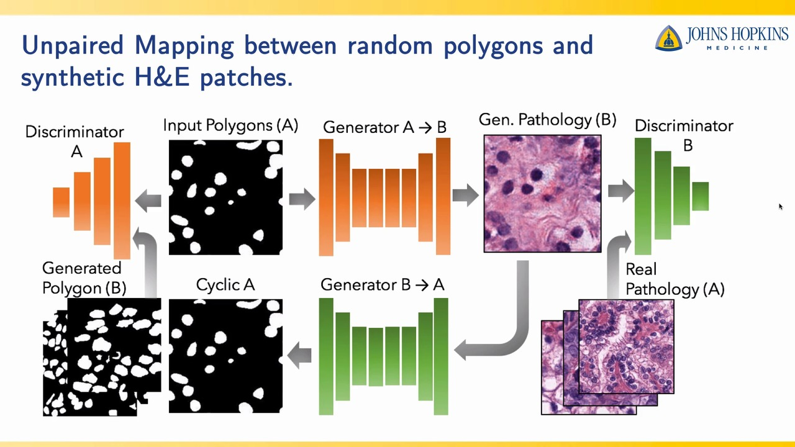
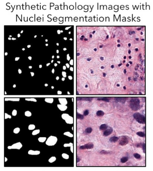
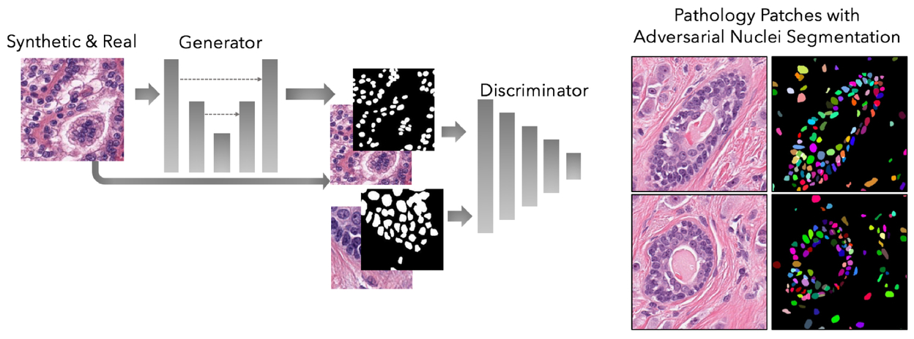
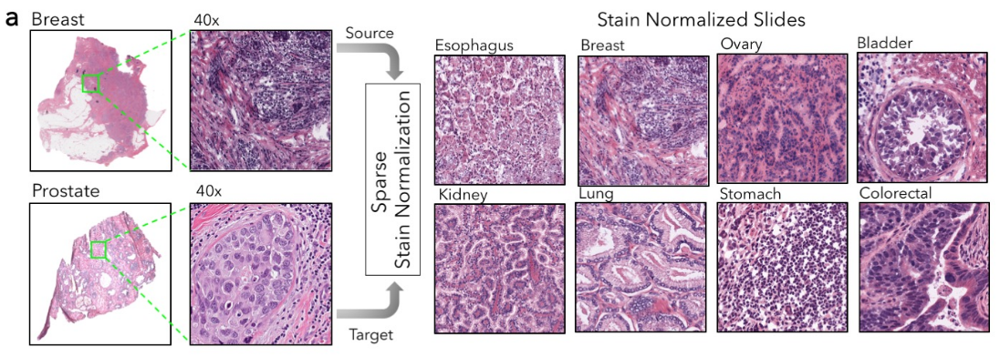
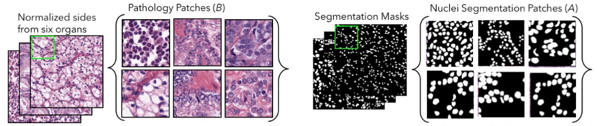

# Deep Adversarial Training for Multi-Organ Nuclei Segmentation in Histopathology Images

## Main Ideas

* Paired labelled images for nuclei segmentation are difficult to obtain.

* Unpaired images are relatively easy to get.

    * Original pathology images

    * Randomly draw some polygons to generate synthetic image segmentation masks.

### Train a CycleGAN to learn the mappings between synthetic image segmentation masks and pathology images.

### Using the trained CycleGAN model to create images pairs between pathology images and segmentation masks.

### Using the CycleGAN generated synthetic pairs as the training dataset to train a Pix2Pix network. 

### Stain color normalization

### Patch-based approach 

## References

* [Deep Adversarial Training for Multi-Organ Nuclei Segmentation in Histopathology Images](https://arxiv.org/pdf/1810.00236.pdf) by Faisal Mahmood, Daniel Borders, Richard Chen, Gregory N. McKay, Kevan J. Salimian, Alexander Baras,
and Nicholas J. Durr.