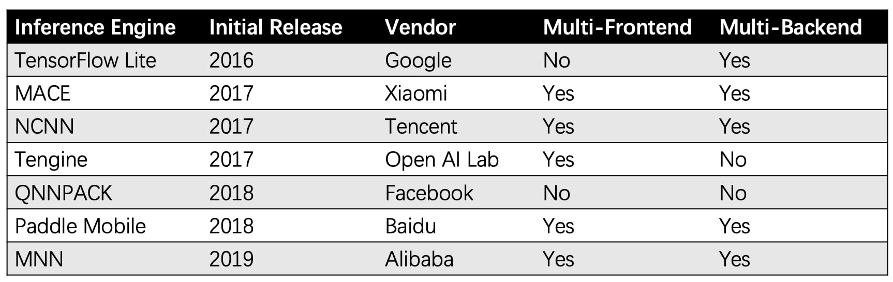
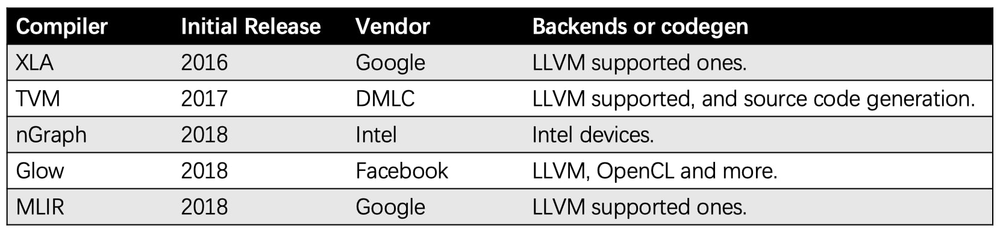

# Deep Learning Compiler
## Deep Learning Inference Engine
自 2012 年伊始的深度学习热潮，到今年已经是是第 8 年了。TensorFlow、PyTorch 系统不断完善，算法应用「落地」的呼声也日益高涨，尤其是在移动端。

而 TensorFlow 和 PyTorch 对移动端来说太重了。于是，轻量级的、专注于预测的「推理引擎」出现了，TensorFlow 的 TFLite 是典型代表。然而，TFLite 属于 TensorFlow 生态，不支持工业界遗留的大量的 Caffe 模型，也不支持 PyTorch 等框架。此外，TFLite 的计算性能也不够强大，在中低端手机上的运行效果堪忧。

*Deep Learning Inference Engines*
 
这些推理引擎提供的功能一般包括：

  * 多种前端支持，即能够导入多种训练框架的模型文件。
  * 大多数都支持模型量化（Quantization）技术，一些系统还能优化模型结构，例如融合 BN。
  * 多种后端的支持，虽然一般主打的还是 ARM CPU。

这些功能本身复杂度不高，用的都是比较成熟的技术（类似 Caffe 的架构），同质化严重。可见的差异也就是神经网络算子支持的完善程度，和网络运行的计算性能。又由于算子支持是很简单的工程问题，实质性的差异只有计算性能，这也很可能是决出最后的赢家的关键因素之一。

目前在 ARM 设备侧，QNNPACK 拥有最好的性能，可惜得用 Caffe2 部署才行。其次是 Tengine，但整体生态很差。NCNN 和 MNN 分别是国内两大互联网厂商的产品，在自家平台上久经验证，MNN 则有后发优势。MACE 和 Paddle Mobile/Lite 的用户似乎在收缩，不过自家运营应该不成问题。TensorFlow Lite 目前性能有点落后，是各家产品宣发时爆锤的对象，不过 Marat Dukhan（QNNPACK 作者）加入 Google 后的工作令人期待。（笔者曾和 Marat 有过短暂的交流，其在加入 Google 后依然专注于计算性能优化这一方向。从近期开源的 XNNPACK 看，Marat 将间接卷积算法应用到了浮点系统中。）

随着时间的推移，推理引擎的工作也基本完善，计算性能方面的工作会在一年内逐步填平。当然，各大厂家应该还是会自己维护系统，可控是很重要的。

## Deep Learning Compiler

*Deep Learning Compilers*

然而深度学习编译器或者相关的自动优化器不是魔杖，并不能挥一挥就让网络跑得飞起。这些工具的出现降低了网络优化的门槛，能帮助我们快速获得比较好的性能，但更进一步还是要投入大量的工程。

经常会有人提出 TVM 是在深度学习领域的 LLVM，笔者对此持保留态度。TVM 的发展比较依赖社区，现在还不好说会不会重演 MXNet 的悲剧。尽管如此，笔者还是看好 TVM 成为一个尝试各种性能优化技巧的良好平台。不过事在人为，以华盛顿大学为核心的 TVM 作者们成立了 OctoML 推动 TVM 的产业化，让我们期待在部署和使用方面的下一步改进。

与竞品相比，MLIR 可能是目标更长远的工作。MLIR 是一套设计 IR 的基础设施，其对计算的表达能力比较增强。TensorFlow 也在尝试用 MLIR 解决不同软件系统中网络拓扑结构转换的问题，而这一点也要比 ONNX 走得更远。当然，这使得系统的复杂性变得很高，也需要更长的时间磨合。

对于目前这些深度学习编译器，其中一部分实际上是被当做推理引擎在用，另一部分则需要更长的时间成长。

## 未来可能的趋势
如上节所述，目前深度学习软硬件系统百家争鸣、百花齐放，但这种情况不会持续太久。「以古为鉴，可知兴替」。回顾中央处理器和图形计算的历史，我们大体能判断这一波深度学习软硬件系统的可能趋势。

### 硬件系统
硬件系统分为移动端和云端两大部分（这里将所谓的边缘计算纳入移动端，雾计算纳入云端）。我们一般会说芯片是个「赢家通吃」拿走绝大部分利润的行业，例如 Intel 的 CPU 和 Nvidia 的 GPU，因为赢家会迅速获得生态和支撑继续发展的资金。

首先移动端会很快收敛为两股势力，一是 ARM 提供的公版 NPU。较弱势的中低端 ARM 芯片厂商为了节约成本基本上会采用 ARM 的方案，特别是 ARM 可能为了获取优势地位赠送 NPU IP。这样可以共享底层的软硬件系统生态，对 ARM 和芯片厂商都是有利的。二是以高通和海思为代表的大芯片厂会自行设计 NPU，毕竟 SoC 的方案掌握在他们手里，其赚取的利润也足以支持在中高端芯片中采用区别于 ARM NPU 的方案，形成差异化竞争。抱歉，这里真的没有太多其他厂商的位置。

云端其实也是类似的情况，一是 Nvidia 这样的 2B（To Business）厂商继续提供 GPU 或 NPU。无意自研 NPU 的云服务商或自建数据中心的企业会采用这样的标准方案。二是以 Google 为代表的云服务商自研 NPU，相关服务以 AI 算法作为接口时可以天然地屏蔽底层硬件差异（虽然不知道其他厂商什么时候能真正商用）。云是个好东西，但它正让 Intel 和 Nvidia 这样的公司远离用户和开发者，变得更像台积电。

这个演变可能需要 5-10 年甚至更长的时间，绝大多数从事相关行业的公司都会在两三年之内死去，而最后的赢家或许还没出现在大家的视野中。

这里再谈一点。寒武纪曾在很长时间内将指令集作为宣发的重点，因为创始团队认为指令集是生态的入口。笔者赞同关注生态的问题，这也是写作本文的原因之一，但笔者并不赞同在深度学习领域谈论指令集。指令集作为生态入口是 CPU 发展的结果，与龙芯同根同源的寒武纪执迷于指令集也不意外。而 GPU 之争已经不再硬件指令，而是编程系统——开发者编程使用的界面在整个软件栈中上移了。这一点在 NPU 时代会进一步发展，开发者使用的编程接口是 TensorFlow 这样的框架，而不是 CUDA、OpenCL，更不是机器指令集。一言以蔽之，NPU 指令集对生态的影响不大，不要刻舟求剑。

## 软件系统
随着领域发展逐渐成熟，硬件系统逐步定型，相关的软件标准也会一步步得到明确。中央 Khronos 的 NNEF（Neural Network Exchange Format）和 Facebook 的 ONNX（Open Neural Network Exchange）就是早期的尝试（虽然很原始）。

相比起硬件，软件的变化灵活很多，很难说最后会演变成什么形态。

*Android Neural Networks API Architecture*

理想中的终极场景大体上会像 Android Neural Networks API 那样，在操作系统中形成两层抽象：底层是系统和驱动对接的接口、上层是应用和系统对接的接口。当然，具体两层接口的抽象形态值得探讨。在这种场景下，NPU 厂商无需再将自己的加速库集成到各种框架或引擎中，引擎开发者不必费尽心思为 CPU、GPU、DSP 等开发计算核，应用开发者也无需为不同的引擎框架适配头疼。

基于这样的假设，移动端的推理引擎市场会迅速收敛。不过大厂依然会「有钱任性」自建生态，毕竟淘宝的 Android 应用连 Java 虚拟机都是自带的，更不用说这两年兴起的小程序热潮。

## 深度学习编译器

深度学习编译器开发团体对自身工作价值的表述通常包含两方面：一是方便用户部署，二是自动优化性能。

第一点的方便部署其实是伪命题，因为任何一个推理引擎都可以做到这一点，而且做得更好。在本文的设想中，模型部署这一当下有时候会造成麻烦的问题，会在整个生态完善后，变得像写 Hello World 那样轻而易举——我是指像用 Python 那样。

至于第二点，计算性能好往往需要足够的信息，一方面是模型的，另一方面是硬件信息，同时拥有这两点信息的是系统偏底层的部分。结合各类虚拟机，各类尝试抽象计算的系统设计，这样的编译功能应当可以放置到驱动中去。在底层抽象中，或许不一定是像 Android NNAPI 这样的表示，而是类程序语义的表示——表达能力更强，计算粒度更小的表示。

从用户价值来看，一个好的生态是不应当让用户考虑「编译」这种过程的，因为它干扰了用户尝试新想法的流程，这在深度学习环境中显得尤为重要——用户执行的是算法，而不是程序。基于这个逻辑，XLA 在易用性方面是优于 TVM 的。当然，系统总是可以持续更新迭代的，低端设备用 AOT ，其他用 JIT 或许是一个可期的状态，且对用户透明。

概念是会变的，现在声称自己是深度学习编译器系统未必一直都会是编译器。例如 TVM 的演化方向实际上是推理加速引擎，诸多用户也是将其作为 TFLite 的替代品。

## TVM与XLA的对比

XLA的整体设计理念，跟TVM存在一些比较明显的区别（以开源部分为例）：

1). XLA目前打击的是非计算密集算子，TVM打击的是计算密集算子，优化目标不一样，导致其作法存在明显的差异；

2). XLA强调自动化，所以给定计算图，XLA会直接codegen出可执行码(XLA社区最近也有一些妥协，开始考虑让用户在计算图上标记XLA的compilation scope，从而应对缓解XLA可用性的问题，虽然我觉得这种作法有一些倒退，但如果配合上系统层面的设计，倒不失为一个务实的解法)，而TVM则把一部分优化工作转移到用户身上（TVM开发者），这个设计理念的区别，我认为其影响还是比较深远的，因为涉及到了整个优化任务复杂性的拆解，XLA想在系统层面完成更多工作，TVM则认为可以把部分工作offload给用户，我认为这跟两个工具假定的目标用户存在差异有关。XLA假定的用户更倾向于是普通算法建模用户，而TVM目前的用户更多是DL引擎开发者（随着时间推移，我的观察和判断TVM会更多推广让普通算法建模用户的使用，但目前的用户还更多是具备引擎系统经验的开发者），这两类用户对于使用接口的容忍度存在比较明显的差异；

3). XLA整体的工程系统设计更为考究，也更为厚重，但不容易拆解出来以模块化的方式为外部使用，而TVM的设计相对更为轻巧，也比较容易以松耦合的方式被外部使用（比如TVM离线gen的kernel被集成到其他DL引擎框架里）；

4). XLA在图优化方面，会有更为复杂专注的实现逻辑，而TVM在图优化方面的实现则相对简单得多；

5). 为了支持更为复杂的图优化，加上自动codegen可执行码的理念，XLA的codegen部分实现逻辑是比较复杂的，相比较而言TVM的codegen部分其实比较朴素直接，如果用技术语言来描述一下的话，TVM的codegen部分，更像是一个纯粹的1-1 mapping性质的visitor实现，而XLA的codegen则除了对IR DAG遍历以外，涉及到针对不同计算pattern的inter-op的codegen逻辑拼接，以及数据存取index的推导计算和复用优化等等。当然TVM的codegen也可能针对不同硬件，加入一些inter-op的graph pattern的处理逻辑，但并不影响主体的界定；

6).TVM是一个经典的machine learning-based system，在完成schedule/computation抽象以外，整个优化空间探索，转换成了一个data-driven的机器学习优化问题，这是一个轻巧，但也一力降十会的作法。XLA在这方面，因为是纯system guy的工作，所以比较实在，是以纯系统的方式来解决优化问题。但是除了机器学习的方式以外，改成heuristics的方式来进行优化空间探索是不是也可能获得相近的效果呢？我觉得这还是一个open的question。不过把历史数据使用起来，辅助指导优化过程的探索寻优，这个原则我是buy in的。

1.2. 优化算法
深度学习的优化算法我觉得也可以算入深度学习加速的范畴，因为各式各样的优化算法（SGD，Adagrad，Adadelta，RMSprop，Momentum，Adam，Adamax，Nadam）的目标都是使得梯度下降搜索的时候可以更加趋近全局最优，使得收敛的速度更快，从而加速训练进度。

1.3. （轻量级）高效的神经网络结构
由于神经网络对于噪声不敏感，所以许多早期经典模型的参数其实是存在很大冗余度的，这样的模型很难部署在存储有限的边缘设备，因此学术界开始追求一些轻量级的网络设计（这代表着更少的参数，更少的乘法操作，更快的速度）：

减小卷积核大小

主要的做法包括使用更小的3x3卷积(加深网络来弥补感受野变小)；将大卷积核分解成一系列小的卷积核的操作组合。

减少通道数

第一种方式：1x1卷积的应用。在大卷积核前应用1X1卷积，可以灵活地缩减feature map通道数（同时1X1卷积也是一种融合通道信息的方式），最终达到减少参数量和乘法操作次数的效果。

第二种方式：group convolution，将feature map的通道进行分组，每个filter对各个分组进行操作即可，像上图这样分成两组，每个filter的参数减少为传统方式的二分之一（乘法操作也减少）。

第三种方式：depthwise convolution，是组卷积的极端情况，每一个组只有一个通道，这样filters参数量进一步下降。

如果只采用分组卷积操作，相比传统卷积方式，不同组的feature map信息无法交互，因此可以在组卷积之后在feature map间进行Shuffle Operation来加强通道间信息融合。或者更巧妙的是像Pointwise convolution那样将原本卷积操作分解成两步，先进行 depthwise convolution，之后得到的多个通道的feature map再用一个1X1卷积进行通道信息融合，拆解成这样两步，卷积参数也减少了。

减少filter数目

直接减少的filter数目虽然可以减少参数，但是导致每层产生的feature map数目减少，网络的表达能力也会下降不少。一个方法是像DenseNet那样，一方面减少每层filter数目，同时在每层输入前充分重用之前每一层输出的feature map。

池化操作

池化操作是操作卷积神经网络的标准操作，池化层没有参数，同时又可以灵活缩减上一级的feature map大小，从而减少下一级卷积的乘法操作。

## References
* [Efficient Processing of Deep Neural Networks: from Algorithms to Hardware Architectures](http://eyeriss.mit.edu/2019_neurips_tutorial.pdf) by Vivienne Sze from MIT.
* [Learning to Optimize Tensor Programs](https://arxiv.org/pdf/1805.08166.pdf)
* [Boost Quantization Inference Performance](https://jackwish.net/2019/boost-quant-perf.html)
* [Introducing TFLite Parser Python Package](https://jackwish.net/2020/introducing-tflite-parser-package.html)
* [深度学习加速：算法、编译器、体系结构与硬件设计](https://zhuanlan.zhihu.com/p/101544149)
* [也谈TVM和深度学习编译器](https://zhuanlan.zhihu.com/p/87664838)
* [手把手带你遨游TVM](https://zhuanlan.zhihu.com/p/50529704)
* [TVM: Deep Learning模型的优化编译器(强烈推荐, 附踩坑记录)](https://zhuanlan.zhihu.com/p/58918363)
* [深度学习推理引擎的一些思考](https://zhuanlan.zhihu.com/p/87392811)
* [AutoTVM：让AI来编译优化AI系统底层算子](https://zhuanlan.zhihu.com/p/37181530)
* [TVM教程1 — 用TVM编译深度学习模型](https://zhuanlan.zhihu.com/p/111842386)
* [TensorFlow官方发布剪枝优化工具：参数减少80%，精度几乎不变](https://zhuanlan.zhihu.com/p/65846143)
* [神经网络优化算法：Dropout、梯度消失/爆炸、Adam优化算法，一篇就够了！](https://zhuanlan.zhihu.com/p/78854514)
* [模型压缩一半，精度几乎无损，TensorFlow推出半精度浮点量化工具包，还有在线Demo](https://zhuanlan.zhihu.com/p/76872595)
