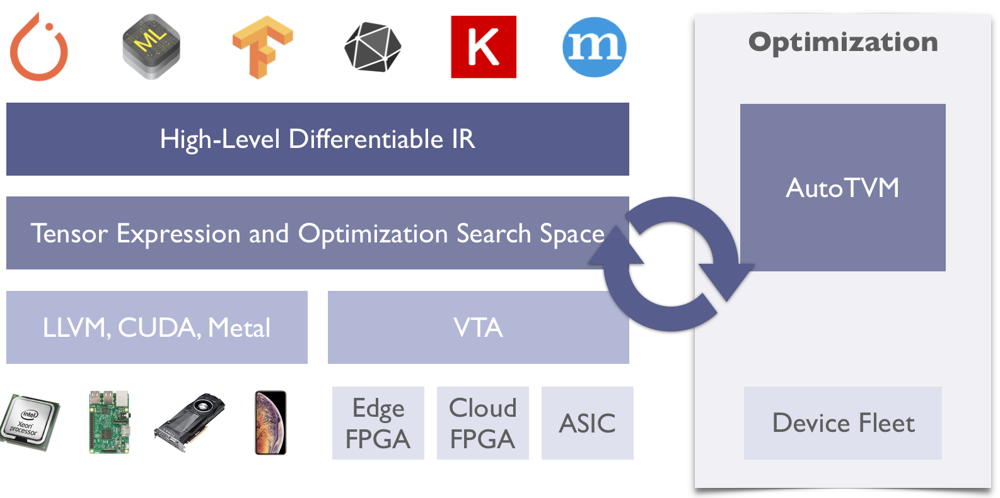
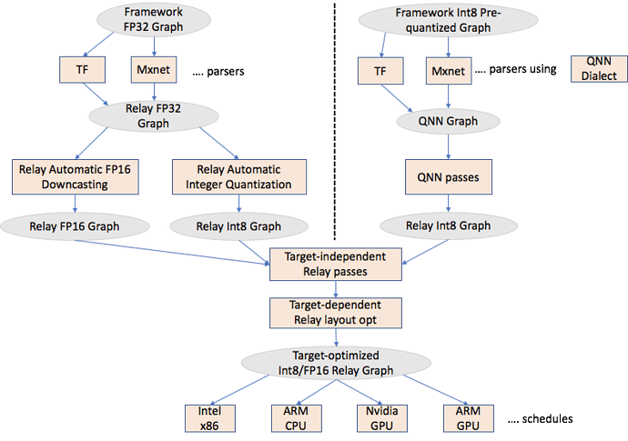

# TVM
   * [Introduction](#introduction)
   * [Installation](https://tvm.apache.org/docs/install/from_source.html)
   * [Quantization](#quantization)
      * [Quantization Scales](#quantization-scales)
   * [Tutorials](#tutorials)
   
## Introduction
Apache(incubating) TVM is an open deep learning compiler stack for CPUs, GPUs, and specialized accelerators. It aims to close the gap between the productivity-focused deep learning frameworks, and the performance- or efficiency-oriented hardware backends. TVM provides the following main features:

  * Compilation of deep learning models in Keras, MXNet, PyTorch, Tensorflow, CoreML, DarkNet into minimum deployable modules on diverse hardware backends.
  
  * Infrastructure to automatic generate and optimize tensor operators on more backend with better performance.
  
TVM began as a research project at the SAMPL group of Paul G. Allen School of Computer Science & Engineering, University of Washington. The project is now an effort undergoing incubation at The Apache Software Foundation (ASF), driven by an open source community involving multiple industry and academic institutions under the Apache way.

TVM provides two level optimizations show in the following figure. Computational graph optimization to perform tasks such as high-level operator fusion, layout transformation, and memory management. Then a tensor operator optimization and code generation layer that optimizes tensor operators. More details can be found at the [techreport](https://arxiv.org/pdf/1802.04799.pdf).

## Quantization

### Frameworks to Relay

As shown in the above figure, there are two different parallel efforts ongoing

  * <b>Automatic Integer Quantization:</b> It takes a FP32 framework graph and automatically converts it to Int8 within Relay.
  
  * <b>Accepting Pre-quantized Integer models:</b> This approach accepts a pre-quantized model, introduces a Relay dialect called QNN and generates an Int8 Relay graph.
  
### Quantization Scales

In quantization, we need to find the scale for each weight and intermediate feature map tensor of each layer.

  * For weights, the scales are directly calculated based on the value of the weights. Two modes are supported: <b>power2</b> and <b>max</b>. Both modes find the maximum value within the weight tensor first. 
  
      * In power2 mode, the maximum is rounded down to power of two. If the scales of both weights and intermediate feature maps are power of two, we can leverage bit shifting for multiplications. This make it computationally more efficient. 
  
      * In max mode, the maximum is used as the scale. Without rounding, max mode might have better accuracy in some cases. When the scales are not powers of two, fixed point multiplications will be used.

  * For intermediate feature maps, we can find the scales with <b>data-aware quantization</b>. 
  
      * Data-aware quantization takes a calibration dataset as the input argument. Scales are calculated by minimizing the <b>KL divergence</b> between distribution of activation before and after quantization. 
      
      * Alternatively, we can also use <b>pre-defined global scales</b>. This saves the time for calibration. But the accuracy might be impacted.

### Relay Optimizations

  * <b>Target-independent Relay passes</b>: TVM community is continuously adding these passes. Examples are fuse constant, common subexpression elimination etc.
  
  * <b>Target-dependent Relay passes</b>: These passes transform the Relay graph to optimize it for the target. An example is Legalize or AlterOpLayout transform, where depending on the target, we change the layouts of convolution/dense layer. TVM community is working on improving on both infrastructure to enable such transformation, and adding target-specific layout transformations. 

### Relay to Hardware

Once we have an optimized Relay graph, we need to write optimized schedules. Like FP32, we have to focus our efforts only on expensive ops like conv2d, dense etc. There are scattered efforts and TVM community is working on unifying them. Some of the developers that have worked on different backends (not necessarily Int8)

## Tutorials
  
  * Quick Start Tutorial for Compiling Deep Learning Models
      * [Jupyter notebook](relay_quick_start.ipynb)
      * [Python source code](relay_quick_start.py)

## References

* [TVM: An Automated End-to-End Optimizing Compiler for Deep Learning](https://arxiv.org/pdf/1802.04799.pdf) by Tianqi Chen, Thierry Moreau, Ziheng Jiang, Lianmin Zheng, Eddie Yan, Meghan Cowan, Haichen Shen, Leyuan Wang, Yuwei Hu, Luis Ceze, Carlos Guestrin, Arvind Krishnamurthy.
* [Automating Optimization of Quantized Deep Learning Models on CUDA](https://tvm.apache.org/2019/04/29/opt-cuda-quantized) by Wuwei Lin
