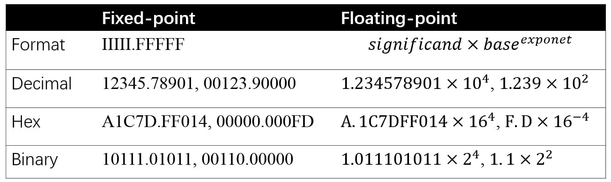
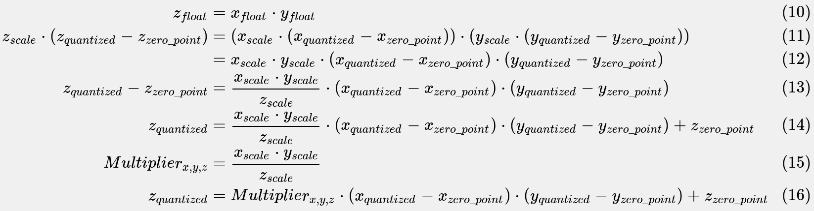
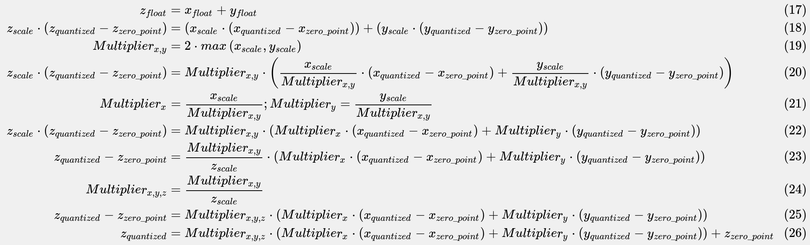
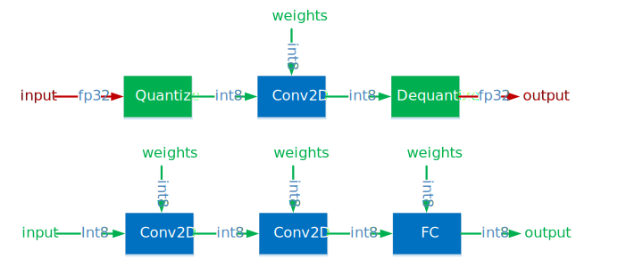
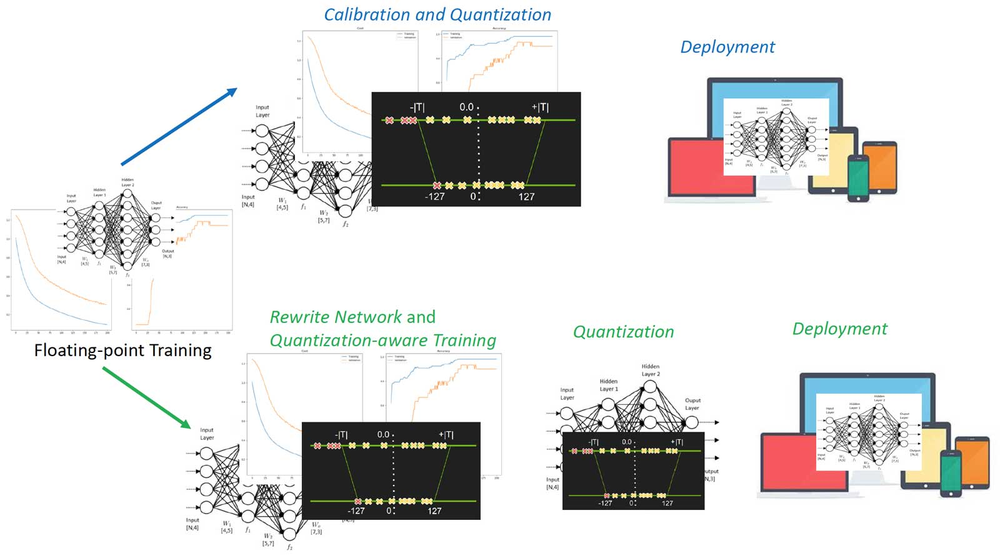
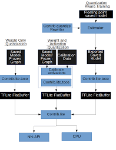

# Model Quantization
  * [Quantization Arithmetic](#quantization-arithmetic)
     * [Fixed-point and floating-point](#fixed-point-and-floating-point)
     * [Quantizing floating-point](#quantizing-floating-point)
     * [Quantized arithmetic](#quantized-arithmetic)
  * [Quantization Techniques and Approaches](#quantization-techniques-and-approaches)
     * [Post-training quantization](#post-training-quantization)
       * [Hybrid operations](#hybrid-approaches)
       * [INT8 quantization](#int8-quantization)
     * [Quantization aware training](#quantization-aware-training)
  * [Tensorflow Quantization](#tensorflow-quantization)
     * [Tensorflow Post-Training Integer Quantization](#tensorflow-post-training-integer-quantization)
  
Quantization for deep learning is the process of approximating a neural network that uses floating-point numbers, which by default are 32-bit, by a neural network of low bit width numbers. This results in a smaller model size and faster computation.

## Quantization Arithmetic
Quantization process can be divided into two parts: converting model from FP32 to INT8, and inferencing with INT8.

### Fixed-point and Floating-point
Fixed point and floating point are both representation of numbers. The difference is where the point, which divides the integer part and fractional part of a number, is placed. Fixed point reserves specific number of digits for both parts, while floating point reserves specific number of digits for significand and exponent respectively.


*Figure: Formatand example of fixed-point and floating-point*

For fixed-point, I denotes integer and F denotes fraction in IIIII.FFFFF. For floating-point, the base is 2,10 and 16 for binary, decimal and hex format respectively. The digit examples of fixed-point and floating-point are the one-to-one same in the above Figure.

In the context of premitive data type of ISA (Instruction Set Architecture), fixed point is integer which doesn’t reserve fractional part, floating-point is in binary format. Generally speaking, fixed point is continuous since it is integer and the gap of two nearest representable numbers is 1. Floating point, on the other hand, the representation gap is determined by exponent. Thus, floating point has very wide value range (for 32 bits, max integer is 2<sup>31</sup>−1 and max float is (2−2<sup>−23</sup>)×2<sup>127</sup>), and the closer the value is to 0, more accurate it can represent a real number. One observation is that, floating point has same number of values in different range determined by exponent as Figure 6. For exmple, the number of floating point values in [1,2) is same as [0.5,1), [2,4), [4,8) and so on.


*Figure: Real numbers and floating point numbers*

Floating point operation can be composed by integer operations. In the early days, it is software which emulates floating-point arithmetic on fixed-point only hardware. Equations below show how floating-point multiplication is resolved into multiplication and addition of integer - the significand and exponent.


*Equation: Floating-point multiply*

In practice, after the integer multiplication of significand above, a rescaling operation is usually needed when the multiplication results in a number is too large for the representation. Rescaling moves part of the significand result to exponent, and round the remained significand in a nearest rounding approach. Because some digits are abandoned, floating-point multiplication loses some information.


*Figure: Significant part of floating-point multiplication*

### Quantizing Floating-point
Neural networks are built of floating point arithmetic. As stated in Fixed-point and Floating-point, value ranges of FP32 and INT8 are [(2−2<sup>−23</sup>)×2<sup>127</sup>,(2<sup>23</sup>−2)×2<sup>127</sup>] and [−128,127], while the value count approximate 2<sup>32</sup> and 2<sup>8</sup> respectively. Therefore, converting networks from FP32 to INT8 is not a trivial work like truncated casting of data types.

Fortunately, the value distribution of neural network weight is of small range, which is very close to 0. Figure below shows weight distribution of 10 layers (layers that have most value points) of MobileNetV1.


*Figure: Weight distribution of 10 layers of MobileNetV1*
  
Quantizing float value is as Equations below, and can be summarized in two steps:

  * Determining x<sub>scale</sub> and x<sub>zero_point</sub> by finding min and max value in weight tensor.
  * Converting weight tensor from FP32 to INT8 per value.


Note that, rounding is needed in these steps when the floating-point operation result doesn’t equal to an integer. Considering mapping [−1,1] FP32 range to INT8 range [0,255]. We have x<sub>scale</sub>=2/255, and x<sub>zero_point</sub>=255−255/2≈127. 

It’s obverious that there is error in quantization process. The error is inevitable just like the quantization in digital signal processing, where the quantization terminology comes from. Figure below shows the quantization and the error of digital signal processing.


*Figure: Quantization and the error of digital signal processing*

### Quantized Arithmetic
Equation 10-16 below is the detail behind quantized multiplication x<sub>float</sub>⋅y<sub>float</sub>. 


*Equation: Quantized multiplication arithmetic*

Since the scale factors of input x, weight y and output z are all known for a given neural network, thus Multiplier<sub>x,y,z</sub> can be pre-computed before network forwarding. Therefore operations in Equation 16 are in integer except the multiplication between Multiplier<sub>x,y,z</sub> and (x<sub>quantized</sub>−x<sub>zero_point</sub>)⋅(y<sub>quantized</sub>−y<sub>zero_point</sub>).

Equation 17-26 are the quantized addition arithmetic.


*Equation: Quantized addition arithmetic*

Besides multiplication and addition, there are many other arithemtic operations such as division, subtraction, exponentation and so on. There are particular methods, which can be decomposed into multiplication and addition, to represent these operations in quanzation regardless of whether it is complex or not. With theses methods the quantized neural network forwards and generates valid result just like the network it quantizes from.

 
* <b>Low precision</b> could be the most generic concept. As normal precision uses FP32 (floating point of 32 bits which is single precision) to store model weights, low precision indicates numeric format such as FP16 (half precision floating point), INT8 (fixed point integer of 8 bits) and so on. There is a tend that low precision means INT8 these days.

* <b>Mixed precision</b> utilizes both FP32 and FP16 in model. FP16 reduces half of the memory size (which is a good thing), but some parameters/operators have to be in FP32 format to maitain accuracy. Check Mixed-Precision Training of Deep Neural Networks if you are interested in this topic.

* <b>Quantization</b> is basically INT8. Still, it has sub-categories depending on how many bits it takes to store one weight element. For example:

  * Binary Neural Network: neural networks with binary weights and activations at run-time and when computing the parameters’ gradient at train-time.
  * Ternary Weight Networks: neural networks with weights constrained to +1, 0 and -1.
  * XNOR Network: the filters and the input to convolutional layers are binary. XNOR-Networks approximate convolutions using primarily binary operations.
  
## INT8 Quantization  
* Some frameworks simply introduce Quantize and Dequantize layer which converts FP32 to INT8 and the reverse, when feeding to and fetching from Convolution/Fully Connected layer. In this case, the model itself and input/output are in FP32 format. Deep learning framework loads the model, rewrites network to insert Quantize and Dequantize layer, and converts weights to INT8 format.

 * Some other frameworks convert the network into INT8 format as a whole, online or offline. Thus, there is no format translation during inference. This method needs to support quantization per operator, for the data flowing between operators is INT8. For the not-yet-supported ones, it may fallback to Quantize/Dequantize scheme. 


*Figure: Mixed FP32/INT8 and Pure INT8 Inference. Red color is FP32, green color is INT8 or quantization*

## Quantization Techniques and Approaches
Post-training quantization via “hybrid operations”, which is quantizing the parameters of the model (i.e. weights), but allowing certain parts of the computation to take place in floating point. 

Post-training integer quantization. Integer quantization is a general technique that reduces the numerical precision of the weights and activations of models to reduce memory and improve latency.

## Tensorflow Quantization

Quantization works by reducing the precision of the numbers used to represent a model's parameters, which by default are 32-bit floating point numbers. This results in a smaller model size and faster computation.

The following types of quantization are available in TensorFlow Lite:


Below are the latency and accuracy results for post-training quantization and quantization-aware training on a few models. All latency numbers are measured on Pixel 2 devices using a single big core CPU. As the toolkit improves, so will the numbers here:


*Table: Benefits of model quantization for select CNN models*

## Tensorflow post-training integer quantization

### Why you should use post-training integer quantization

“hybrid” post training quantization approach reduced the model size and latency in many cases, but it has the limitation of requiring floating point computation, which may not be available in all hardware accelerators (i.e. Edge TPUs), but makes it suitable for CPU.

Post-training integer quantization enables users to take an already-trained floating-point model and fully quantize it to only use 8-bit signed integers (i.e. `int8`). By leveraging this quantization scheme, we can get reasonable quantized model accuracy across many models without resorting to retraining a model with quantization-aware training. With this new tool, models will continue to be 4x smaller, but will see even greater CPU speed-ups. Fixed point hardware accelerators, such as Edge TPUs, will also be able to run these models.

Compared to quantization-aware training, this tool is much simpler to use, and offers comparable accuracy on most models. There may still be use cases where quantization-aware training is required, but we expect this to be rare as we continue to improve post-training tooling.

In summary, a user should use “hybrid” post training quantization when targeting simple CPU size and latency improvements. When targeting greater CPU improvements or fixed-point accelerators, they should use this integer post training quantization tool, potentially using quantization-aware training if accuracy of a model suffers.

### How to enable post-training integer quantization

Tensofflow integer quantization tool requires a small calibration set of representative data. By simply providing the representative_dataset generator to the converter, the optimization parameter will perform integer quantization on the input model.
  ```
  def representative_dataset_gen():
    data = tfds.load(...)

    for _ in range(num_calibration_steps):
      image, = data.take(1)
      yield [image]

  converter = tf.lite.TFLiteConverter.from_saved_model(saved_model_dir)
  converter.optimizations = [tf.lite.Optimize.DEFAULT]
  converter.representative_dataset = tf.lite.RepresentativeDataset(
      representative_dataset_gen) 
  ```

### Is the model entirely quantized?

Just like the existing post-training quantization functionality, by default, the operations (“ops”) that do not have quantized implementations will automatically be left in floating point. This allows conversion to occur smoothly, and will produce a model that will always execute on a typical mobile CPU — consider that TensorFlow Lite will execute the integer operations in the integer-only accelerator, falling back to CPU for the operations involving floating point. To execute entirely on specialized hardware that does not support floating point operations at all (for example, some machine learning accelerators, including the Edge TPU), you can specify a flag in order to output only integer operations:
  ```
  converter.target_ops = [tf.lite.OpsSet.TFLITE_BUILTINS_INT8]
  ```

When this flag is used and an operation has no integer quantizable counterpart, the TensorFlow Lite Converter will throw an error.

### Very little data is needed
In our experiments, we found that a few dozen examples that are representative of what the model will see during execution are sufficient to get the best accuracy. For instance the accuracy numbers below are from models calibrated on only 100 images from the ImageNet dataset.

### Results
#### Latency
Compared to their float counterparts, quantized models are up to 2–4x faster on CPU and 4x smaller. We expect further speed-ups with hardware accelerators, such as Edge TPUs.


*Figure: Float vs int8 CPU time per inference (ms)*

#### Accuracy
With just 100 calibration images from ImageNet dataset, fully quantized integer models have comparable accuracy with their float versions (MobileNet v1 loses 1%).


### How these integer models work

#### Recording dynamic ranges
Our new tool works by recording dynamic ranges, running multiple inferences on a floating point TensorFlow Lite model, using the user-provided representative dataset as input. We use the values logged from inferences to determine the scaling parameters needed to execute all tensors of the model in integer arithmetic.

#### Int8 quantization scheme
It is important to note that our new quantization specification enabled this post-training use case that uses per-axis quantization for certain operations. Prior to our addition of per-axis quantization, post-training integer quantization was impractical due to accuracy drops; but the accuracy benefits of per-axis bring the accuracy much closer to float for many models.

8-bit quantization approximates floating point values using the following formula:

```
real_value = (sint8_value — zero_point) * scale.
```

Per-axis (also known as “per-channel”) or per-layer weights represented by int8 two’s complement values in the range [-127, 127] with zero-point equal to 0.

Per-layer activations/inputs represented by int8 two’s complement values in the range [-128, 127], with a zero-point in range [-128, 127].

For more details, see the full quantization specification.

#### What about quantization aware training?

We believe in making quantization as simple as possible. Hence, enabling a way to quantize models after training is something that we are very excited about! However, we also know that some models preserve the best quality when they are trained with quantization. That’s why we are also working on a quantization aware training API. In the meantime, we encourage you to try post-training quantization, since it may be all your model needs!

### The Accuracy Problem
The method described in [Quantizing Floating-point](#quantizing-floating-point) section is pretty straightforward. In the early development of a framework (or engine or whatever else you call it), that trivial approach is applied to make INT8 able to run. However, the predication accuracy of such INT8 quantized network usually drops significantly.

What happened? Though the value range of FP32 weight is narrow, the value points are huge. Taking the scaling example, 2<sup>31</sup> around (yes, basically half of the representables) FP32 values in [−1,1] are mapped into 256 INT8 values. Now consider two important rules discussed in Quantization Arithmetic section:

* The value density improves as floating-point values approach zero. The nearer a value is to zero, the more accurate it can be.
* The uniform quantization approach maps dynamic value density of floating-point to fixed-point of which the value density is constant.

So in the naive quantization approach, the floating-point values that near zero are less accuratly represented in fixed-point than the ones are not when quantizing. Consequently, the predicate result of quantized network is far less accurate when compared with the original network. This problem is inevitable for uniform quantization.

Equation 4 shows that the value mapping precision is singificantly impacted by x<sub>scale</sub> which is derived from x<sup>min</sup><sub>float</sub> and x<sup>max</sup><sub>float</sub>. And, weight value distribution shows that the number of value points near x<sup>min</sup><sub>float</sub> and x<sup>max</sup><sub>float</sub> are often ignorable. So, maybe the min and max of floating-point value can be tweaked?


*Figure: Tweaking min/max when quantizing floating-point to fixed-point*

Tweaking min/max means chosing a value range such that values in the range are more accurately quantized while values out the range are not (mapped to min/max of the fixed-point). For example, when chosing x<sup>min</sup><sub>float</sub>=−0.9 and x<sup>max</sup><sub>float</sub>=0.8 from original value range [−1,1], values in [−0.9,0.8] are more accurately mapped into [0,255], while values in [−1,−0.9] and [0.8,1] are mapped to 0 and 255 respectively.

### Tweaking Approaches
The tweaking is yet another machine learning process which learns hyper parameter (min/max) of the quantization network with a target of good predicate accuracy. Different tweaking approaches have been proposed and can be categoried into Calibration (post-training quantization) and Quantization-aware Training according to when the tweaking happens.

TensorRT, MXNet and some other frameworks that are likely to be deployed in inference enviroment are equipped with calibration. Top half of the below Figure is the process of calibration which works with pre-trained network regardless of how it is trained. Calibration often combines the min/max searching and quantization into one step. After calibration, the network is quantized and can be deployed.


*Figure: Calibration and quantization-aware training process*

As calibration choses a training independent approach, TensorFlow inovates quantization-aware training which includes four steps:

  1. Training models in floating-point with TensorFlow as usual.
  
  2. Training models with tf.contrib.quantize which rewrites network to insert Fake-Quant nodes and train min/max.
  
  3. Quantizing the network by TensorFlow Lite tools which reads the trained min/max of step 2.
  
  4. Deploying the quantized network with TensorFlow Lite.
  
Step 2 is the so-called quantization-aware training of which the forwarding is simulated INT8 and backwarding is FP32. Figure 12 illustrates the idea. Figure 12 left half is the quantized network which receives INT8 inputs and weights and generates INT8 output. Right half of Figure 12 is the rewrited network, where Fake-Quant nodes (in pink) quantize FP32 tensors into INT8 (FP32 actually, the original FP32 was Quantize and Dequantize to simulate the quantization arithmetic) on-the-fly during training. The network forwarding of Step 2 above simulates the INT8 inference arithmetic.


*Network node example of quantization-aware training*

## Summary

You may ask why quantization works (having a good enough predication accuracy) with regard to the information losing when converting FP32 to INT8? Well, there is no solid theory yet, but the intuition is that neural networks are over parameterized such that there is enough redundant information which can be safely reduced without significant accuracy drop. One evidence is that, for given quantization scheme, the accuracy gap between FP32 network and INT8 network is small for large networks, since the large networks are more over parameterized.

* Overview of schemes for model quantization: One can quantize weights post training (left) or quantize weights and activations post training (middle). It is also possible to perform quantization aware training for improved accuracy.   
    
   
        
* Weight only quantization: per-channel quantization provides good accuracy, with asymmetric quantization providing close to floating point accuracy.
    
    <p align="center">
       
    </p>
    
    *  Post training quantization of weights and activations: per-channel quantization of weights and per-layer quantization of activations works well for all the networks considered, with asymmetric quantization providing slightly better accuracies.
    
    <p align="center">
       
    </p>
    
  * Continuous-discrete learning
    * During training there are effectively two networks : float-precision and binary-precision. The binary-precision is updated in the forward pass using the float-precision, and the float-precision is updated in the backward pass using the binary-precision. In this sense, the training is a type of alternating optimization.
    
    <p align="center">
       
    </p>
    
     * Ternary parameter networks are an alternative to binary parameters that allow for higher accuracy, at cost of larger model size.
    <p align="center">
       
    </p>
    
  * Quantized activations
 
    <p align="center">
       
    </p>
    
  * Multiple bit width activations
 
    <p align="center">
       
    </p>
   
## References
* [Quantizing deep convolutional networks for efficient inference: A white paper](https://arxiv.org/pdf/1806.08342.pdf) by Google.
* [Quantization and Training of Neural Networks for Efficient Integer-Arithmetic-Only Inference](https://arxiv.org/pdf/1712.05877.pdf) by Benoit Jacob, Skirmantas Kligys, Bo Chen, Menglong Zhu, Matthew Tang, Andrew Howard, Hartwig Adam, and Dmitry Kalenichenko from Google.
* [Quantization Algorithms](https://nervanasystems.github.io/distiller/algo_quantization.html) Neural Network Distiller
* [Mixed-Precision Training of Deep Neural Networks](https://devblogs.nvidia.com/mixed-precision-training-deep-neural-networks/) by Nvidia
* [8-bit Inference with TensorRT](http://on-demand.gputechconf.com/gtc/2017/presentation/s7310-8-bit-inference-with-tensorrt.pdf) by Szymon Migacz from Nvidia
* [Fast INT8 Inference for Autonomous Vehicles with TensorRT 3](https://devblogs.nvidia.com/int8-inference-autonomous-vehicles-tensorrt/) by Joohoon Lee from Nvidia
* [Making Neural Nets Work with Low Precision](https://sahnimanas.github.io/post/quantization-in-tflite/) 
* [What I've learned about neural network quantization](https://petewarden.com/2017/06/22/what-ive-learned-about-neural-network-quantization/) by Pete Warden.
