# Tensorflow Qunatization  
   * [Introduction](#introduction)  
   * [Post-training Quantization](#post-training-quantization)
      * [Optimization options](#optimization-options)
      * [Full integer quantization of weights and activations](#full-integer-quantization-of-weights-and-activations)
   * [Post-training integer quantization jupyter notebook](./post_training_integer_quant.ipynb) from [Tensorflow Lite guide](https://www.tensorflow.org/lite/performance/post_training_integer_quant)
   * [Tutorial on Quantized Neural Network using Tensorflow Lite](./QNN/README.md)
      * [01- Introduction to TFLite](./QNN/01_Intro_to_TFlite.ipynb)

## Introduction

Quantization works by reducing the precision of the numbers used to represent a model's parameters, which by default are 32-bit floating point numbers. This results in a smaller model size and faster computation.

The following types of quantization are available in TensorFlow Lite:

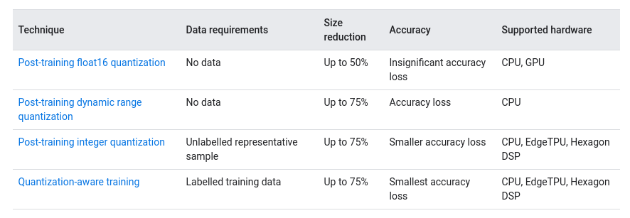

Below are the latency and accuracy results for post-training quantization and quantization-aware training on a few models. All latency numbers are measured on Pixel 2 devices using a single big core CPU. As the toolkit improves, so will the numbers here:


*Table: Benefits of model quantization for select CNN models*

## Post-training Quantization

Post-training quantization is a conversion technique that can reduce model size while also improving CPU and hardware accelerator latency, with little degradation in model accuracy. You can perform these techniques using an already-trained float TensorFlow model when you convert it to TensorFlow Lite format.

### Optimization options

There are several post-training quantization options to choose from. Here is a summary table of the choices and the benefits they provide:

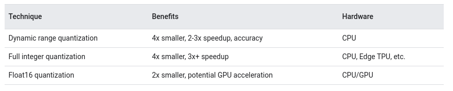

This decision tree can help determine which post-training quantization method is best for your use case:

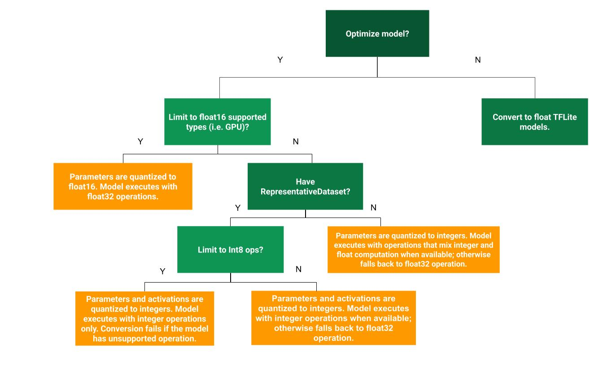

Alternatively, you might achieve higher accuracy if you perform quantization-aware training. However, doing so requires some model modifications to add fake quantization nodes, whereas the post-training quantization techniques on this page use an existing pre-trained model.

### Full integer quantization of weights and activations

Tensofflow integer quantization tool requires a small calibration set of representative datato measure the dynamic range of activations and inputs. By simply providing the representative_dataset generator to the converter, the optimization parameter will perform integer quantization on the input model.
  ```
  def representative_dataset_gen():
    data = tfds.load(...)

    for _ in range(num_calibration_steps):
      image, = data.take(1)
      yield [image]

  converter = tf.lite.TFLiteConverter.from_saved_model(saved_model_dir)
  converter.optimizations = [tf.lite.Optimize.DEFAULT]
  converter.representative_dataset = tf.lite.RepresentativeDataset(
      representative_dataset_gen) 
  ```
The resulting model should be fully quantized, but any ops that do not have quantized implementations are left in floating point. This allows conversion to occur smoothly, but the model won't be compatible with accelerators that require full integer quantization.

Additionally, the model still uses float input and output for convenience.

To ensure compatibility with some accelerators (such as the Coral Edge TPU), you can enforce full integer quantization for all ops and use integer input and output by adding the following lines before you convert:

  ```
  converter.target_spec.supported_ops = [tf.lite.OpsSet.TFLITE_BUILTINS_INT8]
  converter.inference_input_type = tf.uint8
  converter.inference_output_type = tf.uint8
  ```
The first line makes the converter throw an error if it encounters an operation it cannot currently quantize.


## Tensorflow post-training integer quantization

### Why you should use post-training integer quantization

“hybrid” post training quantization approach reduced the model size and latency in many cases, but it has the limitation of requiring floating point computation, which may not be available in all hardware accelerators (i.e. Edge TPUs), but makes it suitable for CPU.

Post-training integer quantization enables users to take an already-trained floating-point model and fully quantize it to only use 8-bit signed integers (i.e. `int8`). By leveraging this quantization scheme, we can get reasonable quantized model accuracy across many models without resorting to retraining a model with quantization-aware training. With this new tool, models will continue to be 4x smaller, but will see even greater CPU speed-ups. Fixed point hardware accelerators, such as Edge TPUs, will also be able to run these models.

Compared to quantization-aware training, this tool is much simpler to use, and offers comparable accuracy on most models. There may still be use cases where quantization-aware training is required, but we expect this to be rare as we continue to improve post-training tooling.

In summary, a user should use “hybrid” post training quantization when targeting simple CPU size and latency improvements. When targeting greater CPU improvements or fixed-point accelerators, they should use this integer post training quantization tool, potentially using quantization-aware training if accuracy of a model suffers.

### How to enable post-training integer quantization


### Very little data is needed
In our experiments, we found that a few dozen examples that are representative of what the model will see during execution are sufficient to get the best accuracy. For instance the accuracy numbers below are from models calibrated on only 100 images from the ImageNet dataset.

### Results
#### Latency
Compared to their float counterparts, quantized models are up to 2–4x faster on CPU and 4x smaller. We expect further speed-ups with hardware accelerators, such as Edge TPUs.

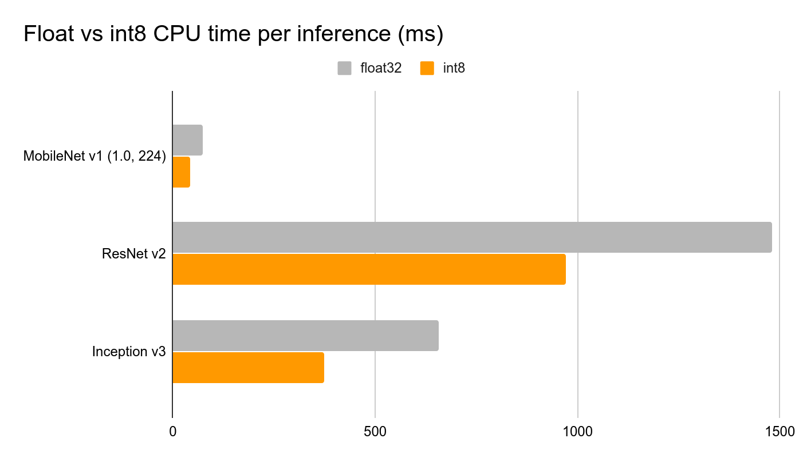
*Figure: Float vs int8 CPU time per inference (ms)*

#### Accuracy
With just 100 calibration images from ImageNet dataset, fully quantized integer models have comparable accuracy with their float versions (MobileNet v1 loses 1%).

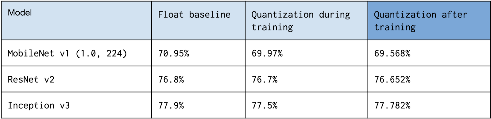

### How these integer models work

#### Recording dynamic ranges
Our new tool works by recording dynamic ranges, running multiple inferences on a floating point TensorFlow Lite model, using the user-provided representative dataset as input. We use the values logged from inferences to determine the scaling parameters needed to execute all tensors of the model in integer arithmetic.

#### Int8 quantization scheme
It is important to note that our new quantization specification enabled this post-training use case that uses per-axis quantization for certain operations. Prior to our addition of per-axis quantization, post-training integer quantization was impractical due to accuracy drops; but the accuracy benefits of per-axis bring the accuracy much closer to float for many models.

8-bit quantization approximates floating point values using the following formula:

```
real_value = (sint8_value — zero_point) * scale.
```

Per-axis (also known as “per-channel”) or per-layer weights represented by int8 two’s complement values in the range [-127, 127] with zero-point equal to 0.

Per-layer activations/inputs represented by int8 two’s complement values in the range [-128, 127], with a zero-point in range [-128, 127].

For more details, see the full quantization specification.

#### What about quantization aware training?

We believe in making quantization as simple as possible. Hence, enabling a way to quantize models after training is something that we are very excited about! However, we also know that some models preserve the best quality when they are trained with quantization. That’s why we are also working on a quantization aware training API. In the meantime, we encourage you to try post-training quantization, since it may be all your model needs!

### The Accuracy Problem
The method described in [Quantizing Floating-point](#quantizing-floating-point) section is pretty straightforward. In the early development of a framework (or engine or whatever else you call it), that trivial approach is applied to make INT8 able to run. However, the predication accuracy of such INT8 quantized network usually drops significantly.

What happened? Though the value range of FP32 weight is narrow, the value points are huge. Taking the scaling example, 2<sup>31</sup> around (yes, basically half of the representables) FP32 values in [−1,1] are mapped into 256 INT8 values. Now consider two important rules discussed in Quantization Arithmetic section:

* The value density improves as floating-point values approach zero. The nearer a value is to zero, the more accurate it can be.
* The uniform quantization approach maps dynamic value density of floating-point to fixed-point of which the value density is constant.

So in the naive quantization approach, the floating-point values that near zero are less accuratly represented in fixed-point than the ones are not when quantizing. Consequently, the predicate result of quantized network is far less accurate when compared with the original network. This problem is inevitable for uniform quantization.

Equation 4 shows that the value mapping precision is singificantly impacted by x<sub>scale</sub> which is derived from x<sup>min</sup><sub>float</sub> and x<sup>max</sup><sub>float</sub>. And, weight value distribution shows that the number of value points near x<sup>min</sup><sub>float</sub> and x<sup>max</sup><sub>float</sub> are often ignorable. So, maybe the min and max of floating-point value can be tweaked?


*Figure: Tweaking min/max when quantizing floating-point to fixed-point*

Tweaking min/max means chosing a value range such that values in the range are more accurately quantized while values out the range are not (mapped to min/max of the fixed-point). For example, when chosing x<sup>min</sup><sub>float</sub>=−0.9 and x<sup>max</sup><sub>float</sub>=0.8 from original value range [−1,1], values in [−0.9,0.8] are more accurately mapped into [0,255], while values in [−1,−0.9] and [0.8,1] are mapped to 0 and 255 respectively.

### Tweaking Approaches
The tweaking is yet another machine learning process which learns hyper parameter (min/max) of the quantization network with a target of good predicate accuracy. Different tweaking approaches have been proposed and can be categoried into Calibration (post-training quantization) and Quantization-aware Training according to when the tweaking happens.

TensorRT, MXNet and some other frameworks that are likely to be deployed in inference enviroment are equipped with calibration. Top half of the below Figure is the process of calibration which works with pre-trained network regardless of how it is trained. Calibration often combines the min/max searching and quantization into one step. After calibration, the network is quantized and can be deployed.

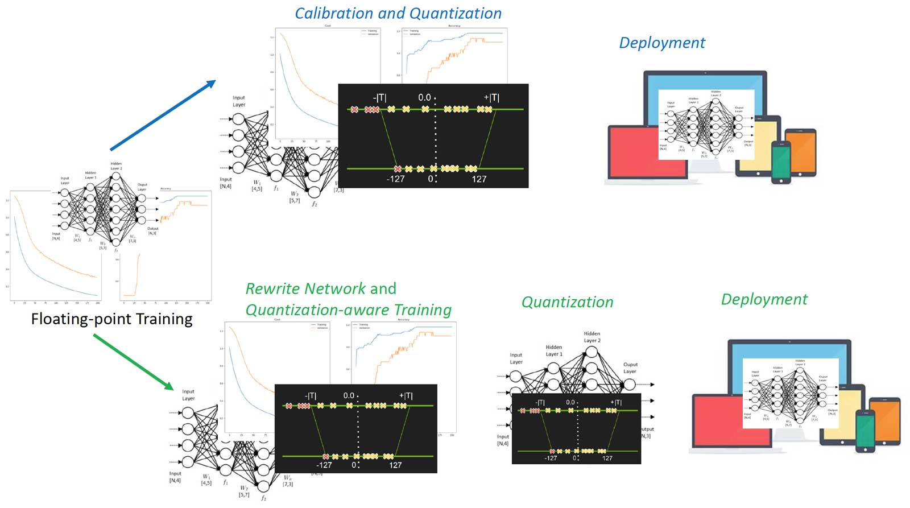
*Figure: Calibration and quantization-aware training process*

As calibration choses a training independent approach, TensorFlow inovates quantization-aware training which includes four steps:

  1. Training models in floating-point with TensorFlow as usual.
  
  2. Training models with tf.contrib.quantize which rewrites network to insert Fake-Quant nodes and train min/max.
  
  3. Quantizing the network by TensorFlow Lite tools which reads the trained min/max of step 2.
  
  4. Deploying the quantized network with TensorFlow Lite.
  
Step 2 is the so-called quantization-aware training of which the forwarding is simulated INT8 and backwarding is FP32. Figure 12 illustrates the idea. Figure 12 left half is the quantized network which receives INT8 inputs and weights and generates INT8 output. Right half of Figure 12 is the rewrited network, where Fake-Quant nodes (in pink) quantize FP32 tensors into INT8 (FP32 actually, the original FP32 was Quantize and Dequantize to simulate the quantization arithmetic) on-the-fly during training. The network forwarding of Step 2 above simulates the INT8 inference arithmetic.

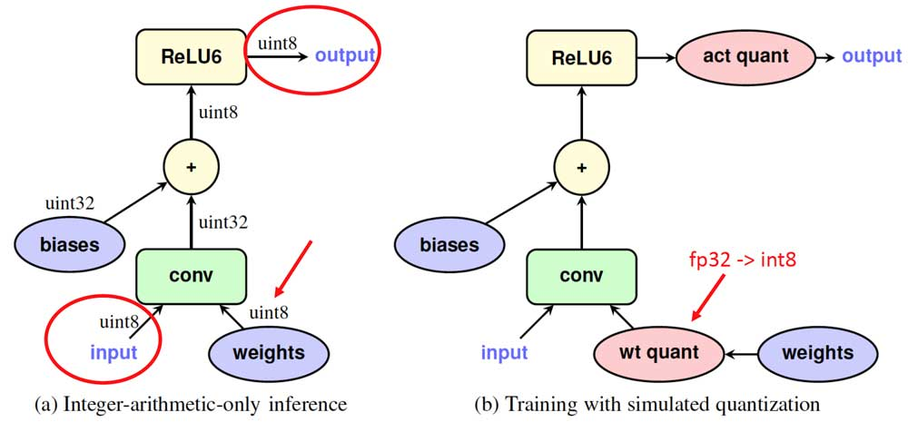
*Network node example of quantization-aware training*

## Summary

You may ask why quantization works (having a good enough predication accuracy) with regard to the information losing when converting FP32 to INT8? Well, there is no solid theory yet, but the intuition is that neural networks are over parameterized such that there is enough redundant information which can be safely reduced without significant accuracy drop. One evidence is that, for given quantization scheme, the accuracy gap between FP32 network and INT8 network is small for large networks, since the large networks are more over parameterized.
        
* Weight only quantization: per-channel quantization provides good accuracy, with asymmetric quantization providing close to floating point accuracy.
    
    <p align="center">
       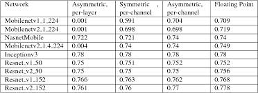
    </p>
    
    *  Post training quantization of weights and activations: per-channel quantization of weights and per-layer quantization of activations works well for all the networks considered, with asymmetric quantization providing slightly better accuracies.
    
    <p align="center">
       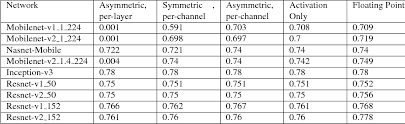
    </p>
    
  * Continuous-discrete learning
    * During training there are effectively two networks : float-precision and binary-precision. The binary-precision is updated in the forward pass using the float-precision, and the float-precision is updated in the backward pass using the binary-precision. In this sense, the training is a type of alternating optimization.
    
    <p align="center">
       
    </p>
    
     * Ternary parameter networks are an alternative to binary parameters that allow for higher accuracy, at cost of larger model size.
    <p align="center">
       
    </p>
    
  * Quantized activations
 
    <p align="center">
       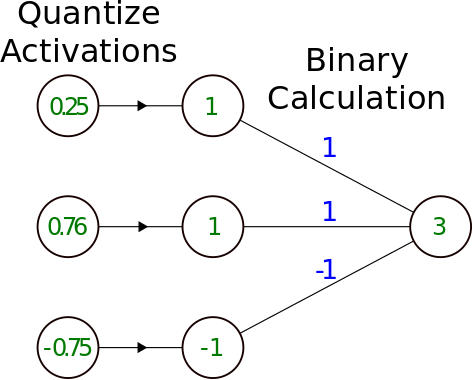
    </p>
    
  * Multiple bit width activations
 
    <p align="center">
       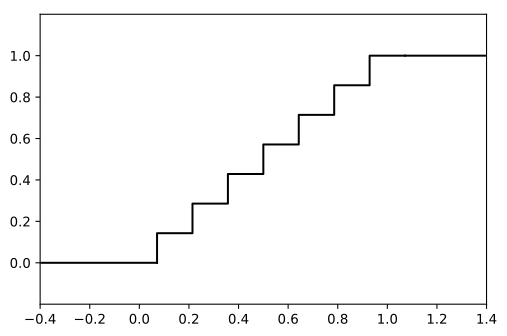
    </p>
   
## References
* [Quantizing deep convolutional networks for efficient inference: A white paper](https://arxiv.org/pdf/1806.08342.pdf) by Google.
* [Quantization and Training of Neural Networks for Efficient Integer-Arithmetic-Only Inference](https://arxiv.org/pdf/1712.05877.pdf) by Benoit Jacob, Skirmantas Kligys, Bo Chen, Menglong Zhu, Matthew Tang, Andrew Howard, Hartwig Adam, and Dmitry Kalenichenko from Google.
* [Quantization Algorithms](https://nervanasystems.github.io/distiller/algo_quantization.html) Neural Network Distiller
* [Mixed-Precision Training of Deep Neural Networks](https://devblogs.nvidia.com/mixed-precision-training-deep-neural-networks/) by Nvidia
* [8-bit Inference with TensorRT](http://on-demand.gputechconf.com/gtc/2017/presentation/s7310-8-bit-inference-with-tensorrt.pdf) by Szymon Migacz from Nvidia
* [Fast INT8 Inference for Autonomous Vehicles with TensorRT 3](https://devblogs.nvidia.com/int8-inference-autonomous-vehicles-tensorrt/) by Joohoon Lee from Nvidia
* [Making Neural Nets Work with Low Precision](https://sahnimanas.github.io/post/quantization-in-tflite/) 
* [What I've learned about neural network quantization](https://petewarden.com/2017/06/22/what-ive-learned-about-neural-network-quantization/) by Pete Warden.
