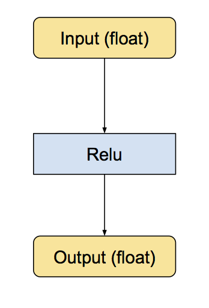
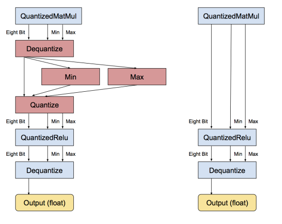

# Tensorflow Qunatization  
   * [Quantization Scheme](#quantization-scheme)  
   * [A Typical Quantized Layer](#a_typical_quantized_layer)
   * [Fake Quantization](#fake_quantization)
   * [INT8 Quantization](#int8_quantization)
   * [Tutorials on Quantized Neural Network using Tensorflow Lite](./QNN/README.md)
      * [01- Introduction to TFLite](./QNN/01_Intro_to_TFlite.ipynb)
      * [02- Quantization Basics](./QNN/02_Quantization_Basics.ipynb)
      * [03- Quantizing Tensorflow Graph](./QNN/03_Quantizing_Tensorflow_Graph.ipynb)
      * [04- Custom Gradients](./QNN/04_Custom_Gradients.ipynb)
      * [05- Training](./QNN/05_Training.ipynb)
      * [06- Batchnorm Folding](./QNN/06_Batchnorm_Folding.ipynb)
      * [07- Efficient Integer Inference](./QNN/07_Efficient_Integer_Inference.ipynb)

## Quantization Scheme

* It should be linear (or affine)

    * If it weren’t that way, then the result of fixed-point calculations won’t directly map back to real numbers.

* It allows us to always repreent `0.f` accurately

    * If we quantize and dequantize any real value, only 256 (or generally, 2<sup>B</sup>) of them will return the exact the same number, while all others will suffer some precision loss. If we ensure that `0.f` is one of these 256 values , it turns out that DNNs can be quantized more accurately, because 0 has a special significance in DNNs (such as padding). Besides, having 0 map to another value that’s higher/lower than zero will introduce a bias in the quantization scheme.

So our quantization scheme will simply be a shifting and scaling of the real number line to a quantized number line. For a given set of real values, we want the minimum/maximum real values in this range [r<sub>min</sub>, r<sub>max</sub>] to map to the minimum/maximum integer values [0, 2<sup>B</sup>-1] respectively, with everything in between linearly distributed.

This gives us a pretty simple linear equation:    


Here,

    * r is the real value (usually float32)
    * q is its quantized representation as a B-bit integer (uint8, uint32, etc.)
    * S(float32) and z(uint) are the factors by which we scale and shift the number line. z will always map back exactly to 0.f.


## A Typical Quantized Layer

Let’s look at the components of a conventional layer implemented in floating-point:

    * Zero or more weight tensors, which are constant, and stored as float.
    * One or more input tensors; again, stored in float.
    * The forward pass function which operates on the weights and inputs, using floating point arithmetic, storing the output in float
    * Output tensors, again in float.

Now the weights of a pre-trained network are constant, so we can convert & store them in quantized form beforehand with their exact ranges known to us.

The input to a layer, or equivalently the output of a preceding layer, are also quantized with their own separate parameters. But wait – to quantize a set of numbers don’t we need to know their range (and thus their actual values) in float first? Then what’s the point of quantized computation? The answer to this lies behind the fact that a layer’s output generally lies in a bounded range for most inputs, with only a few outliers. While we ideally would want to know the exact range of values to quantize them accurately, results of unknown inputs can still be expected to be in similar bounds. Luckily, we are already computing the output in float during another stage – training. Thus, we can find the average output range on a large number of inputs during training and use this as a proxy to the output quantization parameters. When running on an actual unseen input, an outlier will get squashed if our range is too small, or get rounded if the range is too wide. But hopefully there will only be a few of these.

What’s left is the main function that computes the output of the layer. Changing this to a quantized version requires more than simply changing float to int everywhere, as the results of our integer computations can overflow. So, we’ll have to store results in larger integers (say, int32) and then requantize it to the 8-bit output. This is not a concern in conventional full-precision implementations, where all variables are in float and the hardware handles all the nitty-gritties of floating-point arithmetic. Additionally, we’ll also have to change some of the layers’ logic. For example, ReLU should now compare values against `Quantized(0)` instead of `0.f`

The below figure puts it all together.


## Fake Quantization


## INT8 Quantization

The quantization first replaces all the individual ops it knows about with quantized equivalents. These are small sub-graphs that have conversion functions before and after to move the data between float and eight-bit. Below is an example of what they look like. First here’s the original Relu operation, with float inputs and outputs:



Then, this is the equivalent converted subgraph, still with float inputs and outputs, but with internal conversions so the calculations are done in eight bit.


The min and max operations actually look at the values in the input float tensor, and then feeds them into the Quantize operation that converts the tensor into eight-bits. 


Schematic of Naive Quantization for MatMuls in Tensorflow


Dequantizatin


GatherNd quantization optimization


Once the individual operations have been converted, the next stage is to remove unnecessary conversions to and from float. If there are consecutive sequences of operations that all have float equivalents, then there will be a lot of adjacent Dequantize/Quantize ops. This stage spots that pattern, recognizes that they cancel each other out, and removes them, like this:



## How these integer models work

### Recording dynamic ranges

Running multiple inferences on a floating point model, using the user-provided representative dataset as input. We use the values logged from inferences to determine the scaling parameters needed to execute all tensors of the model in integer arithmetic.

### Int8 quantization scheme

It is important to note that our new quantization specification enabled this post-training use case that uses per-axis quantization for certain operations. Prior to our addition of per-axis quantization, post-training integer quantization was impractical due to accuracy drops; but the accuracy benefits of per-axis bring the accuracy much closer to float for many models.

8-bit quantization approximates floating point values using the following formula:

```
real_value = (sint8_value — zero_point) * scale.
```

Per-axis (also known as “per-channel”) or per-layer weights represented by int8 two’s complement values in the range [-127, 127] with zero-point equal to 0.

Per-layer activations/inputs represented by int8 two’s complement values in the range [-128, 127], with a zero-point in range [-128, 127].

For more details, see the full quantization specification.

## References

* [Quantizing deep convolutional networks for efficient inference: A white paper](https://arxiv.org/pdf/1806.08342.pdf) by Google.
* [Quantization and Training of Neural Networks for Efficient Integer-Arithmetic-Only Inference](https://arxiv.org/pdf/1712.05877.pdf) by Benoit Jacob, Skirmantas Kligys, Bo Chen, Menglong Zhu, Matthew Tang, Andrew Howard, Hartwig Adam, and Dmitry Kalenichenko from Google.
* [Quantization Algorithms](https://nervanasystems.github.io/distiller/algo_quantization.html) Neural Network Distiller
* [Mixed-Precision Training of Deep Neural Networks](https://devblogs.nvidia.com/mixed-precision-training-deep-neural-networks/) by Nvidia
* [8-bit Inference with TensorRT](http://on-demand.gputechconf.com/gtc/2017/presentation/s7310-8-bit-inference-with-tensorrt.pdf) by Szymon Migacz from Nvidia
* [Fast INT8 Inference for Autonomous Vehicles with TensorRT 3](https://devblogs.nvidia.com/int8-inference-autonomous-vehicles-tensorrt/) by Joohoon Lee from Nvidia
* [Making Neural Nets Work with Low Precision](https://sahnimanas.github.io/post/quantization-in-tflite/) 
* [What I've learned about neural network quantization](https://petewarden.com/2017/06/22/what-ive-learned-about-neural-network-quantization/) by Pete Warden.
