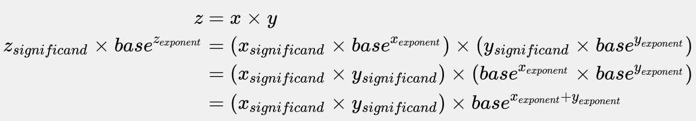
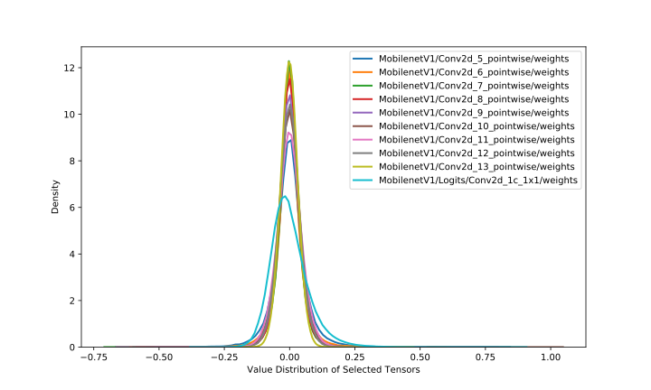
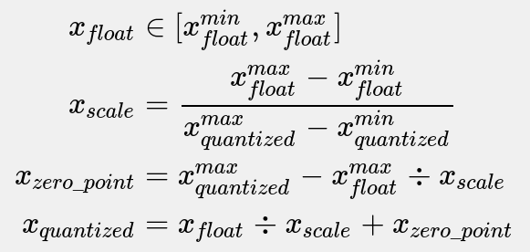
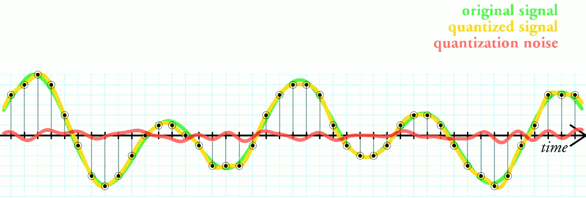
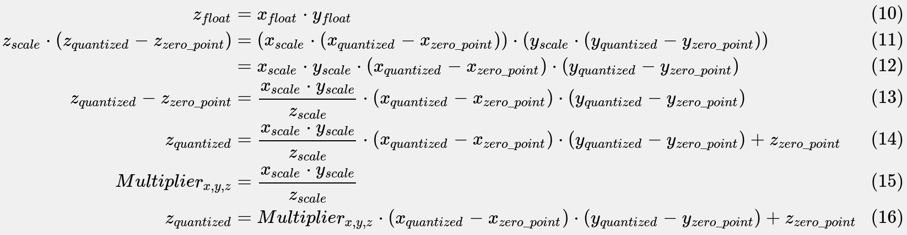
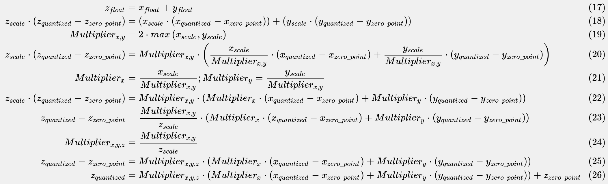
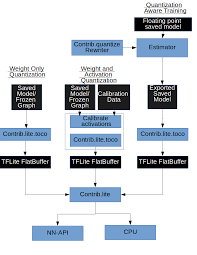
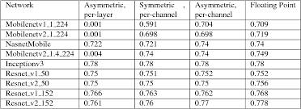
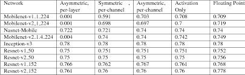
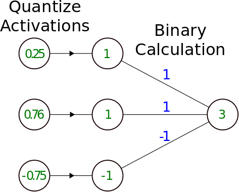

# Model Quantization
Quantization for deep learning is the process of approximating a neural network that uses floating-point numbers by a neural network of low bit width numbers.
 
* <b>Low precision</b> could be the most generic concept. As normal precision uses FP32 (floating point of 32 bits which is single precision) to store model weights, low precision indicates numeric format such as FP16 (half precision floating point), INT8 (fixed point integer of 8 bits) and so on. There is a tend that low precision means INT8 these days.

* <b>Mixed precision</b> utilizes both FP32 and FP16 in model. FP16 reduces half of the memory size (which is a good thing), but some parameters/operators have to be in FP32 format to maitain accuracy. Check Mixed-Precision Training of Deep Neural Networks if you are interested in this topic.

* <b>Quantization</b> is basically INT8. Still, it has sub-categories depending on how many bits it takes to store one weight element. For example:

  * Binary Neural Network: neural networks with binary weights and activations at run-time and when computing the parameters’ gradient at train-time.
  * Ternary Weight Networks: neural networks with weights constrained to +1, 0 and -1.
  * XNOR Network: the filters and the input to convolutional layers are binary. XNOR-Networks approximate convolutions using primarily binary operations.
  
## INT8 Quantization  
* Some frameworks simply introduce Quantize and Dequantize layer which converts FP32 to INT8 and the reverse, when feeding to and fetching from Convolution/Fully Connected layer. In this case, the model itself and input/output are in FP32 format. Deep learning framework loads the model, rewrites network to insert Quantize and Dequantize layer, and converts weights to INT8 format.

 * Some other frameworks convert the network into INT8 format as a whole, online or offline. Thus, there is no format translation during inference. This method needs to support quantization per operator, for the data flowing between operators is INT8. For the not-yet-supported ones, it may fallback to Quantize/Dequantize scheme. 

## Quantization Arithmetic
Quantization process can be divided into two parts: converting model from FP32 to INT8, and inferencing with INT8.

### Fixed-point and Floating-point
Fixed point and floating point are both representation of numbers. The difference is where the point, which divides the integer part and fractional part of a number, is placed. Fixed point reserves specific number of digits for both parts, while floating point reserves specific number of digits for significand and exponent respectively.

For fixed-point, I denotes integer and F denotes fraction in IIIII.FFFFF. For floating-point, the base is 2,10 and 16 for binary, decimal and hex format respectively. The digit examples of fixed-point and floating-point are the one-to-one same in the above Figure.

In the context of premitive data type of ISA (Instruction Set Architecture), fixed point is integer which doesn’t reserve fractional part, floating-point is in binary format. Generally speaking, fixed point is continuous since it is integer and the gap of two nearest representable numbers is 1. Floating point, on the other hand, the representation gap is determined by exponent. Thus, floating point has very wide value range (for 32 bits, max integer is 231−1 and max float is (2−2−23)×2127), and the closer the value is to 0, more accurate it can represent a real number. One observation is that, floating point has same number of values in different range determined by exponent as Figure 6. For exmple, the number of floating point values in [1,2) is same as [0.5,1), [2,4), [4,8) and so on.

Floating point operation can be composed by integer operations. In the early days, it is software which emulates floating-point arithmetic on fixed-point only hardware. Equations below show how floating-point multiplication is resolved into multiplication and addition of integer - the significand and exponent.

In practice, after the integer multiplication of significand above, a rescaling operation is usually needed when the multiplication results in a number is too large for the representation. Rescaling moves part of the significand result to exponent, and round the remained significand in a nearest rounding approach. Because some digits are abandoned, floating-point multiplication loses some information.

### Quantizing Floating-point
Neural networks are built of floating point arithmetic. As stated in Fixed-point and Floating-point, value ranges of FP32 and INT8 are [(2−2−23)×2127,(223−2)×2127] and [−128,127], while the value count approximate 232 and 28 respectively. Therefore, converting networks from FP32 to INT8 is not a trivial work like truncated casting of data types.

Fortunately, the value distribution of neural network weight is of small range, which is very close to 0. Figure below shows weight distribution of 10 layers (layers that have most value points) of MobileNetV1.

  
Quantizing float value is as Equations below, and can be summarized in two steps:

  * Determining xscale and xzero_point by finding min and max value in weight tensor.
  * Converting weight tensor from FP32 to INT8 per value.

Note that, rounding is needed in these steps when the floating-point operation result doesn’t equal to an integer. Considering mapping [−1,1] FP32 range to INT8 range [0,255]. We have xscale=2/255, and xzero_point=255−255/2≈127. 

It’s obverious that there is error in quantization process. The error is inevitable just like the quantization in digital signal processing, where the quantization terminology comes from. Figure below shows the quantization and the error of digital signal processing.

### Quantized Arithmetic
Equation 10-16 below is the detail behind quantized multiplication xfloat⋅yfloat. 

Since the scale factors of input x, weight y and output z are all known for a given neural network, thus Multiplierx,y,z can be pre-computed before network forwarding. Therefore operations in Equation 16 are in integer except the multiplication between Multiplierx,y,z and (xquantized−xzero_point)⋅(yquantized−yzero_point).

Equation 17-26 are the quantized addition arithmetic.

Besides multiplication and addition, there are many other arithemtic operations such as division, subtraction, exponentation and so on. There are particular methods, which can be decomposed into multiplication and addition, to represent these operations in quanzation regardless of whether it is complex or not. With theses methods the quantized neural network forwards and generates valid result just like the network it quantizes from.

* Overview of schemes for model quantization: One can quantize weights post training (left) or quantize weights and activations post training (middle). It is also possible to perform quantization aware training for improved accuracy.   
    
   
        
* Weight only quantization: per-channel quantization provides good accuracy, with asymmetric quantization providing close to floating point accuracy.
    
    

       
    

    
    *  Post training quantization of weights and activations: per-channel quantization of weights and per-layer quantization of activations works well for all the networks considered, with asymmetric quantization providing slightly better accuracies.
    
    

       
    

    
  * Continuous-discrete learning
    * During training there are effectively two networks : float-precision and binary-precision. The binary-precision is updated in the forward pass using the float-precision, and the float-precision is updated in the backward pass using the binary-precision. In this sense, the training is a type of alternating optimization.
    
    

       
    

    
     * Ternary parameter networks are an alternative to binary parameters that allow for higher accuracy, at cost of larger model size.
    

       
    

    
  * Quantized activations
 
    

       
    

    
  * Multiple bit width activations
 
    

       
    

   
## References
* [Quantizing deep convolutional networks for efficient inference: A white paper](https://arxiv.org/pdf/1806.08342.pdf)
* [Quantization Algorithms](https://nervanasystems.github.io/distiller/algo_quantization.html)
