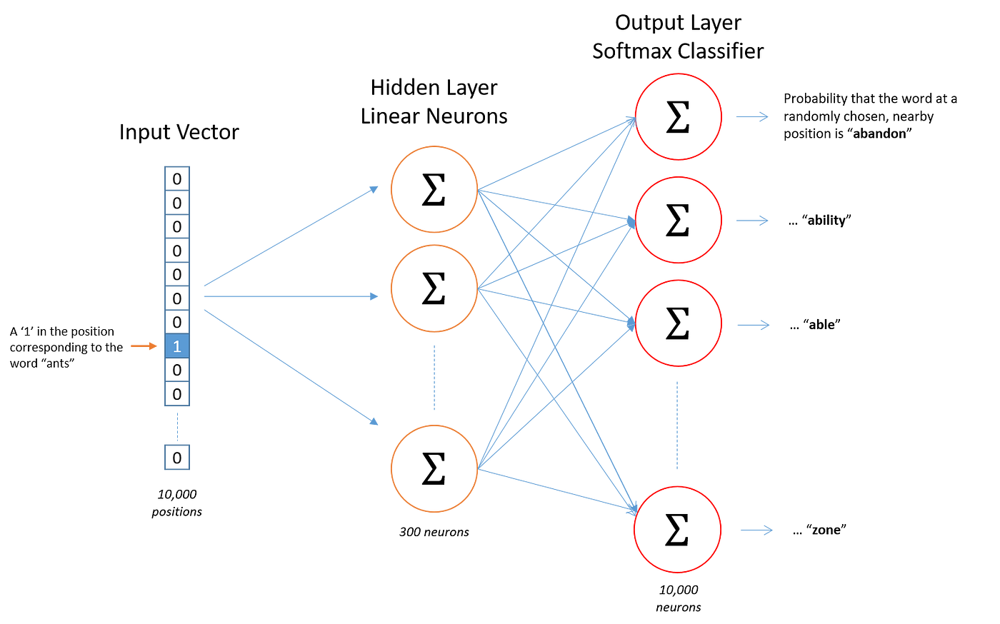

# Word Embedding

The Big Idea of Word Embedding is to turn text into numbers.

<b>Word Embedding is a means of building a low-dimensional vector representation from corpus of text, which preserves the contextual similarity of words.</b>

This transformation is necessary because many machine learning algorithms (including deep nets) require their input to be vectors of continuous values; they just won’t work on strings of plain text.

So a natural language modelling technique like Word Embedding is used to map words or phrases from a vocabulary to a corresponding vector of real numbers. As well as being amenable to processing by learning algorithms, this vector representation has two important and advantageous properties:

* Dimensionality Reduction — it is a more efficient representation

* Contextual Similarity — it is a more expressive representation

If you’re familiar with the [Bag of Words](#bag-of-words) approach, you’ll know it results in huge, very sparse one-hot encoded vectors, where the dimensionality of the vectors representing each document is equal to the size of the supported vocabulary. Word Embedding aims to create a vector representation with a much lower dimensional space. These are called Word Vectors.

Word Vectors are used for semantic parsing, to extract meaning from text to enable natural language understanding. For a language model to be able to predict the meaning of text, it needs to be aware of the contextual similarity of words. 

The vectors created by Word Embedding preserve these similarities, so words that regularly occur nearby in text will also be in close proximity in vector space. 

## Word2Vec

If you’ve encountered dimensionality reduction before you’ll know this is typically achieved using an unsupervised learning algorithm. And this is the approach used by one of the best known algorithms for producing word embeddings: word2vec.

There are actually two ways to implement word2vec, `CBOW (Continuous Bag-Of-Words)` and `Skip-gram`.

In CBOW we have a window around some target word and then consider the words around it (its context). We supply those words as input into our network and then use it to try to predict the target word.

Skip-gram does the opposite, you have a target word, and you try to predict the words that are in the window around that word, i.e. predict the context around a word.

The input words are passed in as `one-hot encoded vectors`. This will go into a hidden layer of linear units, then into a softmax layer to make a prediction. The idea here is to train the hidden layer weight matrix to find efficient representations for our words. This weight matrix is usually called the `embedding` matrix, and can be queried as a look-up table.

The embedding matrix has a size of the number of words by the number of neurons in the hidden layer (the embed size). So, if you have 10,000 words and 300 hidden units, the matrix will have size 10,000×300 (as we’re using one-hot encoded vectors for our inputs). Once computed, getting the word vector is a speedy O(1) lookup of corresponding row of the results matrix:

So, for the word that’s the 4th entry in the vocabulary, its vector is (10,12,19).
So each word has an associated vector, hence the name: `word2vec`.

The embed size, which is the size of the hidden layer and thus the number of features that represent similarities between words, tends to be much smaller than the total number of unique words in the vocabulary, (hundreds rather than tens of thousands). The embed size used is a trade-off: more features mean extra computational complexity, and so longer run-times, but also allow more subtle representations, and potentially better models.

## Bag of Words

A representation of the words in a phrase or passage, irrespective of order. For example, bag of words represents the following three phrases identically:

  * the dog jumps
  * jumps the dog
  * dog jumps the
  
Each word is mapped to an index in a sparse vector, where the vector has an index for every word in the vocabulary. For example, the phrase the dog jumps is mapped into a feature vector with non-zero values at the three indices corresponding to the words the, dog, and jumps. The non-zero value can be any of the following:

  * A 1 to indicate the presence of a word.
  * A count of the number of times a word appears in the bag. For example, if the phrase were <i>the maroon dog is a dog with maroon fur</i>, then both maroon and dog would be represented as 2, while the other words would be represented as 1.
  * Some other value, such as the logarithm of the count of the number of times a word appears in the bag. 
 
 ## References

 * [Glossary of Deep Learning: Word Embedding](https://medium.com/deeper-learning/glossary-of-deep-learning-word-embedding-f90c3cec34ca)
