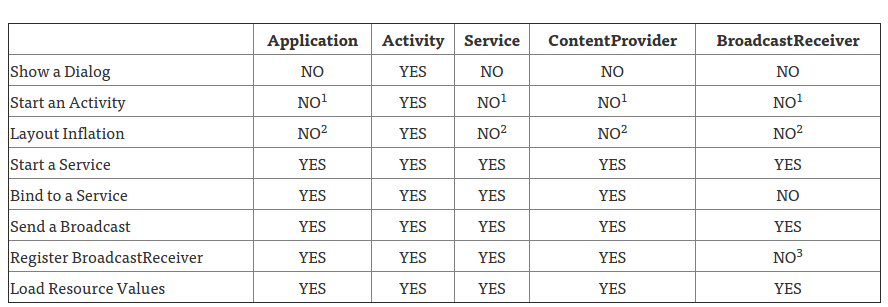

# Different Ways to Get Context in Android

## The "this" Keyword

The `this` keyword in general sense refers to current class instance. So, when use `this` keyword inside an Activity, it refers to that Activity instance. And as Activity is subclass of `Context`, you will get context of that activity.

## Get current activity context: View.getContext()

This method can be called on a View like textView.getContext(). This will give the context of activity in which the view is currently hosted in.

## Get App-level context : getApplicationContext()

If you need to access resources which are out of scope of specific activity, like when accessing `SharedPreferences`, displaying `Toast message` etc. you can use this.

So unlike activity context, which will be destroyed when close an activity, Application Context is the application wide context which won’t get destroyed until you completely close application.

You can directly access application context by calling `getApplicationContext()` or by calling on activity context like `context.getApplicationContext()`

## Get Context from Fragment : getContext()

When you call getContext() from an Fragment, you will get the context of the activity in which that fragment is hosted in.

## Get parent Activity : getActivity()

You can get the parent activity from a Fragment by calling getActivity().

💡Difference : Both getContext() and getActivity() are not much different in most cases, when you just need a context as both will get Parent activity context. Except for some cases, for example when using ContextWrapper, getContext() and getActivity() can point to different contexts.

## Applicaton Context vs Activity Context

They are both instances of `Context`, but the application instance is tied to the lifecycle of the application, while the Activity instance is tied to the lifecycle of an Activity. Thus, they have access to different information about the application environment.

