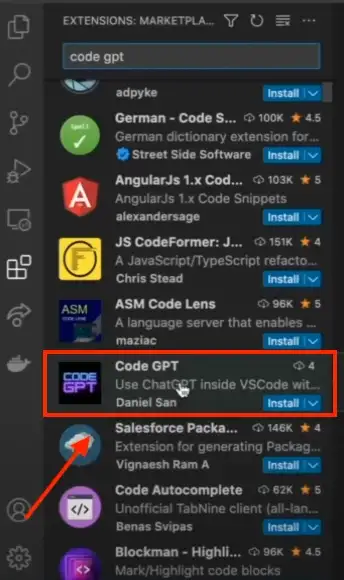
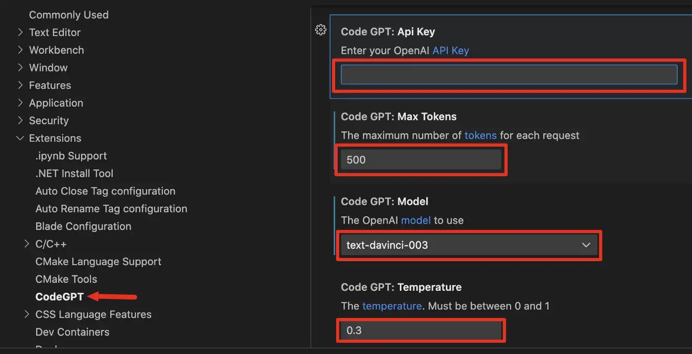
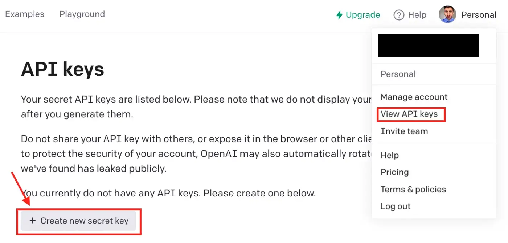

# CodeGPT: The VSCode Extension with ChatGPT-Like Functionalities

With CodeGPT we can generate code, explain code, refactor code, and more.

## Setting up CodeGPT on VSCode

To install this extension, we have to open VSCode, go to extensions, and search “Code GPT.” Once we find it, we click on “install”.

Once Code GPT is installed, we have to go to “Settings” and go to “Code GPT” (on macOS go to the menu bar and click on Code, then select “Preferences” to find the “Settings” option).

On settings, we’ll see the following.

To work with this extension you need to type your OpenAI API key in the first box in the image above.

You can leave the remaining boxes as is, but in case you want to customize them, keep this in mind:

- Max tokens: Maximum number of tokens you want to get for each request to the API

- Model: Currently there are 3 models available in this extension (text-davinci-003, code-cushman-001 and code-davinci-002). Among these options code-davinci-002 is the most powerful when it comes to coding.

- Temperature: Controls how much randomness is in the output (the lower the temperature, the more likely GPT-3 will choose words with a higher probability of occurrence)

## Exploring CodeGPT

Here are the top features of CodeGPT

- Generate Code: You only need to type a comment asking for a specific code, then press cmd-shift-iand CodeGPT will open a new window with the code.

- Explain Code: Select some code, right-click on it and select the option “Explain CodeGPT.” CodeGPT will open a new window and explain the code.

But that’s not all! Here are Other things you can do with CodeGPT:

- Ask questions
- Refactor code
- Document code
- Find problems in your code