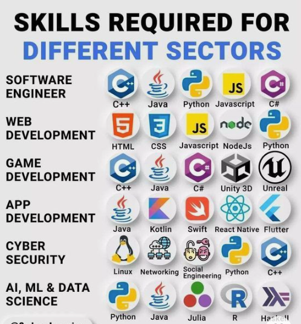

     
# Full Stack

* Skills required for different sectors

* HTML 
  * standard markup language for Web pages.
  * Define the content of web pages  

* CSS
  * CSS is the language we use to style an HTML document.
  * specify the layout of web pages.

* JavaScript
  * JavaScript is the world's most popular programming language.
  * JavaScript is the programming language of the Web.
  * JavaScript to program the behavior of web pages.

* React
  * React is a JavaScript library for building user interfaces.  
  * React, sometimes referred to as a frontend JavaScript framework, is a JavaScript library created by Facebook.

* SQL
  * SQL is a standard language for storing, manipulating and retrieving data in databases.

* C#
  * C# is a programming language developed by Microsoft that runs on the .NET Framework.  

* Bootstrap
  * Bootstrap is the world's most famous free CSS framework.

* jQuery
  * jQuery is a JavaScript Library.
  * jQuery greatly simplifies JavaScript programming.  

* XML
  * XML stands for eXtensible Markup Language.
  * XML was designed to store and transport data.
  * XML was designed to be both human- and machine-readable.  

* Node.js
  * Node.js is an open source server environment.
  * Node.js allows you to run JavaScript on the server.

* R
  * R is often used for statistical computing and graphical presentation to analyze and visualize data.  

* TypeScript
  * TypeScript is JavaScript with added syntax for types.  

* PHP
  * PHP is a server scripting language, and a powerful tool for making dynamic and interactive Web pages.
  * PHP was originally an abbreviation of Personal Home Page.
  * PHP: Hypertext Preprocessor. It now stands for the recursive initialism.

* Django
  * Django is a back-end server side web framework.
  * Django is free, open source and written in Python.
  * Django makes it easier to build web pages using Python.

* PostgreSQL
  * PostgreSQL supports both relational (SQL) and non-relational (JSON) queries.  

* MongoDB
  * MongoDB is a document database. It stores data in a type of JSON format called BSON.

* ASP and ASP.NET
  * ASP stands for Active Server Pages
  * ASP is a development framework for building web pages. 

* Kotlin
  * Kotlin is 100% compatible with Java.  

* Flutter
  * by Google
  * Dart programming language

* React Native
  * by Meta 
  * JavaScript programming language
  * TypeScript, a stronly typed superset of JavaScript, has become the framework's default language
  * React library to construct user interface  

* Ionic
  * an open-source UI toolkit for crafting cross-platform mobile and desktop applications.
  * Using web technologies HTML, CSS and JavaScript, seamless integration for Angular, React and Vue frameworks.

* Kotlin Multiplatform
  * by JetBrains
  * compilable for Android, iOS, web, desktop and server-side applications
  * Google's endorsement    

* Electron
  * by GitHub
  * Using web technologies such as HTML, CSS and JavaScript
  * built on Chromium and Node.js
* Qt
   * run seamlessly on Windows, macOS and Linux
   * support C++, Python and JavaScript
   * complex user interfaces, multimedia applications and high-performance graphics
* GTK+
   * Similar as Qt
* wxWidget
   * similar as Qt
   * It is a C++ framwork, support Python, Perl and Ruby
* JavaFx
   * Java-based framework         
* Windows Presentation Foundation (WPF)
   * Building Windows desktop applications