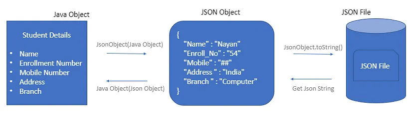

# Gson

## Overview

Google Gson is a simple Java-based library to serialize Java objects to JSON and vice versa. It is an open-source library developed by Google.

The following points highlight why you should be using this library −

- Standardized − Gson is a standardized library that is managed by Google.

- Efficient − It is a reliable, fast, and efficient extension to the Java standard library.

- Optimized − The library is highly optimized.

- Supports complex inner classes − It supports complex objects with deep inheritance hierarchies.

## Three Ways of Processing JSON

Gson provides three alternative ways to process JSON −

- Streaming API
    It reads and writes JSON content as discrete events. `JsonReader` and `JsonWriter` read/write the data as token, referred as JsonToken.

    It is the most powerful approach among the three approaches to process JSON. It has the lowest overhead and it is quite fast in read/write operations. It is analogous to `Stax` parser for XML.

- Tree Model
    It prepares an in-memory tree representation of the JSON document. It builds a tree of JsonObject nodes. It is a flexible approach and is analogous to `DOM` parser for XML.

- Data Binding
    It converts JSON to and from POJO (Plain Old Java Object) using property accessor. Gson reads/writes JSON using data type adapters. It is analogous to `JAXB` parser for XML.    

## Gson Dependency

### Gradle:

```
dependencies {
  implementation 'com.google.code.gson:gson:2.10.1'
}
```

### Maven:
```
<dependency>
  <groupId>com.google.code.gson</groupId>
  <artifactId>gson</artifactId>
  <version>2.10.1</version>
</dependency>    
```

## Steps to Remember

Following are the important steps to be considered here.



### Step 1 − Create Gson object using GsonBuilder

Create a Gson object. It is a reusable object.

```
GsonBuilder builder = new GsonBuilder(); 
builder.setPrettyPrinting(); 
Gson gson = builder.create();
```

### Step 2 − Deserialize JSON to Object

Use `fromJson()` method to get the Object from the JSON. Pass Json string / source of Json string and object type as parameter.

```
//Object to JSON Conversion 
Student student = gson.fromJson(jsonString, Student.class);
```

### Step 3 − Serialize Object to JSON

Use `toJson()` method to get the JSON string representation of an object.

```
//Object to JSON Conversion   
jsonString = gson.toJson(student); 
```

## Deserialize a List<T> object with Gson

```
MyClass[] mcArray = gson.fromJson(jsonString, MyClass[].class);
```

If you really need a list you can always convert the array to a list by:
```
List<MyClass> mList = Arrays.asList(mcArray);
```

And to make it be an actual list (that can be modified, see limitations of Arrays.asList()) then just do the following:

```
List<MyClass> mcList = new ArrayList<>(Arrays.asList(mcArray));
```

## Example

```
private void saveTestsToFile() {
    File uploadFile = new File(Environment.getExternalStorageDirectory(),
            "DCIM/CBCX/" + upload_filename);

    // Gson gson = new Gson();
    // Enable pretty print
    Gson gson = new GsonBuilder().setPrettyPrinting().create();
    try {
        String uploads_json = gson.toJson(tests);
        FileWriter writer = new FileWriter(uploadFile);
        writer.write(uploads_json);
        writer.flush();
        writer.close();
    } catch (IOException e) {
        e.printStackTrace();
    }
}

public void loadTestsFromFile() {
    File testsFile = new File(Environment.getExternalStorageDirectory(),
            "DCIM/CBCX/" + upload_filename);
    if (testsFile.exists()) {
        try {
            FileReader reader = new FileReader(testsFile);
            Gson gson = new GsonBuilder().setPrettyPrinting().create();
            OneTest[] test_array = gson.fromJson(reader, OneTest[].class);
            List<OneTest> test_list = Arrays.asList(test_array);
            tests = Collections.synchronizedList(test_list);
        } catch (FileNotFoundException e) {
            e.printStackTrace();
        }
    }
}
```